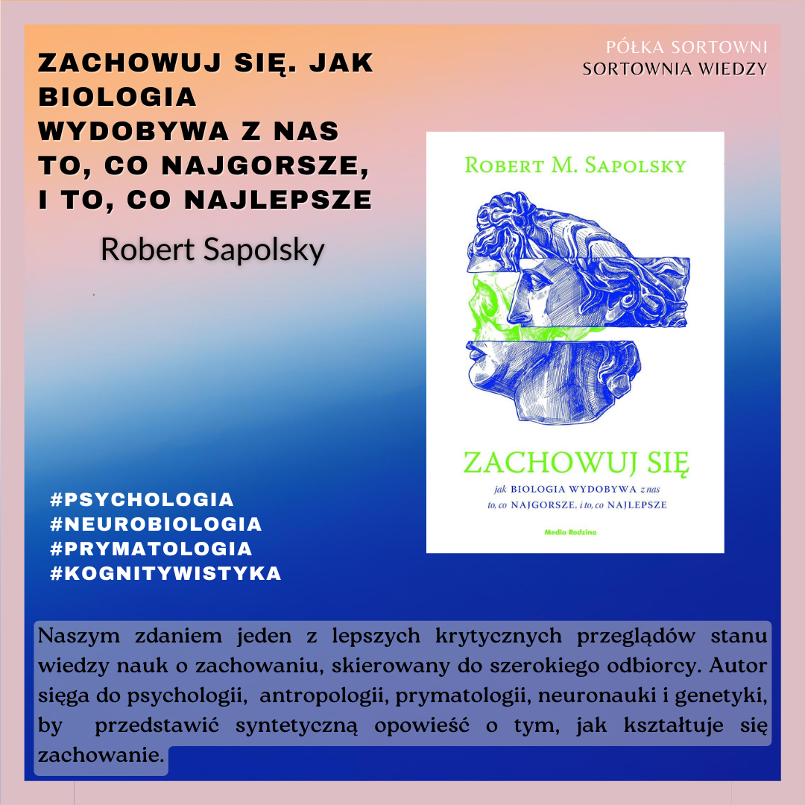

**Zachowuj się. Jak biologia wydobywa z nas to, co najgorsze, i to, co najlepsze** 

**Autor**: Robert Sapolsky 
**Wydawnictwo**: Media Rodzina 
**Uwagi**: Polskie tłumaczenie pozostawia wiele do życzenia 

Naszym zdaniem jeden z lepszych krytycznych przeglądów stanu wiedzy nauk o zachowaniu, skierowany do szerokiego odbiorcy. Autor sięga do psychologii,  antropologii, prymatologii, neuronauki i genetyki, by przedstawić syntetyczną opowieść o tym, jak kształtuje się zachowanie. 

https://lubimyczytac.pl/ksiazka/4949256/zachowuj-sie-jak-biologia-wydobywa-z-nas-to-co-najgorsze-i-to-co-najlepsze  
https://www.goodreads.com/book/show/31170723-behave 

Sapolsky, R. M. (2021). Zachowuj się: jak biologia wydobywa z nas to, co najgorsze, i to, co najlepsze. Media Rodzina.
