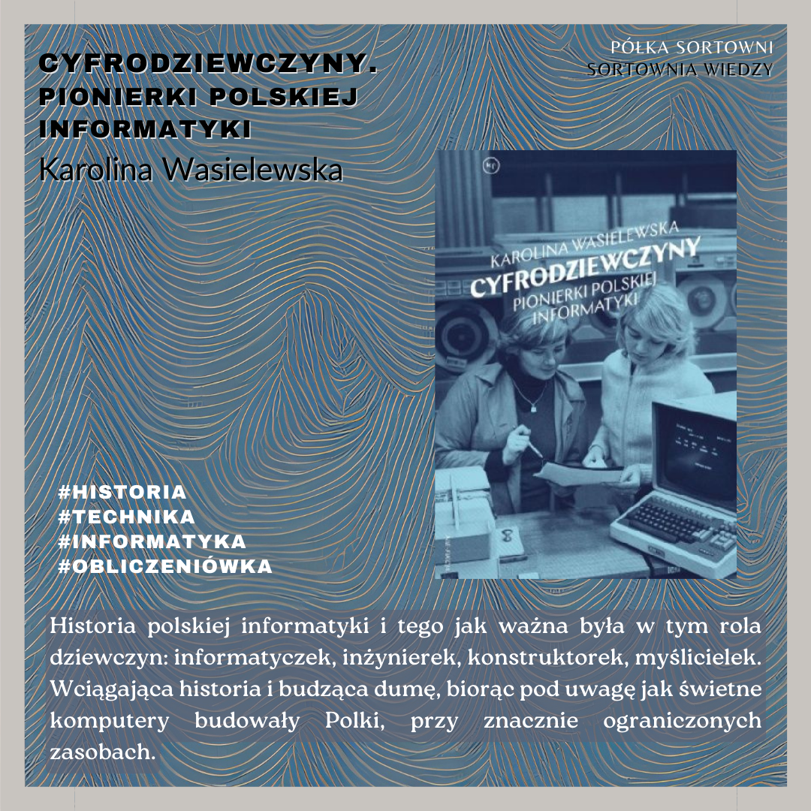

**Cyfrodziewczyny. Pionierki polskiej informatyki**  

**Autorka**: Karolina Wasielewska  
**Wydawnictwo**: Wydawnictwo Krytyki Politycznej 

Historia polskiej informatyki i tego jak ważna była w tym rola dziewczyn: informatyczek, inżynierek, konstruktorek, myślicielek. Wciągająca historia i budząca dumę, biorąc pod uwagę jak świetne komputery budowały Polki, przy znacznie ograniczonych zasobach. 

  
  
https://lubimyczytac.pl/ksiazka/4914179/cyfrodziewczyny  
https://www.goodreads.com/en/book/show/50522825  
https://www.google.pl/books/edition/Cyfrodziewczyny/Yeu5zQEACAAJ?hl=en  

Wasielewska, K. (2020). Cyfrodziewczyny: Pionierki polskiej informatyki. Wydawnictwo Krytyki Politycznej.
