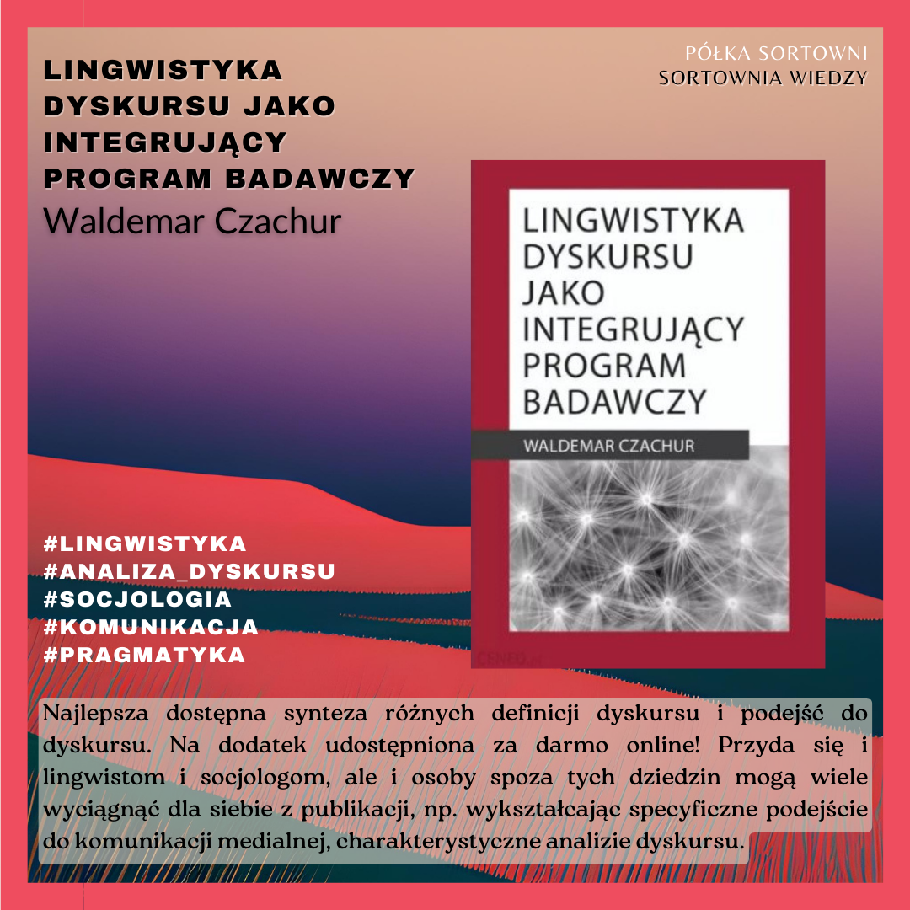

**Lingwistyka dyskursu jako integrujący program badawczy** 

**Autor**: Waldemar Czachur  
**Wydawnictwo**: Wydawnictwo ATUT 

Najlepsza dostępna synteza różnych definicji dyskursu i podejść do dyskursu. Na dodatek udostępniona za darmo online! Przyda się i lingwistom i socjologom, ale i osoby spoza tych dziedzin mogą wiele wyciągnąć dla siebie z publikacji, np. wykształcając specyficzne podejście do komunikacji medialnej, charakterystyczne analizie dyskursu. 

  

https://lubimyczytac.pl/ksiazka/5049502/lingwistyka-dyskursu-jako-integrujacy-program-badawczy  
https://www.goodreads.com/book/show/57287391-lingwistyka-dyskursu-jako-integruj-cy-program-badawczy  
https://www.google.pl/books/edition/Lingwistyka_dyskursu_jako_integruj%C4%85cy_p/TCQqEAAAQBAJ?hl=en  

Czachur, W. (2020). Lingwistyka dyskursu jako integrujący program badawczy. Oficyna Wydawnicza ATUT - Wrocławskie Wydawnictwo Oświatowe.
