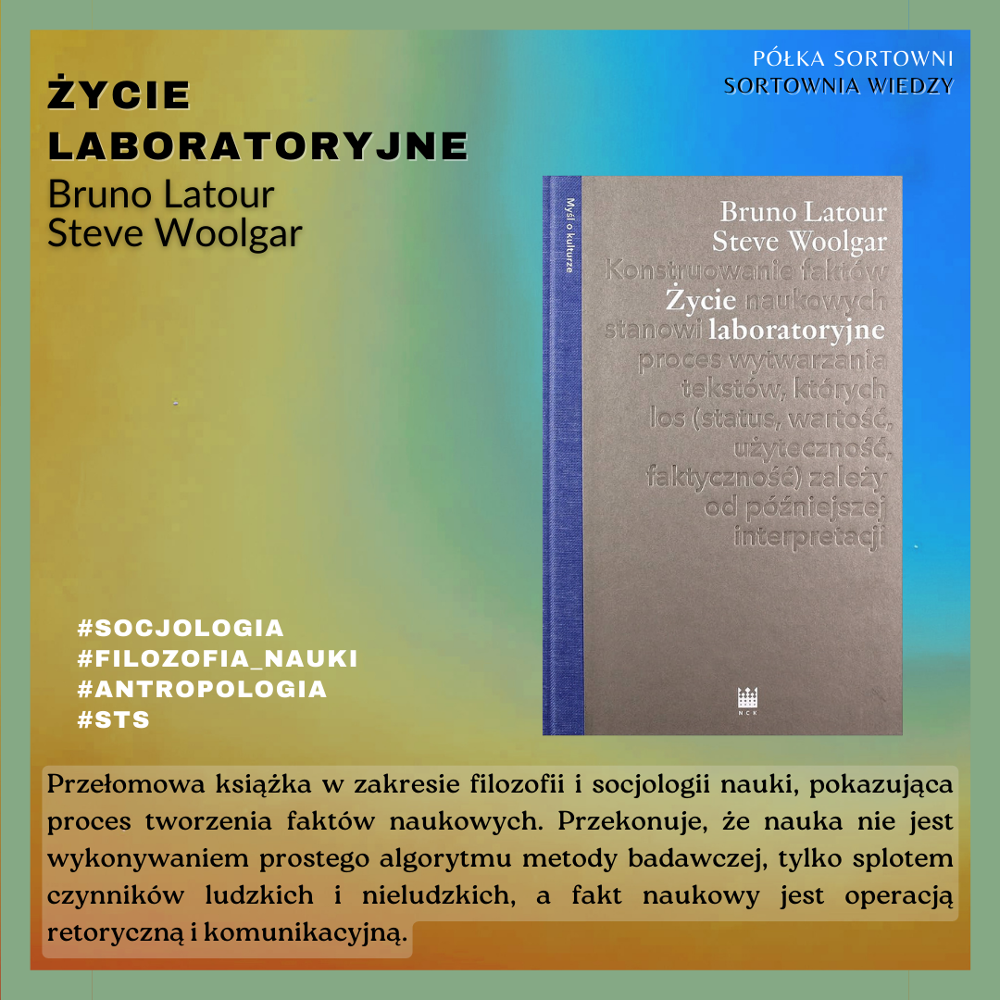

**Życie Laboratoryjne** 

**Autorzy**: Bruno Latour, Steve Woolgar  
**Tłumacz**: Krzysztof Abriszewski  
**Wydawnictwo**: Narodowe Centrum Kultury 

Przełomowa książka w zakresie filozofii i socjologii nauki, pokazująca proces tworzenia faktów naukowych. Przekonuje, że nauka nie jest wykonywaniem prostego algorytmu metody badawczej, tylko splotem czynników ludzkich i nieludzkich, a fakt naukowy jest operacją retoryczną i komunikacyjną. 

  

https://lubimyczytac.pl/ksiazka/4931535/zycie-laboratoryjne-konstruowanie-faktow-naukowych  
https://www.goodreads.com/book/show/55844861-ycie-laboratoryjne-konstruowanie-fakt-w-naukowych  
https://www.google.pl/books/edition/Zycie_laboratoryjne/6lq6zQEACAAJ?hl=en  

Latour, B., & Woolgar, S. (2020). Życie laboratoryjne: Konstruowanie faktów naukowych. Narodowe Centrum Kultury.
