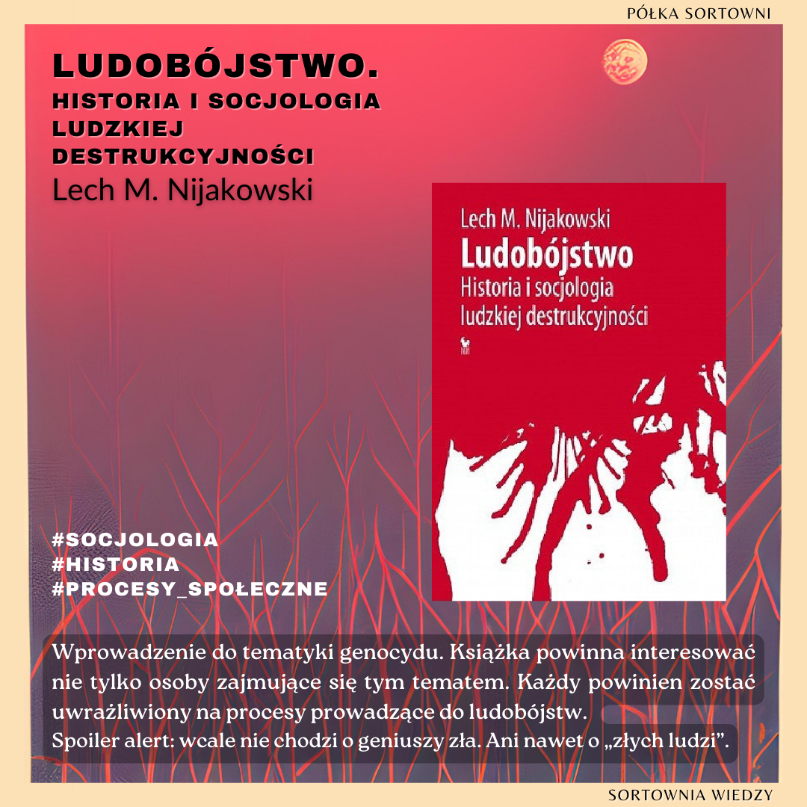

**Ludobójstwo. Historia i socjologia ludzkiej destrukcyjności** 

**Autor**: Lech M. Nijakowski 
**Wydawnictwo**: Iskry 

Wprowadzenie do tematyki genocydu. Książka powinna interesować nie tylko osoby zajmujące się tym tematem. Każdy powinien zostać uwrażliwiony na procesy prowadzące do ludobójstw. 
Spoiler alert: wcale nie chodzi o geniuszy zła. Ani nawet o „złych ludzi”. 

  

https://lubimyczytac.pl/ksiazka/4865145/ludobojstwo-historia-i-socjologia-ludzkiej-destrukcyjnosci  
https://www.goodreads.com/book/show/42604033-ludob-jstwo-historia-i-socjologia-ludzkiej-destrukcyjno-ci  
https://www.google.pl/books/edition/Ludob%C3%B3jstwo/CsM8vQEACAAJ?hl=en  

Nijakowski, L. M. (2018). Ludobójstwo: Historia i socjologia ludzkiej destrukcyjności: popularne wprowadzenie. Iskry.
