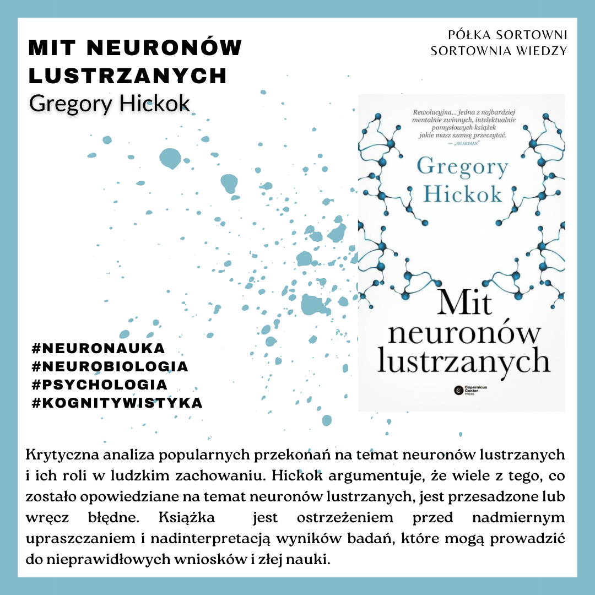

**Mit neuronów lustrzanych** 

**Autor**: Gregory Hickok 
**Wydawnictwo**: Copernicus Center Press 

Krytyczna analiza popularnych przekonań na temat neuronów lustrzanych i ich roli w ludzkim zachowaniu. Hickok argumentuje, że wiele z tego, co zostało opowiedziane na temat neuronów lustrzanych, jest przesadzone lub wręcz błędne. Książka  jest ostrzeżeniem przed nadmiernym upraszczaniem i nadinterpretacją wyników badań, które mogą prowadzić do nieprawidłowych wniosków i złej nauki. 

https://lubimyczytac.pl/ksiazka/4949256/zachowuj-sie-jak-biologia-wydobywa-z-nas-to-co-najgorsze-i-to-co-najlepsze  
https://www.goodreads.com/book/show/31170723-behave 

Hickok, G. (2016). Mit neuronów lustrzanych: rzetelna neuronauka komunikacji i poznania. Copernicus Center Press.
