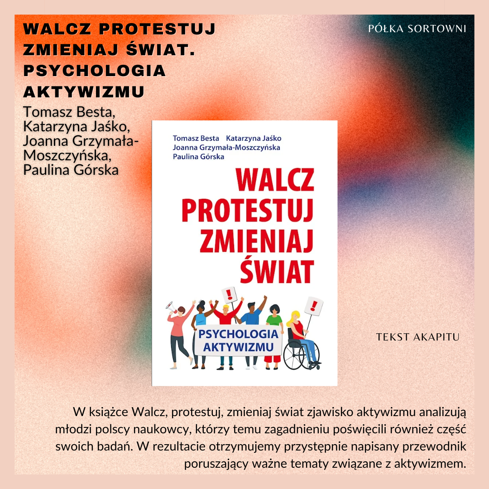

SZABLON W TRAKCIE TWORZENIA  

### Walcz, protestuj, zmieniaj świat: Psychologia aktywizmu   

**Autorzy**: Tomasz Besta, Katarzyna Jaśko, Joanna Grzymała-Moszczyńska, Paulina Górska  
**Wydawnictwo**: Smak Słowa 

W książce Walcz, protestuj, zmieniaj świat zjawisko aktywizmu analizują młodzi polscy naukowcy, którzy temu zagadnieniu poświęcili również część swoich badań. W rezultacie otrzymujemy przystępnie napisany przewodnik poruszający ważne tematy związane z aktywizmem. 

  

https://lubimyczytac.pl/ksiazka/4908286/walcz-protestuj-zmieniaj-swiat  
https://www.goodreads.com/book/show/48755167-walcz-protestuj-zmieniaj-wiat-psychologia-aktywizmu  

Besta, T., Jaśko, K., Grzymała-Moszczyńska, J., & Górska, P. (2019). Walcz, protestuj, zmieniaj świat: Psychologia aktywizmu. Smak Słowa.
