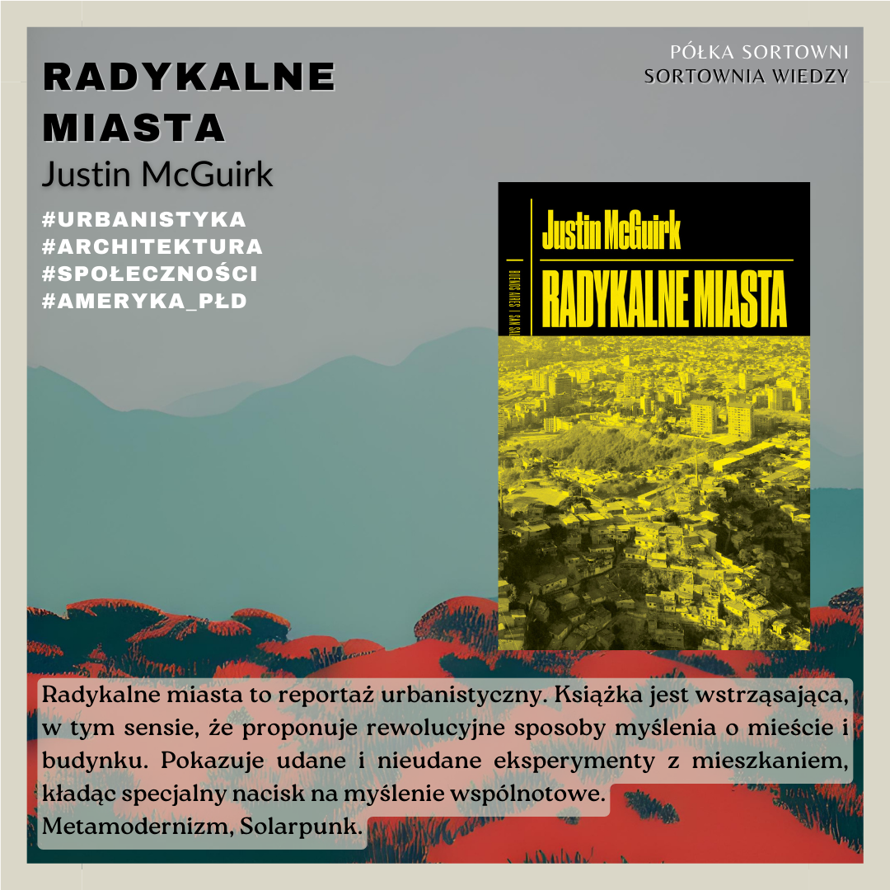

**Radykalne miasta** 

**Autor**: Justin McGuirk  
**Tłumacz**: Marcin Wawrzyńczak 
**Wydawnictwo**: Fundacja Bęc Zmiana 

Radykalne miasta to reportaż urbanistyczny. Książka jest wstrząsająca, w tym sensie, że proponuje rewolucyjne sposoby myślenia o mieście i budynku. Pokazuje udane i nieudane eksperymenty z mieszkaniem, kładąc specjalny nacisk na myślenie wspólnotowe.
Metamodernizm, Solarpunk. 

  

https://lubimyczytac.pl/ksiazka/254943/radykalne-miasta 
https://www.goodreads.com/book/show/37843178-radykalne-miasta-przez-ameryk-aci-sk-w-poszukiwaniu-nowej-architektu  

McGuirk, J. (2015). Radykalne miasta. Przez Amerykę Łacińską w poszukiwaniu nowej architektury (M. Wawrzyńczak, Tłum.). Fundacja Bęc Zmiana.
