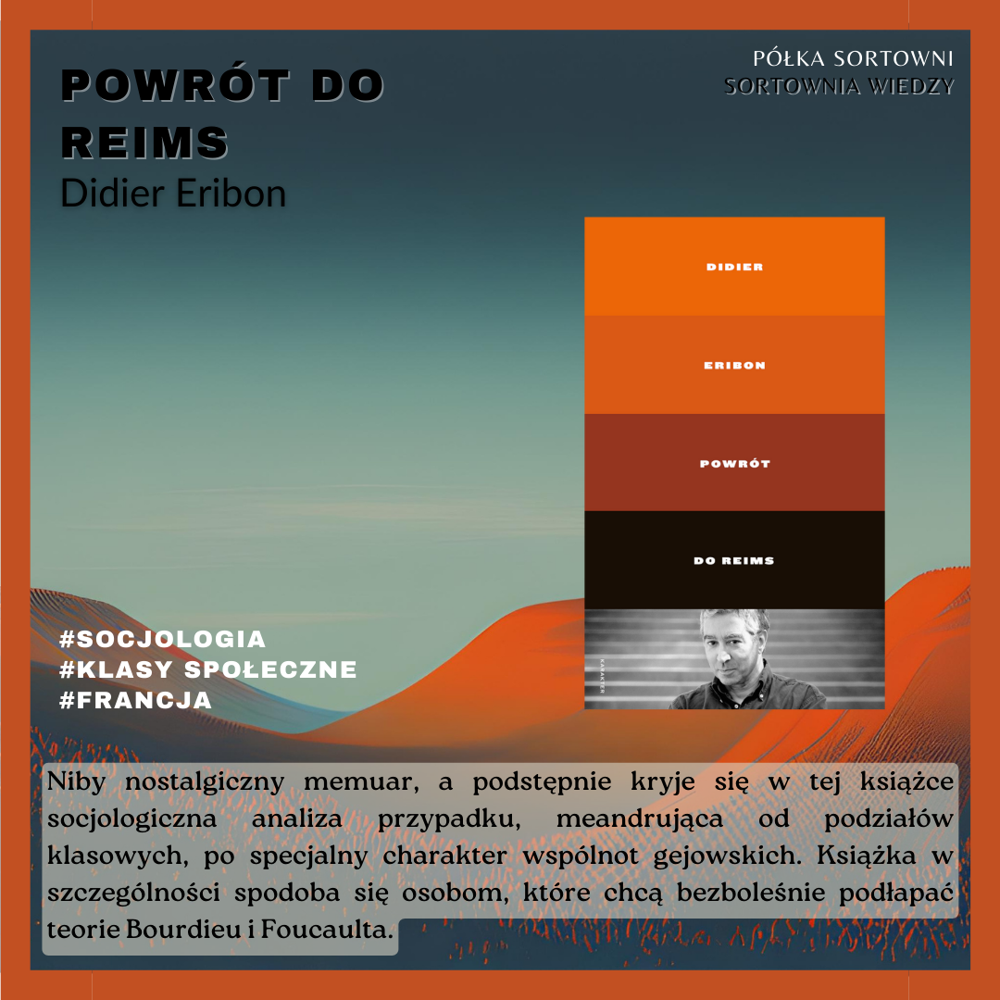

**Powrót do Reims** 

**Autor**: Didier Eribon  
**Tłumaczka**: Maryna Ochab  
**Wydawnictwo**: Wydawnictwo Karakter 

Niby nostalgiczny memuar, a podstępnie kryje się w tej książce socjologiczna analiza przypadku, meandrująca od podziałów klasowych, po specjalny charakter wspólnot gejowskich. Książka w szczególności spodoba się osobom, które chcą bezboleśnie podłapać teorie Bourdieu i Foucaulta. 

  

https://lubimyczytac.pl/ksiazka/4877028/powrot-do-reims  
https://www.goodreads.com/book/show/44428603-powr-t-do-reims? 
https://www.google.pl/books/edition/Powr%C3%B3t_do_Reims/x_FdzgEACAAJ?hl=en  

Eribon, D. (2019). Powrót do Reims (M. Ochab, Tłum.). Wydawnictwo Karakter.

