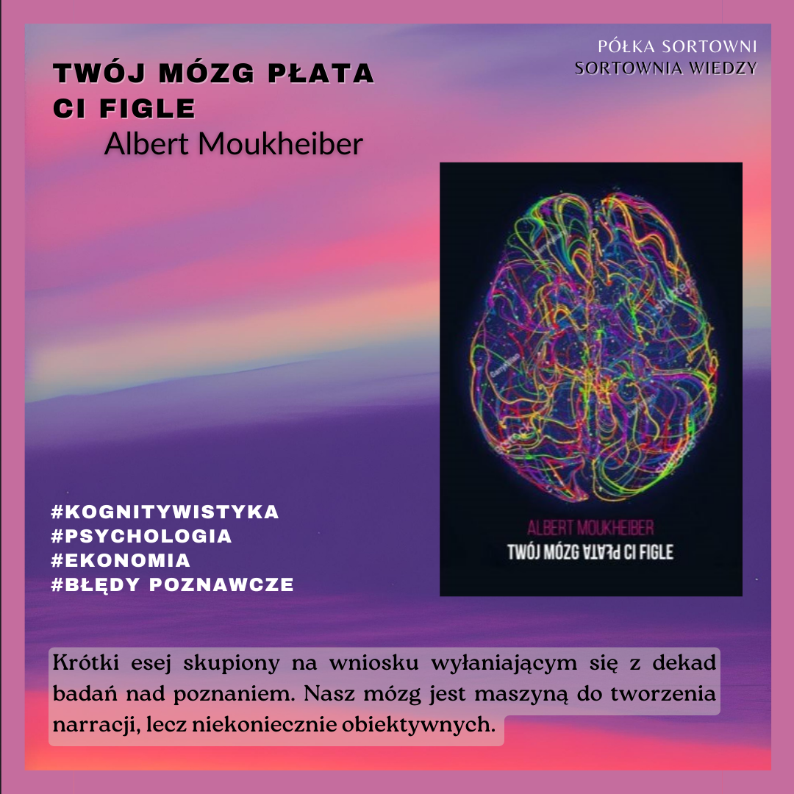

**Twój mózg płata Ci figle** 

**Autor**: Albert Moukheiber 
**Wydawnictwo**: Vis-á-Vis/Etiuda 

Krótki esej skupiony na wniosku wyłaniającym się z dekad badań nad poznaniem. Nasz mózg jest maszyną do tworzenia narracji, lecz niekoniecznie obiektywnych.  

https://lubimyczytac.pl/ksiazka/4943060/twoj-mozg-plata-ci-figle 
https://www.goodreads.com/book/show/61062892-your-brain-is-playing-tricks-on-you?from_search=true&from_srp=true&qid=SqK50Knb31&rank=1 

Moukheiber, A. (2020). Twój mózg płata Ci figle. Vis-á-Vis/Etiuda.
