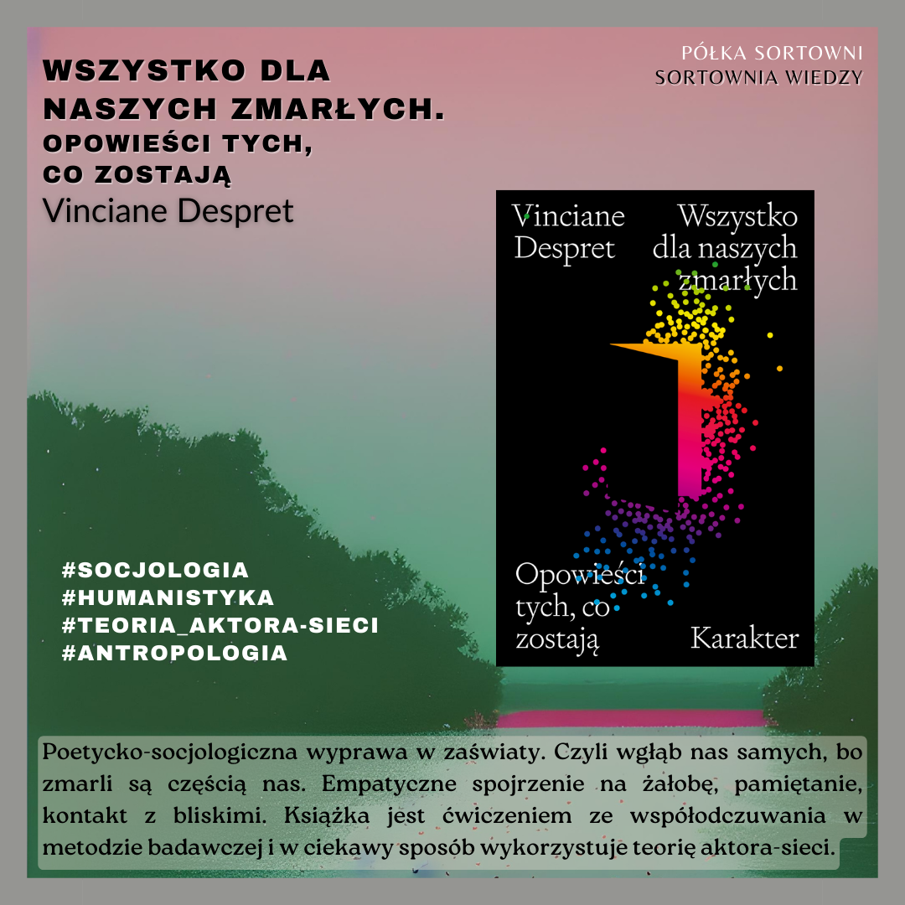

**Wszystko dla naszych zmarłych. Opowieści tych, co zostają** 

**Autorka**: Vinciane Despret  
**Tłumaczka**: Urszula Kropiwiec 
**Wydawnictwo**: Wydawnictwo Karakter 

Poetycko-socjologiczna wyprawa w zaświaty. Czyli wgłąb nas samych, bo zmarli są częścią nas. Empatyczne spojrzenie na żałobę, pamiętanie, kontakt z bliskimi. Książka jest ćwiczeniem ze współodczuwania w metodzie badawczej i w ciekawy sposób wykorzystuje teorię aktora-sieci. 

  

https://lubimyczytac.pl/ksiazka/4973401/wszystko-dla-naszych-zmarlych-opowiesci-tych-co-zostaja  
https://www.goodreads.com/book/show/58553185-wszystko-dla-naszych-zmar-ych-opowie-ci-tych-co-zostaj  
https://www.google.pl/books/edition/Wszystko_dla_naszych_zmar%C5%82ych/5dn_zgEACAAJ?hl=en  

Despret, V. (2021). Wszystko dla naszych zmarłych: Opowieści tych, co zostają (U. Kropiwiec, Tłum.). Karakter.