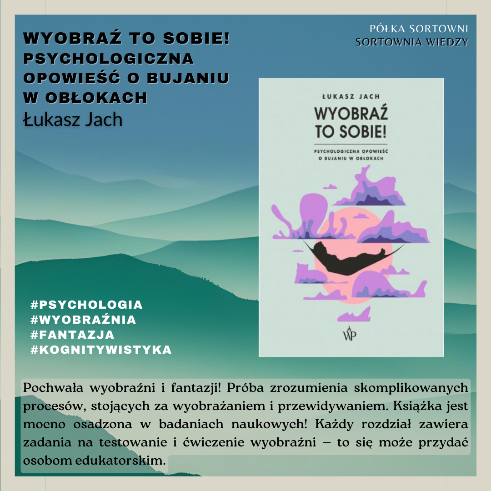

**Wyobraź to sobie! Psychologiczna opowieść o bujaniu w obłokach** 

**Autor**: Łukasz Jach 
**Wydawnictwo**: Wydawnictwo Poznańskie 

Pochwała wyobraźni i fantazji! Próba zrozumienia skomplikowanych procesów, stojących za wyobrażaniem i przewidywaniem. Książka jest mocno osadzona w badaniach naukowych! Każdy rozdział zawiera zadania na testowanie i ćwiczenie wyobraźni — to się może przydać osobom edukatorskim. 

  

https://lubimyczytac.pl/ksiazka/5028207/wyobraz-to-sobie-psychologiczna-opowiesc-o-bujaniu-w-oblokach  
https://www.goodreads.com/book/show/61668442-wyobra-to-sobie-psychologiczna-opowie-o-bujaniu-w-ob-okach 

Jach, Ł. (2022). Wyobraź to sobie! Psychologiczna opowieść o bujaniu w obłokach. Wydawnictwo Poznańskie.
