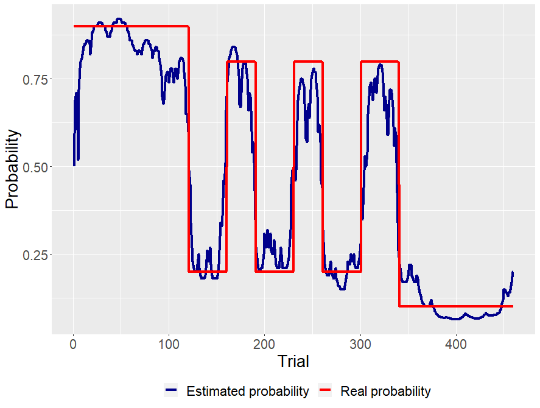
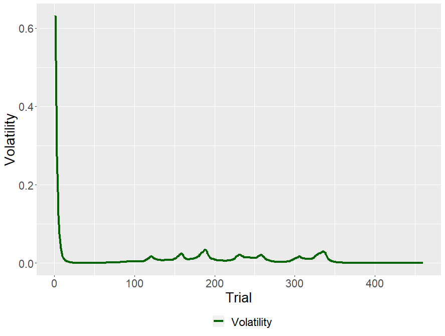
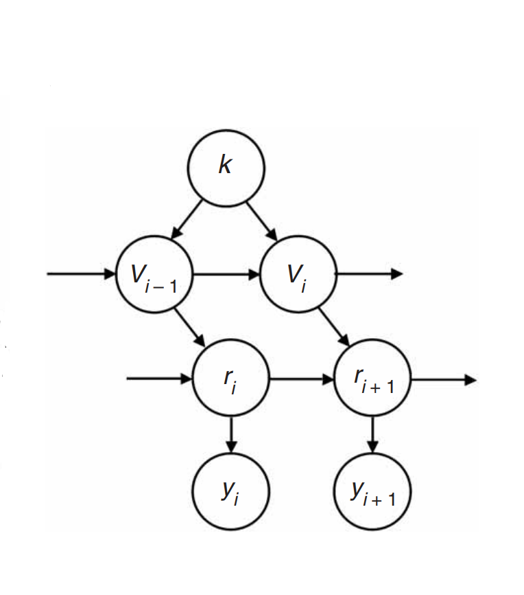

Modelowanie procesów poznawczych to taka dziedzina, dzięki której możemy sięgnąć do czarnej skrzynki, jaką jest umysł. Jednym procesów, który możemy zamodelować, jest uczenie się. Choć my, ludzie, potrafimy nauczyć się czynności poprzez obserwację, czy nawet werbalny komunikat, dzielimy ze wszystkimi zwierzętami starszy (ale nie mniej przydatny) mechanizm. Mowa o warunkowaniu.

Podstawowa zasada warunkowania jest prosta: Jeśli po wykonaniu jakiejś czynności otrzymujemy rezulatat pozytywny, zwiększa się prawdopodobieństwo powtórzenia tej czynności, jeśli negatywny, zmniejsza się. 

Jednym z modeli warunkowania jest model Rescola-Wagner [@sutton2018reinforcement], który wygląda tak:


```{r echo=FALSE, layout="l-body-outset"}
library(knitr)
include_graphics("RL.png")
```
Model jest bardzo prosty. Przewidywaną wartością bodźca $V$ w czasie $i$ jest wartość bodzica w czasie $i-1$ plus błąd predykcji, czyli różnica pomiędzy rezultatem (np. wartością nagrody), a przewidywaną wartością bodźca w czasie $i-1$ , pomnożoną przez stałą $a$. Od wielkości współczynnika uczenia (*learning rate*) $a$ zależy jak szybko agent aktualizuje wartość bodźca. 

Model Rescola-Wagner jest dość prosty i nie odda wszystkich zjawisk zachodzących u ludzi i zwierząt podczas warunkowania. Jednak jego prostota pozwala szybko zrozumieć ideę stojącą za tą klasą modeli - uczenia ze wzmocnieniem (*reinforcement learning models*).

Takie modele wykorzystywane są w kognitywistyce i ekonomii (uczenie się i podejmowanie decyzji), a także w biologii (uczenie ze wzmocnieniem to jedna z podstawowych zasad działania neuronów dopaminergicznych) i robotyce. Ja chciałym się skupić na badaniu przeprowadzonym przez zespół Timothego Behrensa, które wyjątkowo mi się spodobało [@behrens2007learning].

Badani wykonywali proste zadanie, w którym mieli wybierać wiekokrotnie jedną z dwóch opcji. W pierwszej fazie (120 prób) każda z możliwości była związana ze stałym prawdopodbieństwem uzyskania nagrody. Następnie, w drugiej fazie prawdopodobieństwo uzyskania nagrody zmieniało się co 30-40 prób. 

Całą procedurę badani wykonywali w funkcjonalnym rezonansie magnetycznym (fMRI). Dzięki użyciu neurobrazowania, można nie tylko sprawdzić jak dobrze dany model uczenia ze wzmocniem wyjaśnia nam obserwowalne dane (w tym wypadku decyzje badanych), ale możemy sprawdzić czy mózg oblicza wartość bodźca i błąd predykcji w podobny sposób jak model (i jakie ośrodki w mózgu w tym współuczestniczą). 

Behrensa i jego zespół zainteresowali się problemem zmienności środowiska. Jeśli środowisko jest stabilne (prawdopodobieństwa przypisane wyborom/opcjom nie zmieniają się), współczynnik uczenia się powinien być niższy, ponieważ nawet jeśli preferowana przez nas opcja akurat nie dostarczy nagrody, jest to raczej wynikiem przypadku. 
Natomiast jeśli prawdopodobieństwa związane z wyborami zmieniają się (a co za tym idzie zmienia się wartość bodźców), musimy szybko aktualizować wartości bodźców, inaczej z uporem wybieralibyśmy te, których wybranie w przeszłosci dawało często nagrodę. 

Moglibyśmy tak zmodyfikować model Rescola-Wagner, by współczynnik uczenia nie był stały, ale zmieniał się w czasie. Uzyskalibyśmy wtedy informację jak dana osoba dostosowuje swój współczynik uczenia. Nie wiedzielibyśmy jednak dlaczego to robi. Wielkość współczynnika uczenia będzie także zależała od innych czynników. 

Na przykład, gdy nie mamy wcześniejszych informacji na temat wartości bodźców, współczynnik musi być wysoki, byśmy mogli szybko nabyć jakieś przekonania, na podstawie których podejmiemy decyzję. Natomiast, wraz z postępem czasu powinien maleć (wynika to z chartakterystyki uczenia się - wraz z postępem czasu efekty uczenia maleją). 

Jeśli chcielibyśmy wiedzieć jak bardzo współczynnik zmienia się w zależności od niestabilności (*volatility*), a także czy jej monitorowanie jest odzwierciedlone w sygnale fMRI (co interesowało Behrensa), musimy mieć jej jakąś estymatę. 

Behrens stworzył więc algorytm - Bayesowskiego Obserwatora, którego zadaniem było przewidywanie prawdopodobieństw i monitorowanie niestabilności. Uzyskał wartość niestabilności w czasie $i$. Dzięki temu odkrył, że w monitorowaniu zmienności środowiska uczestniczy pewien obszar mózgu - przedni zakręt obręczy.

Ponieważ lubię się pobawić takimi zabawkami, zaimplementowałem go (kod można znaleźć <span style="color:blue">[tutaj](https://github.com/Revan-tech/fuzzy-octo-waddle/tree/main/behrens)</span>). Wygenerowałem zmienną $y$ przyjmującą wartości 0 (brak nagrody) i 1 (nagroda). Przez pierwsze 120 obserwacji prawdopodobieństwo nagrody wynosiło 90%, następnie przez 220 prób prawdopodobieństwo zmieniało się między 80% a 20% co 30 lub 40 prób. W ostatnich 120 obserwacjach prawdopodbieństwo wynosiło 10%. 

Model radzi sobie tak:

```{r echo=FALSE,fig.show = "hold", out.width = "50%"}
library(knitr) 



```

Przy pomocy naszego idealnego obserwatora możemy policzyć teraz niestabilność środowiska. Przy odrobinie wysiłku można zaadaptować model do innych sytuacji, bądź rozwinąć go, by używać niestabilności środowiska jako zmiennej w modelach podejmowania decyzji czy uczenia się. 

Estymowaną niestabilność środowiska moglibyśmy nazwać też niepewnością pierwszego poziomu. Warto wspomnieć, że istnieje model uczenia ze wzmocnieniem - Hierarchical Gaussian Filter, który uwzględnia niepewność decyzyjną $n$ poziomów (właściwie tyle ile chcemy), czyli modeluje też niestabiność niestabilności - i tak dalej [@mathys2014uncertainty]. 

<details>
  <summary><span style="color: blue;">Jak działa model?</span></summary>
  
__Twierdzenie Bayesa__

Bayesowskie modele opierają się na twierdzeniu Bayesa (lub inaczej mówiąc, wzorze na prawdopodobieństwo warunkowe):

$$ P(parameters|data) = \frac{P(data|parameters)P(parameters)}{P(data)}$$
Człon $P(data|parameters)$ (wiarygodność, *likehood*) oznacza prawdopodobieństwo, że dany parametr wygenerował zaobserwowane dane (czyli na przykład prawdopodbieństwo tego, że jeśli prawdopodobieństwo nagrody wynosi 80%, jakie jest prawdopodobieństwo, że zaobserwujemy 1 - czyli nagrodę). 

$P(parameters)$ nazywane prawdopodobieństem *a priori*, oznacza jakie jest prawdopodobieństwo danego parametru. Często opisuje się go jako wcześniejsze doświadczenie, ponieważ możemy wiedzieć, że wystąpienie jakiejś wartości parametru jest mniej prawdopodobne, niż innej (bądź ma pewnien określony rozkład statystyczny). Jeśli tego nie wiemy, $P(parameters)$ przyjmują taką samą wartość dla wszystkich $P(data|parameters)$.

$P(data)$ jest właściwie tylko parametrem skalującym (stałą), bez specjalnej interpretacji. Dlatego powyższy wzór możemy zapisać: 

$$ P(parameters|data) \propto P(data|parameters)P(parameters)$$
gdzie $\propto$ oznacza "jest proporcjonalny do"  

Wreszcie człon $P(parameters|data)$ jest prawdopodbieństwem *a posteriori*, czyli prawdopodbieństwem wartości parametru modelu przy zaobserowanych danych (na przykład, jeśli zaobserwowaliśmy 1, jakie jest prawdopodbieństwo, że prawdopodobieństwo otrzymania nagrody wynosi 66%).


__Proces Markowa__

Proces Markowa to proces stochastyczny, w którym prawdopodobieństwo zdarzenia w czasie $i$ zależy tylko od stanu systemu w czasie $i-1$. Czyli:

$$P(X_i = x|X_{i-1}, X_{i-2}  ... X_1) = P(X_i = x|X_{i-1})$$ 


__Obserwator Bayesowski__

Model Behrensa można zwizualizować następujący sposób:

<center>
{width=350px}
</center>

$y_{i+1}$ czyli nagroda lub jej brak zależy tylko od parametru $r_{i+1}$ - prawdopodobieństwa jej uzyskania. Z kolei parametr $r_{i+1}$ zależy od siebie krok wcześniej $r_{i}$ oraz od niestabilności $v_i$, która sama zależy od $v_{i-1}$ i stałego parametru $k$, który moglibyśmy nazwać niestabilnością niestabilności. Jak widzimy, model Behrensa zakłada proces Markowa (wartości parametrów w czasie $i$ zależą tylko od wartości parametrów w czasie $i-1$). 

Szukamy takich parametrów, które maksymalizują prawdopodobieństwo *a posteriori* $P(r_i,v_i,k|y_i)$. Dzięki temu będziemy poznamy najbardziej prawdopodobne wartości parametrów $r$, $v$ i $k$. 

Używiając twierdzenia Bayesa, wzór na prawdopodobieństwo *a posteriori* wygląda tak: 

$$P(r_i,v_i,k|y_i) \propto \int \int P(y_i|r_i)P(r_{i}|r_{i-1},v_i) P(v_{i}|v_{i-1},k)P(r_{i-1})P(v_{i-1})P(k) dv_{i-1} dr_{i-1} $$

Całka pojawiająca się we wzorze wynika z faktu, że interesuje nas rozkład łączny parametrów w czasie $i$. Innymi słowy szukamy takiego parametru $r_i$, który jest najbardziej prawdopodobny, dla wszystkich $r_{i-1}$.

Potrzebujemy do pełni szczęścia jeszcze poszczególnych prawdopodobieńtw wystepujących we wzorze.

Prawdopodobieństwo $P(y_i|r_i)$, czyli otrzymania nagrody, pod warunkiem prawdopodobieństwa $r_i$ wynosi po prostu $r_i$. Możemy więc zamodelować je rozkładem dwumianowym:

$$P(y_i|r_i) \sim Binomial(r_i)$$

Prawdpodobieństwo $P(r_{i+1}|r_i,v_i)$ Behrens zamodelował rozkładem Beta, jednak ja, kierowany lenistwem, zamodelowałem je rozkładem normalnym ograniczonym na przedziale (0,1): 
$$P(r_{i+1}|r_{i},v_{i}) \sim N^{(0,1)}(r_i,e^{v_{i}})$$

Jak widzimy, prawdopodobieństwo $r_{i+1}$ dane jest rozkładem normalnym o średniej $r_i$ i wariancji $e^{v_{i+1}}$. To jak bardzo prawdopodobny jest większy przeskok pomiędzy $r_i$ do $r_{i+1}$ zależne będzie od tego jak duża jest wariancja $e^{v_{i+1}}$. Właśnie ona jest naszą ukrytą zmienną reprezentującą niestabilność.

Prawdopodobieństwo $P(v_{i+1}|v_i,k)$ również zamodelowane jest rozkładem normalnym: 

$$P(v_{i+1}|v_i,k) \sim N(v_i,e^{k})$$ 

Czyli wielkość przeskoków pomiędzy $v_{i+1}$ i $v_{i}$ zależna jest od parametru k - stałego dla wszystkich $i$, który, a jakże, też zamodelowany jest rozkładem normalnym:

$$P(k) \sim N(0,10^{10})$$

Prawdopodobieństwa $P(r_{i-1})$ i $P(v_{i-1})$ otrzymujemy poprzez "wycałkowanie" z prawdopodobieństwa *a posteriori* z poprzedniej próby $P(r_{i-1},v_{i-1},k|y_{i-1})$ niepotrzebnych parametrów. 

$$P(r_{i-1}) = \int \int P(r_{i-1},v_{i-1},k|y_{i-1}) dv_{i-1}dk $$
$$P(v_{i-1}) = \int \int P(r_{i-1},v_{i-1},k|y_{i-1}) dr_{i-1}dk$$

Po więcej detali polecam zajrzeć do orginalnego artykułu. 


</details>


