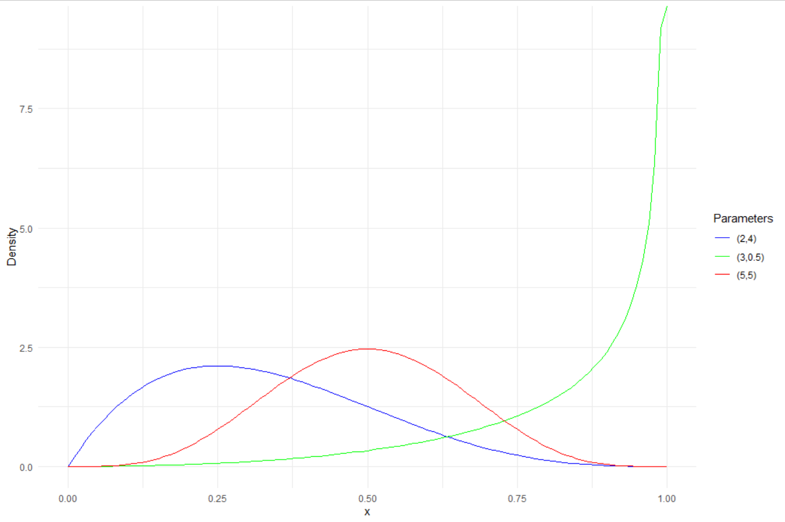

<h1><span style="color:red">Post w budowie</span></h1>


## Mały wstęp

Pomyślałem sobie, że napiszę taki mały tutorial statystyki Bayesowskiej.

Próba wytłumaczenie czegoś komuś jest jedną z najlepszych metod nauki i weryfikacji swojej własnej wiedzy. W przeciwieństwie do rozważań we własnym umyśle, gdy tłumaczy się innym jakieś zagadnienie, nie można nie odpowiedzieć na pewne pytania, czy niektóre rzeczy zgrabnie pominąć :)

Tutorial nie będzie na pewno wyczerpującym podejściem do tematu. Jeśli ktoś potrzebuje metodycznego wprowadzenie do metod bayesowskich, możne znaleźć je świetnej książce "Bayesian Data Analysis" [@gelman2021bayesian]. Tutorial jest raczej pewnego rodzaju przyśpieszonym kursem pozwalający na późniejsze samodzielne eksplorowanie i zabawę statystyką Bayesowską. Forma tutorialu wynika z podejścia w akademii, które dla rozpoczynających karierę naukowców można sprowadzić do zdania: najpierw badaj, potem zastanawiaj się jak zbadać. 

Osobiście preferuję używanie języków programowania i obliczenia w tym tekście będą wykonywane za pomocą R, ale wiele z pokazanych tu rzeczy można także wykonać w graficznym programie statystycznym JASP. W zrozumieniu zawartych tu treści pomoże, jeśli uczestniczyłeś/łaś wcześniej w jakimś kursie statystyki. 

I jeszcze kilka słów wstępu o samej statystyce bayesowskiej. Istnieje obiegowa opinia, że statystyka Bayesowska jest trudniejsza od klasycznej. Osobiście wydaje mi się, że "prostota" klasycznej statystyki wynika z jej dogmatyzmu. Istnieją instrukcje na zastosowanie odpowiednich testów do danych, utarły się schematy, do których należy się stosować, mimo, że czasami są arbitralne. Statystyka Bayesowska wymaga więcej namysłu od badacza, ponieważ nie istnieją tak ostre „reguły kciuka” jak w statystyce klasycznej. 

O statystyce bayesowskiej mówiło się ostatnio, jako rozwiązaniu kryzysu replikacyjnego. Mam pewną obawę, że statystyka bayesowska może tak samo popaść w dogmatyzm, jeśli potraktuje się ją mechanicznie jak klasyczną statystykę. Nie jestem twardym Bayesowcem, to znaczy nie uważam, że należy porzucić statystykę częstościową (tą zwykłą) na rzecz Bayesowskiej. Obie mają pewne zalety i wady. Powtarzam za Kevinem Rosem, że dobry współczesny statystyk korzysta z każdego z podejść w zależności od potrzeb.

## Prawdopodobieństwo

Wszyscy intuicyjnie czujemy czym jest prawdopodobieństwo. Jeśli chcemy sprawdzić czy moneta nie jest obciążona i częściej wypada reszka niż orzeł, najprostszym sposobem jest dokonanie "eksperymentu losowego" i sprawdzenie ile razy wypadnie reszka spośród wszystkich prób. Im więcej razy rzucimy monetą, tym bardziej będziemy pewni otrzymanego wyniku. W statystyce klasycznej wychodzimy z podobnego założenia, formalnie zdefiniowanego tak:

$$ \lim_{n\to\infty} P(A) = \frac{k_n(A)}{n} $$

Słownie możemy przedstawić to założenie tak: Gdy liczba prób dąży do nieskończoności, częstość wystąpień zdarzeń $A$ pośród wszystkich prób będzie się równało prawdopodobieństwu wystąpienia zdarzenia $A$. Innymi słowy im więcej razy rzucimy monetą, tym większe mamy szanse na otrzymanie takiego stosunku reszek do orłów, który jest bliski prawdziwemu prawdopodobieństwu otrzymania reszki. 

W statystyce Bayesowkiej na prawdopodobieństwo patrzy się trochę inaczej. Zakłada się, że prawdopodobieństwo jest miarą pewności, którą możemy przypisać pewnym modelom (hipotezom). Wnioskowanie Bayesowskie można porównać do tego, jak wnioskują ludzie. Mamy jakieś oczekiwania, następnie dostajemy dane i rewidujemy nasze oczekiwania.

Wnioskowanie Bayesowskie opiera się na twierdzeniu Bayesa: 

$$  P(Hipoteza|Dane) = \frac{P(Dane|Hipoteza)P(Hipoteza)}{P(Dane)}$$

$P(Hipoteza)$ nazywane prawdopodobieństwem *a priori*, oznacza uprzednią wiedzę, przed zebraniem danych, które hipotezy są bardziej prawdopodobne. Innymi słowy są to nasze oczekiwania, na przykład, że gdy odkręcimy kran, najprawdopodobniej poleci z niego woda. Również brak wiedzy/oczekiwań jest prawdopodobieństwem *a priori*. Wtedy wszystkie hipotezy można zamodelować jako równie prawdopodobne. 

Człon $P(Dane|Hipoteza)$ (wiarygodność, *likehood*) oznacza prawdopodobieństwo otrzymania danych, że pod warunkiem wygenerowania ich w zgodzie z daną hipotezą (wygenerowania ich przez określony model). Można powiedzieć, że jest to sposób w jaki aktualizujemy nasze przekonania - tzn. nasz model rzeczywistości (po odkręceniu kranu coś z niego leci).

Wreszcie człon $P(Hipoteza|Dane)$ jest prawdopodobieństwem *a posteriori*, czyli prawdopodobieństwem hipotezy w zależności od posiadanych danych. Innymi słowy prawdopodobieństwo *a posteriori* mówi nam jak bardzo zmieniły się nasze przekonania *a priori* pod wpływem danych. Czyli jeśli z kranu popłynęło wino, to zrewidowaliśmy nasze oczekiwania względem tego kranu.  

$P(Dane)$ jest parametrem skalującym (stałą), bez specjalnej interpretacji. O jego roli przekonamy się nieco dalej w tekście. 

Wszystko to wygląda fajnie, ale już na tym etapie może budzić zamieszanie. Czym są owe prawdopodobieństwa? Żeby to dobrze zrozumieć, przypomnimy sobie czym jest prawdopodobieństwo warunkowe, a następnie wyprowadzimy wzór Bayesa. 

### Twierdzenie Bayesa

Prawdopodobieństwo zdarzenia $A$ w zależności zdarzenia B równa się prawdopodobieństwu wystąpienia zdarzeń $A$ i $B$ podzielonym na prawdopodobieństwo zdarzenia $B$: 

$$P(A|B) = \frac{P(A \land B)}{P(B)}$$
By obliczyć prawdopodobieństwo palenia papierosów pod warunkiem bycia mężczyzną musimy po prostu podzielić liczbę mężczyzn palących papierosy przez liczbę wszystkich mężczyzn. 

Zauważmy, że powyższe równanie możemy przekształcić w następujący sposób:

$$  P(A|B)P(B) = {P(A \land B)}$$
$$  \frac{P(A|B)P(B)}{P(A)} = \frac{P(A \land B)}{P(A)} = P(B|A)$$
To co otrzymaliśmy, jest twierdzeniem Bayesa:

$$  P(B|A) = \frac{P(A|B)P(B)}{P(A)}$$

### Dyskretny przykład

By uświadomić sobie przydatność twierdzenia Bayesa wykonajmy małe ćwiczenie. Załóżmy, że opracowaliśmy test pozwalający na wykrycie pewnej choroby z 99% prawdopodobieństwem u osób faktycznie chorych. Możemy zapisać to w następujący sposób $P(Pozytywny|Choroba) = 0.99$. Test jednak daje też wynik fałszywie pozytywny u 3% osób zdrowych $P(Pozytywny|\neg Choroba) = 0.05$. Wiemy także, że nosicielem choroby jest 1 procent populacji $P(Choroba) = 0.01$. Chcielibyśmy się dowiedzieć jakie jest prawdopodobieństwo choroby, jeśli wynik jest pozytywny $P(Choroba|Pozytywny)$. By je obliczyć potrzebujemy jeszcze prawdopodobieństwa otrzymania wyniku pozytywnego. Uzyskać je możemy za pomocą prawa sumy.


<style>
p.comment {
-moz-border-radius: 6px;
-webkit-border-radius: 6px;
background-color: #f0f7fb;
background-image: url(css-box-icon-3.png);
background-position: 9px 0px;
background-repeat: no-repeat;
border: solid 1px #3498db;
border-radius: 6px;
line-height: 18px;
overflow: hidden;
padding: 15px 60px;
}

</style>


<br>

<p class="comment">
**Prawo całkowitego prawdopodobieństwa**
<br>
<br>
Jeśli $B_1$, $B_2$ ... $B_n$ są  parami rozłączne, których suma zdarzeń wynosi 1, to dla dowolnego zdarzenia $A$ zachodzi wzór:
Dla wartości dyskretnych.
$$P(A)=\sum_{B}P(A \land B) $$
Dla wartosci ciągłych.
$$ P(A) = \int_{}P(A \land B)dB$$
</p>
<br>

Czyli, by obliczyć intersujące nas prawdopodobieństwo musimy podstawić odpowiednie wartości do wzoru:

$P(Choroba|Pozytywny) =\frac{P(Pozytywny|Choroba)P(Choroba)}{P(Pozytywny|Choroba)P(Choroba) + P(Pozytywny|\neg Choroba)P( \neg Choroba) }$

Po podstawieniu do wzoru

$$\frac{0.99*0.01}{0.99*0.01 + 0.05*0.99} = 0.166 $$

Tylko 16% procent osób z pozytywnym testem faktycznie będzie miało chorobę. Powyższy przykład obrazuje czemu czasami profilaktyczne badania mogą powodować więcej problemów niż ich brak. Jeśli osoby byłby wysyłane na badanie bez innych wskazań świadczących o chorobie, ponad 85% osób zdrowych, otrzymałoby fałszywy wynik świadczący o chorobie.


## Pewność pomiaru

Rozważmy teraz następujący problem. Mierzymy IQ 15 osób i chcemy się dowiedzieć z jaką pewnością możemy mówić o średniej IQ z próby jako estymacie średniej IQ w populacji. 

### Częstościowcy

W statystyce klasycznej opieramy policzylibyśmy błąd standardowy i przedział ufności zgodnie z paradygmatem Null Hypothesis Significance Testing (NHST). Dla uwidocznienia różnic pomiędzy podejściem Bayesowskim a częstościowym przypominajmy sobie na jakich założeniach opiera się NHST. 

Zgodnie z Centralnym Twierdzeniem Granicznym średnia niezależnych zmiennych losowych o takim samym rozkładzie dąży o rozkładu normalnego gdy liczba zmiennych dąży do nieskończoności. Średnia takiego rozkładu jest równa średniej w populacji, a jej wariancja wynosi $\frac{D^2}{n}$, gdzie $D^2$ to wariancja w populacji. Zwizualizujmy taki rozkład dla średnich z wielkości próby równej 15. Wiemy, że średnia IQ wynosi 100, a odchylenie standardowe 15. 
 

```{r, layout="l-body-outset"}
library(tidyverse)
breaks <- qnorm(c(0, .025, .2, .5, .8, .975, 1),100, 15/sqrt(15))
ggplot(data.frame(x = c(85, 115)), aes(x)) +
scale_fill_brewer("x") +
stat_function(fun = dnorm,n = 1000, args = list(mean = 100, sd = 15/sqrt(15)),geom = "area",
  colour = "gray30", alpha = 0.7, aes(fill = after_stat(x) |> cut(!!breaks),
  group = after_scale(fill))) +
  geom_vline(xintercept = c(100 - 15/sqrt(15)*qnorm(.975), 100 + 15/sqrt(15)*qnorm(.975))) +
  labs(x = "Mean IQ", y = "Density") +
  scale_fill_discrete(name = "P(X < x)", labels = c('0.025', '0.2', '0.5', '0.8',              '0.975','1'))
```

Stworzyliśmy w ten sposób estymowany rozkład wszystkich możliwych średnich IQ z piętnastoosobowych prób. Ten rozkład mówi nam, że losując 15 osobową próbę mamy 95% prawdopodobieństwo na wylosowanie takiej próby, w której średnie IQ znajdzie się w przedziale ufności oznaczonym przez czarne pionowe kreski na wykresie. 95% jest tu wartością umowną, badacz może przyjąć dowolny poziom ufności. 

Zwykle gdy dokonujemy pomiaru, nie znamy średniej i wariancji i dopiero estymujemy je z naszej próby. Jeśli będziemy wielokrotnie wykonywać pomiar i wyznaczać przedziały ufności, możemy spodziewać się, że w 95% w przedziałach ufności z prób znajdzie się prawdziwa wartość średniej IQ. 

```{r, layout="l-body-outset"}
set.seed(999)
data <- data.frame()

for(i in 1:50) {
  sample <- rnorm(15, 100, 15)
  data <- rbind(data,data.frame(Mean = mean(sample), se = sd(sample)/sqrt(15)))
}

data$Sample <-1:50

ggplot(data, aes(x = Sample, y = Mean)) +       
  geom_errorbar(aes(ymin = Mean - se*qnorm(.975), ymax = Mean + se*qnorm(.975))) +
  coord_flip() +
  geom_hline(yintercept = 100, colour = "red" )

```

No dobrze, jaki z płynie wniosek? W idealnej sytuacji, gdy nie ma błędów systematycznych, wszystkie założenia są spełnione i próba była wylosowana w sposób reprezentatywny, kiedy wykonujemy wiele pomiarów średniej, średnio 95% przedziałów ufności dla próby powinno zawierać w sobie prawdziwą średnią.

Załóżmy teraz, że wykonaliśmy pomiar IQ w 15 osobowej próbie i stwórzmy sobie takie dane:

```{r}
iq <- c(87, 112, 83, 95, 106,105, 123, 107, 103, 98, 137, 114, 90, 90, 117)
data <- data.frame(IQ = "Our sample", Mean = mean(iq), se = sd(iq)/sqrt(length(iq)))
ggplot(data, aes(x = IQ, y = Mean)) +        
  geom_point() +
  geom_errorbar(aes(ymin = Mean - se*qnorm(.975), ymax = Mean + se*qnorm(.975))) +
  coord_flip()

```

Jaką daje nam to pewność co do naszego pomiaru? Na ile możemy być pewni, że prawdziwa średnia leży w tym przedziale ufności? Tu zaczynają się trudności. 

NHST historycznie powstała do stosowania w warunkach przemysłowych, gdzie wykonujemy bardzo wiele identycznych badań, na przykład w kontroli jakości produktów. Na przykład, w Ikei produkowany jest pewien element do konstrukcji szafek. Każdy kolejny wyprodukowany egzemplarz tego elementu różni się odrobinę w długości od schematu, ale dobrze skalibrowana maszyna przycinająca elementy działa tak, że te różnice nie są na tyle duże by element nie pasował do szafki.

Osoba odpowiedzialna za kontrolę jakości regularnie wykonuje pomiary długości $n$ elementów każdego, by sprawdzić czy średnia długość elementów nie wykracza założonego przedziału bezpiecznej różnicy w długości. Obliczył sobie ile elementów musi zmierzyć dziennie, by przedział ufności pokrywał się z tą bezpieczną różnicą przy ustalonym poziomie ufności 90%. Jeśli maszyna będzie działać poprawnie, kontroler otrzyma średnio 1 fałszywy alarm na 10 dni. 

Zasadniczo, w idealnej sytuacji mamy 95% prawdopodobieństwo na wylosowanie takiej próby,  której przedział ufności będzie zawierał prawdziwą średnią. Często spotykane, choć nie do końca zasadnym, jest twierdzenie, w danej próbie istnieje 95% prawdopodobieństwo, że w przedziale zawiera się średnia. 95% prawdopodobieństwo mamy przed wylosowaniem próby, gdy już ją mamy, nie wiemy co wylosowaliśmy.  

### Bayesowcy

No dobrze. Czas na Bayesowskie podejście do problemu. Chcemy obliczyć $P(Hipoteza|Dane)$. Co jest jednak naszą hipotezą? O ile w przypadku zmiennej binarnej jak choroba i jej brak jest to proste, tutaj nasza hipoteza dotyczy wartości średniej - wartość średniej jest raczej zmienną ciągłą, może być dowolna. Dlatego $P(Hipoteza|Dane)$ będzie rozkładem prawdopodobieństwa dla każdej możliwej wartości średniej. 

Rozkład IQ jest, zgodnie z teorią, rozkładem normalnym. Dlatego $P(Dane|Hipoteza)$ możemy zamodelować jako prawdopodobieństwo otrzymania danych pod warunkiem określonych wartości średniej i odchylenia rozkładu normalnego, które nazywamy parametrami. Gdy mamy dużo parametrów, zwykle dla wygody oznaczmy je literką $\theta$, która symbolizuje wektor parametrów. 

My jednak mamy tylko dwa parametry, więc nasze $P(Dane|Hipoteza)$ zapiszemy jako $P(y| \mu ,\sigma)$, które jest rozkładem prawdopodobieństwa, mówi nam jak prawdopodobne jest wylosowanie wartości $y$ z rozkładu normalnego $N(\mu,\sigma)$. Na przykłd, gęstość prawdopodobieństwa otrzymania wartości 6 z rozkładu $N(4,2)$ wynosi:

```{r}
dnorm(6,4,2)
```

Zauważmy, że chcemy by nasza funkcja wiarygodności dawała prawdopodobieństwo wszystkich danych jakie mamy. Ponieważ dane (obserwacje) które mamy są losowe i od siebie niezależne, prawdopodobieństwo ich wylosowania równa się ich iloczynowi:

$$P(A \land B) = P(A)P(B)$$
Czyli prawdopodobieństwo wylosowania całego zbioru danych z rozkładu o określonych parametrach będzie iloczynem prawdopodobieństwa wylosowania każdej obserwacji z osobna: 

$$P(y|\mu,\sigma) = \prod_{i=1}^{n}P(y_i|\mu,\sigma) = P(y_1|\mu,\sigma)*P(y_2|\mu,\sigma)...P(y_n|\mu,\sigma)$$.

Skoro mamy już naszą funkcję wiarygodności, potrzebujemy jeszcze naszego prawdopodobieństwa *A priori* $P(\mu,\sigma)$. Zakładamy, że wartość średniej jest niezależna od wartości odchylenia standardowego, czyli $P(\mu,\sigma) = P(\mu) P(\sigma)$. Tak jak już wspomniałem, prawdopodobieństwo *a priori* przedstawia stan wyjściowy (np. naszą wcześniejszą wiedzę). 

Jaką wiedzę mamy na temat średniego IQ? Wiemy, że w populacji wynosi 100 (tak jest skonstruowana ta miara). Raczej nie podejrzewamy, dużych odstępów od tej wartości więc możemy zamodelować $P(\mu)$ rozkładem normalnym o średniej 100 i odchyleniu 2 $N(100,3)$. Wiemy też, że odchylenie standardowe wynosi 15, ale na potrzeby tego ćwiczenia udamy, że tego nie wiemy. A skoro nie mamy żadnej wcześniejszej wiedzy na temat SD, uznajemy że każda wartość SD jest tak samo prawdopodobna i zamodelujemy $P(\sigma)$ rozkładem jednostajnym (prawdopodobieństwo wylosowania każdej wartości z zadanego przedziału jest takie same). 

Nasz wzór możemy zapisać:

$$P(\mu ,\sigma|y) = \frac{P(y| \mu ,\sigma)P(\mu)P(\sigma)}{P(y)}$$

Potrzebujemy jeszcze prawdopodobieństwa $P(y)$. Ponownie wykorzystujemy prawo sumy, tym razem dla zmiennych ciągłych:

$$P(y) = \int_{-\infty}^{\infty}\int_{-\infty}^{\infty}P(y| \mu ,\sigma)P(\mu)P(\sigma)d\mu d\sigma$$

Choć ta podwójna całka może wyglądać dla niektórych przerażająco, można skonceptualizować ją sobie jako sumowanie członu $P(y| \mu ,\sigma)P(\mu)P(\sigma)$ po wszystkich wartościach $\mu$ i $\sigma$. 

Na marginesie, zasadniczo nie musimy jej obliczać ponieważ jest to wartość stała, która skaluje otrzymany rozkład *post priori* by suma prawdopodobieństw równała się 1. Dlatego nasz wzór możemy zapisać: 

$$P(\mu ,\sigma|y) \propto P(y| \mu ,\sigma)P(\mu)P(\sigma)$$
Co oznacza, że nasz rozkład $P(\mu ,\sigma|y)$ jest proporcjonalny do $P(y| \mu ,\sigma)P(\mu)P(\sigma)$.

Teraz możemy policzyć nasze szukany rozkład prawdopodobieństwa $P(\mu ,\sigma|y)$. W statystyce bayesowskiej popularnością cieszą się rozwiązania numeryczne, ponieważ rozwiązania analityczne (czyli rozwiązania danego problemu czysto za pomocą wzorów) często nie istnieją. 

By obliczyć nasze rozwiązanie, też posłużymy się metodą numeryczną. Będzie ona bardzo prosta, co pozwoli prześledzić dokładnie jak wykonywane są obliczenia, jednak w praktyce stosuje się trochę bardziej skomplikowane metody, które omówimy w następnych częściach tutorialu. 

Równania wyglądają czasami bardzo abstrakcyjnie, zwłaszcza jeśli nie można sobie dokładnie wyobrazić "rzeczy", którą dane równanie reprezentuje. Kod przydaje się w takich momentach. Po każdej wykonanej linijce można sprawdzić co nam wyszło i powiązać to z matematycznym zapisem. 


```{r, layout="l-body-outset"}
# Dane z naszej próby
iq <- c(87, 112, 83, 95, 106,105, 123, 107, 103, 98, 137, 114, 90, 90, 117)

# To są nasze parametry czyli możliwe wartości parametrów mu i sigma. 
# Ponieważ jest to proste przybliżenie numeryczne, ograniczamy możliwe wartości średniej między 50 a 150, dla otchylenia standardowego między 0.1 a 50.
pars <- expand.grid(mu = seq(50, 150, length.out = 300), 
                    sigma = seq(0.1, 50, length.out = 300))

# Liczymy marginalne rozkłady a priori.
pars$mu_prior <- dnorm(pars$mu, mean = 100, sd = 3)
pars$sigma_prior <- dunif(pars$sigma, min = 0.1, max = 50)

# By uzyskać łączne prawdopodobieństwo a priori mnożymy je przez siebie.  
pars$prior <- pars$mu_prior * pars$sigma_prior

# Obliczamy wiarygodność 
for(i in 1:nrow(pars)) {
  # Prawdopodobieństwo wylosowania danej obserwacji z rozkładu normalnego o parametrach mu i sigma.
  likelihoods <- dnorm(iq, pars$mu[i], pars$sigma[i])
  # Mnożymy by uzyskać wiarygodność
  pars$likelihood[i] <- prod(likelihoods)
}
# Mnożymy wiarygodność przez prawdopdobieństwo a priori. 
pars$probability <- pars$likelihood * pars$prior

#Otrzymaną wartość dzielimy przez P(y). 
pars$probability <- pars$probability/sum(pars$probability)

# Voilà, mamy nasz rozkład prawdopodobieństwa P(mu, sigma| y)
library(lattice)
library(viridisLite)
coul <-  viridis(1000)
levelplot(probability ~ mu * sigma, data = pars, col.regions = coul)

```

Widzimy tu prawdopodobieństwo, że dana kombinacja parametrów $\mu$ i $\sigma$ wygenerowała nasze dane. W odróżnieniu do statystyki częstościowej odpowiedzią na nasze pytanie jest nie punktowa wartość parametru, ale jego rozkład $P(\theta|y)$. Możemy skonstruować przedział, w którym zawrze się 95% prawdopodobieństwa. Nazywa się go przedziałem wiarygodności. W odróżnieniu do przedziału ufności, interpretacja przedziały wiarygodności mówi: Biorąc pod uwagę dane, które mamy, oraz prawdopodobieństwa *a priori*, mamy 95% prawdopodobieństwo, że parametr, który wygenerował dane jest w przedziale wiarygodności. 

Weźmy rozkład marginalny dla średniej za pomocą prawa sumy:


```{r, layout="l-body-outset"}
mu = pars %>% group_by(mu) %>% summarise(probability = sum(probability))
cs = cumsum(mu$probability)
boundary_1 = mu$mu[which(cs < 0.025)[length(which(cs < 0.025))]]
boundary_2 = mu$mu[which(cs >= 0.975)[1]]
ggplot(mu, aes(x = mu,y = probability))+
  geom_line(colour = 'light blue') +
  xlim(92,111) +
  geom_area(alpha = 0.75, fill = 'light blue') +
  geom_vline(xintercept = c(boundary_1, boundary_2))


```


Zastanówmy się co by się stało gdybyśmy ponowili nasze badanie. W przypadku statystyki częstościowej musielibyśmy powtórzyć całe postępowanie (tak, technicznie możemy zebrać dane z obu badań i policzyć z nich przedział ufności czy inną statystykę, ale nie byłoby to zgodne z założeniami testów statystycznych). W przypadku bayesowskim możemy potraktować nasz rozkład *post priori* $P(\mu|y)$ jako rozkład *a priori* $P(\mu)$ w następnym badaniu.

Średnia IQ w naszej bayesowskiej analizie wyszła nieco mniejsza niż w częstościowej, ponieważ zastosowaliśmy informatywny rozkład *a priori*. Tu właśnie mamy do czynienia z elementem "subiektywnym". Możliwość arbitralnego doboru wyjściowego przekonania co do stanu rzeczy, była dla statystyków częstościowych czymś nie do przyjęcia. Jak się jednak przekonamy, dobór prawdopodobieństwa *a prori* nie jest aż taką arbitralną decyzją, a rozkłady *a priori* posiadają także niesubiektywistyczną interpretację. 

No dobrze, wynikiem analizy częstościowej i bayesowskiej jest jakiś przedział. Może interpretacje się różnią, ale czy w praktyce nie wychodzi na to samo? Otóż nie. Przedziału wiarygodności używamy w różnych sytuacjach, ale statystyka bayesowska nie sprowadza się do bayesowskiego p-value. 


## Przykład praktyczny

Załóżmy, że korzystamy z internetowej księgarni, która ma system oceny książek przez czytelników. Dla uproszczenia załóżmy, że internauci mogą jedynie polecić książkę lub ją nie polecić. Wybraliśmy sobie trzy książki, które nas interesują, ale stać nas na tylko jedną. Chcemy więc dokonać finalnego wyboru sugerując się ocenami innych. Książkę A poleca 8 z 10 czytających, książkę B poleca 35 z 50, a książkę C poleca 60 z 100. 

Odsetek poleceń książki w stosunku do wszystkich głosów, możemy potraktować jako ocenę jakości książki. Chcemy więc, by ta wartość była jak największa. Ale jednocześnie chcemy nasza miara jakości była jak najbardziej pewna. A jaka jest najbardziej pewna? Ta która ma najwięcej głosów (danych). Jak więc wybrać książkę, która ma największe prawdopodobieństwa bycia dobrą lekturą? 
Zauważmy, że prawdopodobieństwo wylosowania $k$ ocen pozytywnych z $n$ wszystkich ocen danej książki, jeśli książka ma prawdopodobieństwo $p$ otrzymania recenzji pozytywnej możemy zamodelować rozkładem dwumianowym.

<br>
<br>
<p class="comment">
**Rozkład dwumianowy**
<br>
<br>
Rozkład dwumianowy modeluje prawdopodobieństwo uzyskania $k$ sukcesów z $n$ prób, gdy prawdopodobieństwo sukcesu wynosi $p$. Dany jest wzorem:
<br>
$$ P(k)  =  {{n}\choose{k}} \cdot p^k(1-p)^{n-k}$$
</p>
<br>
W statystyce klasycznej najlepszym estymatorem $p$ jest po prostu $\frac{k}{n}$. Nie uwzględnia to jednak niepewności pomiaru. My jednak chcielibyśmy podejść do problemu bayesowsko. Musimy więc zdefiniować wszystkie potrzebne zmienne. 

Zmienną, której rozkład chcemy poznać jest $p$, dlatego $p$ będzie naszą hipotezą. Zauważmy, że $p$ może być dowolną wartością z przedziału <0,1>. Dane to recenzje pozytywne i negatywne. Mamy już dobrego kandydata na funkcję wiarygodności. Prawdopodobieństwo uzyskania $k$ poleceń na $n$ ocen pod warunkiem konkretnej wartości $p$ zamodelujemy rozkładem dwumianowym. 

$$P(k,n|p) = {{n}\choose{k}} \cdot p^k(1-p)^{n-k}$$

Potrzebujemy jeszcze prawdopodobieństwa *a priori* $P(p)$. Zauważmy, że ponieważ szukane przez nas $p$ jest prawdopodobieństwem, może przyjmować dowolne wartości z przedziału <0,1>. Do modelowania prawdopodobieństwa prawdopodobieństwa często wykorzystuje się rozkład Beta.


<br>
<p class="comment">
**Rozkład Beta**
<br>
<br>
Rozkład Beta to rozkład prawdopodobieństwa, którego nośnik (przedział dla którego funkcja zwraca wartości większe od 0) to <0,1>. Rozkład ma dwa parametry kształtu $\alpha$ i $\beta$. Dany jest wzorem:
<br>
$$ P(x)  =  \frac{x^{\alpha-1}(1-x)^{\beta-1}}{Beta(\alpha,\beta)}$$
W mianowniku mamy funkcję Beta. Dla wygody zapisuje się jako $B(\alpha,\beta)$.
<br>
Wartość oczekiwana rozkładu Beta to:
$$E(x) = \frac{\alpha}{\alpha+ \beta}$$
<br>
Na wykresie kształt rozkładu dla różnej wartości parametrów. 
<br>
<br>

</p>
<br>

A więc $P(p)$ możemy zamodelować rozkładem Beta.

$$ P(p)  =  \frac{p^{\alpha-1}(1-p)^{\beta-1}}{B(\alpha,\beta)}$$

Co wiemy parametrach tego rozkładu? Prawdopodobnie nic, ale możemy zastosować metodę zwaną empirycznym Bayesem. To znaczy, weźmiemy rozkład *a priori* z danych. Nie jest to ortodoksyjne podejście Bayesowskie, które zakłada zdefiniowanie rozkładów *a priori* przed spojrzeniem na dane. Niemniej, człowiek musi sobie jakoś radzić. 

Księgarnia internetowa posiada oceny wszystkich książek, jakie są w jej posiadaniu. Załóżmy, że mamy dostęp do tych danych (zasymulujmy je) i stwórzmy histogram wszystkich ocen. 

```{r}
set.seed(123)
x = rbeta(10000,10,10)
hist(x)
```

Na histogramie widzimy jak często pojawiają się dane oceny. Rozkład jest skupiony symetrycznie wokół wartości 0.5, które występują najczęściej. Im wartości bardziej oddalone od 0.5 tym rzadziej występują. Oznacza to, że książki bardzo dobre, albo bardzo złe są rzadsze od przeciętnych. 

Ten rozkład jest sensownym wyborem rozkładu *a priori*. Mówi nam jak prawdopodobne jest, że wylosujemy książkę o danej ocenie, zanim zobaczymy ocenę konkretnej pozycji. 

Wykorzystajmy ten rozkład by dobrać wartości $\alpha$ i $\beta$. Wyestymujmy parametry rozkładu z danych:

```{r}
fit <- function(pars,x) {-sum(log(dbeta(x,pars[1],pars[2])))}
start <- c(1,1)
names(start) <-c('a','b')
recov <- nlminb(start, fit, x = x, lower = -Inf, upper = Inf)
round(recov$par, 2)

```
Fantastycznie. Mamy wszystko czego potrzebujemy by obliczyć nasz rozkład:

$$P(p|k,n) = \frac{P(k,n|p)P(p)}{P(k,n)} $$
Zdradzę wam teraz, że rozwiązaniem jest takie, że $P(p|k,n)$ jest rozkładem Beta o parametrach $\alpha = \alpha_0 + k$ i $\beta = \beta_0 + n - k$, gdzie $\alpha_0$ i $\beta_0$ to parametry rozkładu *a priori*. 

Analityczną forma $P(p|k,n)$ istnieje. Rozkład Beta jest **zgodnym rozkładem *a priori* ** (*conjugate prior*) dla rozkładu dwumianowego. To znaczy, że w tym wypadku nie musimy przybliżać rozwiązania metodami numerycznymi, ale możemy je wprost obliczyć. 

Jeśli kogoś interesują obliczenia, które nie są trudne, a mogą pomóc zrozumieć jak rozkłady *a priori*, *post priori* i wiarygodność są powiązane, zapraszam do rozwinięcia tekstu poniżej. 

<details>
  <summary><span style="color: blue;">Kliknij mnie</span></summary>
---

Podstawmy wszystkie rozkłady pod nasze równanie:

$$P(p|k,n) =\frac{{{n}\choose{k}} \cdot p^k(1-p)^{n-k} \frac{p^{\alpha-1}(1-p)^{\beta-1}}{B(\alpha,\beta)}}{\int{{n}\choose{k}} \cdot p^k(1-p)^{n-k} \frac{p^{\alpha-1}(1-p)^{\beta-1}}{B(\alpha,\beta)}dp} $$

**Nie wygląda zbyt zachęcająco, prawda?** Ale spokojnie, rozwiązanie tego równania jest bardzo proste. Weźmy wszystkie człony równania, które nie zależą od $p$ i zapiszmy je jako $C$.

$$P(p|k,n) = C*p^k(1-p)^{n-k}p^{\alpha-1}(1-p)^{\beta-1} = C* p^{\alpha-1 +k}(1-p)^{\beta-1 + n - k}$$
Gdzie:

$$ C = \frac{{{n}\choose{k}}}{B(\alpha,\beta)\int{{n}\choose{k}} \cdot p^k(1-p)^{n-k} \frac{p^{\alpha-1}(1-p)^{\beta-1}}{Beta(\alpha,\beta)}dp} $$

No dobra, teraz mała sztuczka. Przyjmijmy, że $\alpha = \alpha_0 +k$ i $\beta = \beta_0 + n - k$, gdzie $\alpha_0$ i $\beta_0$ to parametry rozkładu *a priori*. Zauważmy, że ponieważ $C$ nie zależy od $p$, to jest jakąś wartością stałą, skalującą rozkład. 

$$P(k,n|p) \propto p^{\alpha-1}(1-p)^{\beta-1}$$

Zauważmy teraz, że rozkład Beta jest proporcjonalny do $p^{\alpha-1}(1-p)^{\beta-1}$:

$$\frac{p^{\alpha-1}(1-p)^{\beta-1}}{B(\alpha,\beta)}\propto p^{\alpha-1}(1-p)^{\beta-1}$$

Nasz rozkład jest proporcjonalny do rozkładu Beta. A ponieważ nasz $P(p|k,n)$ jest rozkładem prawdopodobieństwa, to jego suma/całka  musi równać się 1. Rozkładem proporcjonalnym do rozkładu Beta, którego suma/całka wynosi 1, **jest właśnie rozkład Beta**, a więc:

$$ C = \frac{1}{B(\alpha,\beta)}$$

Czyli nasz rozkład *a posteriori* $P(p,|k,n)$ jest rozkładem Beta o parametrach $\alpha = \alpha_0 + k$ i $\beta = \beta_0 + n - k$.

---

</details>


Wiemy już, że rozkłady $P(p|k,n)$ dla każdej książki to rozkłady Beta o następujących parametrach:

$$A_p \sim Beta(17.95, 11.96)$$
$$B_p \sim Beta(39.93, 19.93)$$
$$C_p \sim Beta(64.93, 44.93)$$

Zobaczmy je na wykresie razem z wykresem *a priori*:

```{r}

library(tidyverse)
fun.1 = function(x){dbeta(x,17.95, 11.96)}
fun.2 = function(x){dbeta(x,44.95, 24.96)}
fun.3 = function(x){dbeta(x,69.95, 49.96)}
fun.4 = function(x){dbeta(x,9.95, 9.96)}
colors <- c("A" = "blue", "B" = "green", "C" = "red", "a priori" = "black")

ggplot(data = data.frame(x = 0), mapping = aes(x = x)) + 
  stat_function(fun = fun.1, aes(color = "A")) + 
  stat_function(fun = fun.2, aes(color = "B")) +
  stat_function(fun = fun.3, aes(color = "C")) +
  stat_function(fun = fun.4, aes(color = "A priori")) +
  xlab("p") + ylab("Density") + labs(color = "Legend") + 
  scale_colour_manual("Rozkład", values = colors) + 
  xlim(0,1) +
  theme_minimal()

```

Czarna linia to wykres *a priori*. Symbolizuje naszą wiedzę na początku, jak prawdopodobne jest wybranie losowej książki o danej ocenie. Pozostałem linie pokazują jak zmieniły się nasze przekonania w stosunku do konkretnych książek po zobaczeniu ich oceny. By otrzymać bayesowskie estymaty $p$ dla każdej z książek, policzmy sobie średnie rozkładów *post priori*.

$$E(A_p) = 0.6$$
$$E(B_p) = 0.64$$
$$E(C_p) = 0.58$$

Jak widzimy, książka B ma największe prawdopodobieństwo bycia najlepszą książką. Co tu się właściwie zadziało? Wszystkie prawdopodobieństwa są mniejsze, niż gdybyśmy wzięli po prostu częstościową estymatę $\frac{k}{n}$.  

Estymata bayesowska oceny jest mniejsza od częstościowego odpowiednika dla każdej z książek. Dzieje się tak dlatego, że rozkład *a priori* wskazuje, że prawdopodobieństwa bliższe 0.5 - średniej rozkładu *a priori* są bardziej prawdopodobne i "ściąga" rozkłady *post priori* w swoją stronę. Jednocześnie bayesowska ocena książki C najmniej się różni od estymaty częstościowej, dlatego, że ocena książki C składa się z największej ilości głosów (obserwacji).

Żeby to zwizualizować, załóżmy teraz, że wszystkie trzy książki mają 0.8 pozytywnych ocen, ale różnią się liczebnością jak w poprzednim przykładzie i popatrzmy na wykres:

```{r}
library(tidyverse)
fun.1 = function(x){dbeta(x,17.95, 11.96)}
fun.2 = function(x){dbeta(x,49.95, 19.96)}
fun.3 = function(x){dbeta(x,89.95, 29.96)}
fun.4 = function(x){dbeta(x,9.95, 9.96)}
colors <- c("A" = "blue", "B" = "green", "C" = "red", "a priori" = "black")

ggplot(data = data.frame(x = 0), mapping = aes(x = x)) + 
  stat_function(fun = fun.1, aes(color = "A")) + 
  stat_function(fun = fun.2, aes(color = "B")) +
  stat_function(fun = fun.3, aes(color = "C")) +
  stat_function(fun = fun.4, aes(color = "A priori")) +
  xlab("p") + ylab("Density") + labs(color = "Legend") + 
  scale_colour_manual("Rozkład", values = colors) + 
  xlim(0,1) +
  theme_minimal()
```

Im więcej mamy danych (obserwacji), tym mniej istotne staje się prawdopodobieństwo *a priori*. Jednocześnie im bardziej informatywny rozkład *a priori* (im węższy, im więcej gęstości prawdopodobieństwa jest skupione wokół danej wartości) tym więcej danych trzeba by rozkład *post priori* różnił się od niego. 

## Podsumowanie

W statystyce częstościowej dane są modelowane jako zmienne losowe, a parametry traktowane są jako stałe. W analizie staramy się oszacować najlepszą możliwą punktową wartość tego parametru. Jak zauważyliśmy, analiza Bayesowska zwraca nam rozkład prawdopodobieństwa parametru, którego szukamy. Rozkład reprezentuje nasz poziom pewności co do wartości parametru. W podejściu Bayesowskim, dane są stałe, a parmetry są zmiennymi losowymi. To znaczy, że szukane przez nas parametry reprezentujemy jako rozkład statystyczny, pod warunkiem zebranych przez nas danych. Gdy otrzymujemy nowe dane, możemy aktualizować naszą pewność co do prawdopodobieństwa konkretnych wartości parametrów. 

Mam nadzieję, że pokazanymi tu przykładami udało mi się pokazać na czym polega wnioskowanie Bayesowskie. W następnej części zajmiemy się budowaniem i estymowaniem modeli Bayesowskich. 