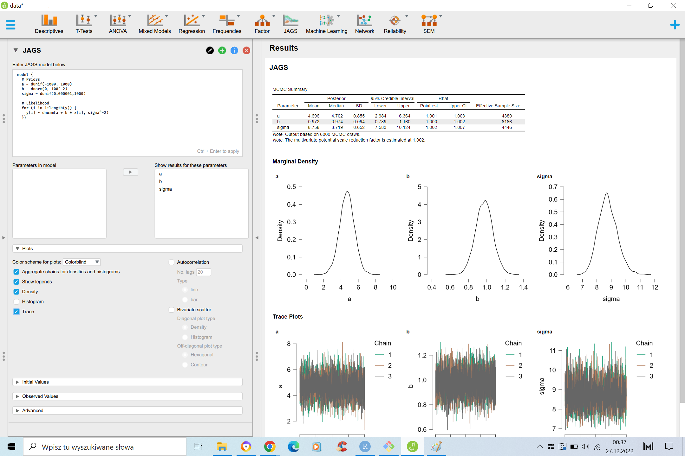

Dzisiejszy wpis będzie krótki. Pokażę wam jak zrobić to co robiliśmy w poprzedniej <span style="color:blue">[części](https://revan-tech.github.io/posts/2022-10-30-tutorial-bayes-ii/)</span>  przy użyciu oprogramowania, które pozwoli nam na tworzenie i estymowanie (przy użyciu MCMC) nawet bardzo skomplikowanych modeli w łatwy sposób. Możliwości jest kilka, ja przedstawie wam JAGS (*Just Another Gibbs Sampler*). Jest to samodzielne oprogramowanie, które można używać bezpośrednio lub za pomocą języków programowania takich jak **R**, a także graficznego programu statystycznego JASP. Pobrać możecie go <span style="color:blue">[tutaj](https://mcmc-jags.sourceforge.io/
)</span>.

### JAGS

Powtórzmy naszą bayesowską regresję z tym razem przy użyciu JAGS. Stwórzmy zbior danych:

```{r tidy=FALSE, results='hide',fig.keep='all', layout="l-body-outset"}

library(rjags)
library(coda)
library(MCMCvis)

x = rnorm(100,0,10)
y = 5 + x + rnorm(100,0,10)
data = data.frame(y,x)
```

Musimy zdefiniować kod naszego modelu. JAGS używa dosyć intuicyjnego kodowania BUGS. Model regresji będzie wyglądał tak:

```{r}
mod = "model {
  # Priors
  a ~ dunif(-1000, 1000)
  b ~ dnorm(0, 100^-2)
  sigma ~ dunif(0.000001,1000)
  
  # Likelihood
  for (i in 1:length(y)) {
    y[i] ~ dnorm(a + b * x[i], sigma^-2)
  }}"

```

Operator ~ oznacza, że parametr po lewej stronie dany jesr rozkładem po prawej. Ponieważ w naszym kodzie tylko zmienna **Y** występuje w danych, JAGS automatycznie rozpozna, że zdefiniowany rozkład **Y** jest funkcją wiarygodności. Zauważcie, że gdy definuje **b** jako wartość losowaną z rozkładu normalnego $N(0,100)$, jako drugi argument podałem $100^{-2}$. JAGS zamiast odchylenia standardowego dla rozkładu normalnego przyjmuje **precyzję** (*precision*), czyli odwrotność wariancji. Po więcej szczegółów polecam zajrzeć do <span style="color:blue">[dokumentacji](https://people.stat.sc.edu/hansont/stat740/jags_user_manual.pdf)</span>. 


```{r}

# Parametry, które chcemy śledzić. 
params = c("a","b","sigma")

## Hiperparametry
n.adapt = 100
# Liczba iteracji adaptacji
ni = 3000
# Liczba iteracji "wypalania"
nb = 3000
# Liczba próbek z rozkładu post priori
nt = 1
# Odchudzanie - 1 oznacza, bierzemy każdą próbkę z rozkładu post priori
nc = 3
# liczba łańcuchów

# Inicjacja modelu
jmod = jags.model(file = textConnection(mod), data = data, n.chains = nc, inits = NULL, n.adapt = n.adapt)

# Wypalanie
update(jmod, n.iter=ni, by=1)

# Losowanie próbek z rozkładu post priori
post = coda.samples(jmod, params, n.iter = nb, thin = nt)
```

Zauważcie, że Jags miał tylko 3000 iteracji wypalania, podczas gdy mój kod z poprzedniej części potrzebował ponad 16 razy więcej. JAGS używa kombinacji różnych agorytmów MCMC, ponado dokonuje za nas tunningu hiperparametrów (takich jak na przykład step size w Metropolis-Hasting). Dlatego, oprócz wypalania i losowania, mamy jeszcze adaptację. 
Obejrzmy sobie rozkłady *post priori*:

```{r tidy=FALSE, layout="l-body-outset"}
plot(post)
```

Policzmy statystyki:

```{r}
summary(post)
```

A także sprawdźmy czy łańcuchy się zbiegły:

```{r}
gelman.diag(post)
```

Statystyka Gelmana-Rubina wskazuje, że łańcuchy się zbiegły. Sprawdźmy jeszcze czy aby na pewno stastystyka nie osiągneła takich wartości przez przypadek. 

```{r tidy=FALSE, layout="l-body-outset"}
gelman.plot(post)
```

Na wykresie widzimy statystykę Gelmana Rubina liczną dla każdych 50 iteracji następujących po sobie. Dzięki temu możemy sprawdzić czy nasze próby wylosowane są z rozkładów, które naprawdę się zbiegły. Widzimy, że dla początkowych wartości łancuchów statystyka ma wyższe wartośći, co może sugerować, że powinniśmy zastosować dłuższy interwał wypalania (choć w naszym przypadku statystyka nie przekracza nigdzie wartości 1.15, więc bybyłby to raczej zabieg kosmetyczny).

Sprawdźmy autokorelację:

```{r}
autocorr.diag(post)
```

Autokorelacja praktycznie nie występuje. 

JAGS poradził sobie dużo lepiej z regresją liniową, niż mój zabawkowy kod.Ponadto jego składnia jest relatywnie prosta. Dlatego z niego będziemy korzystać w następnych częściach tutorialu. 

Przykładowe kody JAGS dla wielu modeli możecie znaleść <span style="color:blue">[tutaj](https://github.com/andrewcparnell/jags_examples)</span>.

### JAGS in JASP

Jeśli ktoś nie jest wielkim fanem robienia statystyk za pomocą języków programowania, JAGS jest kompatybilny z graficznym programem statystycznym JASP. 




### Bonus - diagramy Bayesowskie

Warto wspomnieć, że do wizualizacji modeli bayesowskich często używa się grafów (ja do ich budowy używam biblioteki *daft* w Pythonie). W przypadku naszego modelu: 


```{python, eval = F}
import daft
import matplotlib.pyplot as plt 

pgm = daft.PGM(observed_style="inner")

pgm.add_node("alpha", r"$\alpha$", 0.5, 2)
pgm.add_node("beta", r"$\beta$", 1.5, 2)
pgm.add_node("sigma", r"$\sigma$", 2.5, 2)
pgm.add_node("x", r"$x_i$", 2, 1, observed=True)
pgm.add_node("y", r"$y_i$", 1, 1, observed=True)

pgm.add_edge("alpha", "y")
pgm.add_edge("beta", "y")
pgm.add_edge("x", "y")
pgm.add_edge("sigma", "y")

pgm.add_plate([0.5, 0.5, 2, 1], label=r"$i = 1, \ldots, N$", shift=-0.1)

pgm.render()
plt.show() 
```


```{python, echo=FALSE,results='hide',fig.keep='all',fig.align='center'}

import daft
import matplotlib.pyplot as plt 

pgm = daft.PGM(observed_style="inner")

pgm.add_node("alpha", r"$\alpha$", 0.5, 2)
pgm.add_node("beta", r"$\beta$", 1.5, 2)
pgm.add_node("sigma", r"$\sigma$", 2.5, 2)
pgm.add_node("x", r"$x_i$", 2, 1, observed=True)
pgm.add_node("y", r"$y_i$", 1, 1, observed=True)

pgm.add_edge("alpha", "y")
pgm.add_edge("beta", "y")
pgm.add_edge("x", "y")
pgm.add_edge("sigma", "y")

pgm.add_plate([0.5, 0.5, 2, 1], label=r"$i = 1, \ldots, N$", shift=-0.1)

pgm.render()
plt.show() 
```

Diagram pokazuje, że rozkład zmiennej $y_i$ definują 3 nieobserwowalne parametry (pojedyńcze okręgi) i jedna obserwowalna zmienna (pogrubiony okrąg).

W przypadku modeli bayesowskich zapewno dosyć często będziecie się spotykać z takimi graficznymi opisami modeli. Do grafu dołączane są zwykle definicje parametrów. W naszym przypadku:

$$\alpha \sim U(-1000, 1000)$$
$$ \beta \sim N(0, 100) $$
$$ \sigma \sim U(0.000001,1000)$$ 
$$ y_i \sim N(a + b * x_i, \sigma)$$

