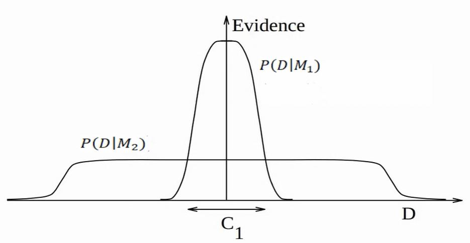

```{css echo=FALSE}
.MathJax_Display, .MJXc-display, .MathJax_SVG_Display {
    overflow-x: auto;
    overflow-y: hidden;
}

img[src*='#center'] { 
    display: block;
    margin: auto;
}

```

<script type="text/x-mathjax-config">
MathJax.Hub.Config({
  TeX: { equationNumbers: { autoNumber: "AMS" } }
});
</script>

<p align="right">*Osobiście nienawidzę czynników Bayesa...*</p>

<p align="right">— Andrew Gelman, 2017</p>

# Wnioskowanie Statystyczne

Jak pamiętamy, wnioskowanie w statystyce częstościowej opiera się na testowaniu hipotezy zerowej. Hipotezą zerową zwykle jest model, który świadczy o braku efektu, na przykład, że różnica średnich wynosi lub współczynnik regresji wynosi 0. Im mniejsza p-value, tym bardziej otrzymane dane nie pasują do modelu zerowego. Jeśli jednak p-value jest większa niż 0.05 nie oznacza to, że model zerowy jest **bardziej prawdopodobny** niż inne. Innymi słowy, ten rodzaj testowania może nam jedynie powiedzieć o występowaniu różnicy średnich czy występowaniu korelacji, ale nie o jej braku. 

Przypomnijmy sobie, że wielkość przedziału ufności dla testu zależy od wariancji i wielkości próby. Gdyby NHST pozwalało nam orzekać o równości średnich, udowodnienie takiej hipotezy byłoby niezwykle łatwe.

Na przykład załóżmy, że chcemy sprawdzić czy nowy lek nie różni się skutecznością od leku będącego już na rynku. Wystarczyłoby manipulować wielkością próby, aby otrzymać wniosek o braku istotnej różnicy pomiędzy wpływem tych dwóch leków!

Dlatego chcielibyśmy móc orzec, który z modeli (hipotez) jest bardziej prawdopodobny. Podejście bayesowskie daje nam taką możliwość (choć, nie do końca). 


## Porównywanie modeli

Czym jest model? **Najprościej mówiąc model jest zbiorem ograniczeń, który nakładamy na proces generujący dane.** Na przykład może interesować nas porównanie dwóch różnych modeli regresji z innymi zbiorami predyktorów. Przykładowy model $M_i$ posiada parametry $\theta$ i funkcję wiarygodności $P(D \mid \theta, M)$. Załóżmy, że chcielibyśmy obliczyć prawdopodobieństwo *a posteriori* modelu $P(M \mid D)$.
 
$$P(M_i \mid D) = \frac{ P(D \mid M_i) \ P(M_i) }{P(D) = \int P(D \mid M) \ P(M) \  \text{d} M}\,$$ 

Widzimy, że analogicznie jak w poprzednich częściach tutorialu za pomocą twierdzenia Bayesa,  interesuje nas obliczenie prawdopodobieństwa modelu $M_i$ pod warunkiem otrzymanych przez nas danych. 

Prawdopodobieństwo $P(M_1)$ jest oczywiście prawdopodobieństwem *a priori* naszego modelu. Sami je ustalamy, więc nie ma z nim problemu.

Nasuwa się jednak pytanie jak obliczyć funkcję wiarygodności? $P(D|M_1)$ oznacza marginalne prawdopodobieństwo (*marginal likelihood*) otrzymania danych pod warunkiem modelu dla wszystkich możliwych wartości parametrów:

$$P(D \mid M_i) = \int P(D \mid \theta, M_i) \ P(\theta \mid M_i) \ \text{d}\theta$$

Co to znaczy dla wszystkich możliwych parametrów? Załóżmy, że mamy dwa modele regresji liniowej, różniące się tym, że jeden ma dodatkowy predyktor. Tak jak pisałem wcześniej w statystyce bayesowskiej nie otrzymamy punktowych estymat parametrów $\theta$, ale ich rozkłady $P(\theta|y)$. Ponieważ jednak chcemy otrzymać jedną wartość - prawdopodobieństwo otrzymania danych wygenerowanych przez model $M_1$, a nie przez jakieś konkretne wartości parametrów tego modelu, musimy całkować po parametrach, by pozbyć się $\theta$ z równania.  
 
Teraz zerknijmy na mianownik naszego równania zawierający $P(D)$. Tutaj sprawa się komplikuje, ponieważ by obliczyć $P(D)$ musielibyśmy całkować po wszystkich (nieskończenie wielu) możliwych modelach. Jego obliczenie jest w zasadzie niemożliwe zarówno analitycznie (jak wyznaczyć rozkład $P(M)$, dla wszystkich możliwych modeli), jak i numerycznie (ponieważ musielibyśmy wymyślić i policzyć te wszystkie modele).

A co jeśli porównamy dwa modele ze sobą?

$$ \underbrace{{\frac{P(M_1|D)}{P(M_2|D)}}}_{\text{stosunek a posteriori}} = \frac{\frac{P(D|M_1)P(M_1)}{P(D)}}{\frac{P(D|M_2)P(M_2)}{P(D)}} = \underbrace{\frac{P(D|M_1)}{P(D|M_2)}}_{{BF_{12}}} * \underbrace{\frac{P(M_1)}{P(M_2)}}_{\text{stosunek a prior}}$$
 
Robiąc tak, pozbywamy się konieczności obliczania $P(D)$! 

### Czynnik Bayesowski 

Jednak oceniając modele nie używamy stosunku prawdopodobieństw *posteriori*, lecz stosunku marginalnych wiarygodności nazywanym **Czynnikiem Bayesowskim**:

$$BF_{12} = \frac{P(D|M_1)}{P(D|M_2)}$$

Jest tak dlatego, że stosunek prawdopodobieństw *a posteriori* zależy od danych, ale także od prawdopodobieństw *a priori* modeli. Manipulując nimi, moglibyśmy zawsze uzyskać miarę faworyzującą nasz model. Użycie stosunku funkcji wiarygodności, mówi nam o ile bardziej/mniej prawdopodobne jest, że $M_1$ wyprodukował obserwowane dane od $M_2$. Ponadto jeśli przepiszemy wzór na stosunek *a posteriori*, uzyskamy 

$$ \underbrace{\frac{P(D|M_1)}{P(D|M_2)}}_{BF_{12}} = \underbrace{\frac{P(M_1|D)}{P(M_2|D)}}_{\text{stosunek posteriori }}:\underbrace{\frac{P(M_1)}{P(M_2)}}_{\text{stosunek a priori}}$$

Co daje nam dodatkową interpretację czynnika Bayesowskiego. Jest on stosunkiem prawdopodobieństw *posteriori* podzielony przez stosunek prawdopodobieństw *a priori* naszych dwóch modeli. Mówi nam **o ile zmieniły się nasze przekonania** *a priori* **po zobaczeniu danych**. Innymi słowy, Czynnik Bayesowski mówi nam jak zmieniły się pod wpływem danych nasze początkowe przekonania co do tego, który model jest lepszy.

Załóżmy, że przeprowadziliśmy analizę dwóch modeli i otrzymaliśmy $stosunek \ posteriori = 4$, faworyzujący pierwszy model. Jednak $BF_{12} = 0.5$, mówiąc nam, że drugi model wyprodukował obserwowane dane z dwa razy większym prawdopodobieństwem. Skąd taka rozbieżność? Wynika ze tego, że $stosunek \ a \ priori = 8$, od początku faworyzował pierwszy model.  

Zwróćmy też uwagę, że jeśli przypiszemy modelom takie same prawdopodobieństwa *a priori*, stosunek *a posteriori* będzie się równał czynnikowi Bayesa. 

### Czynnik Bayesowski a złożoność modelu

Czynnik Bayesowski w naturalny sposób karze za złożoność modelu, choć ta właściwość nie jest widoczna na pierwszy rzut oka. Żeby ją zwizualizować, wyobraźmy sobie, że $P(D|M)$ nie jest pojedyńczą wartością prawdopodobieństwa otrzymania zaobserwowanych danych, lecz rozkładem prawdopodobieństwa wygenerowania **wszystkich możliwych zbiorów danych**, przez model. Weźmy dwa takie rozkłady dla modeli: prostszego modelu - $M_1$ i bardziej złożonego $M_2$. Bardziej złożony model jest w stanie wygenerować więcej możliwych zbiorów danych niż prostszy, ponieważ jest bardziej elastyczny. 



Całka prawdopodobieństw (pole pod wykresem) każdego z rozkładów musi wynosić 1 (z definicji rozkładów prawdopodobieństwa). Oznacza to, że dla przedziału $C_1$ model $M_1$ będzie miał zawsze większe prawdopodobieństwo wygenerowania danych niż $M_2$, w konsekwencji czynnik bayesa będzie faworyzował $M_1$. Logika stojąca za taka własnością $BF$ jest iście Occamowska. Zadajmy sobie pytanie, który z modeli ma większe prawdopodobieństwo wygenerowania danych w przedziale $C_1$ jeśli otrzymane przez nas dane mogą być wyjaśnione przez oba modele. Ten, który częściej będzie generował zbiory danych zawierające się w przedziale $C_1$, czyli $M_1$.


### Bayesian Point Null Hypothesis Testing

Przypomnijmy sobie NHST (*Null Hypothesis Significance Testing*), które testuje hipotezy zerową i alternatywną. Hipoteza zerowa zwykle oznacza, że jakiś parametr $\delta = 0$, a hipoteza alternatywna, że $\delta \neq 0$. Czynnik Bayesa w naukach społecznych jest często wykorzystywany podobnym celu. Nazywa się to *Bayesian Point Null Hypothesis Testing* **(BPNHT)**. Testujemy model, który zakłada, że $\delta$ może przyjąć dowolną wartość, względem takiego, w którym jego wartość jest zerowa. **Takie podobieństwo pomiędzy tymi metodami nie jest przypadkowe i i obie metody dzielą pewne problemy, o czym wkrótce.**

Jako przykład posłużymy się czynnikiem Bayesa do przeprowadzenia bayesowskiej wersji jednoczynnikowej analizy wariancji. Wygenerujmy sobie dane:

```{r}
set.seed(123)
factor_a = sample(c(rep(0,50),rep(1,50)))
y = rnorm(100, 3 + 0.80*factor_a, 1)
data = data.frame(id = 1:50, y = y, factor_a = factor_a)

```

Ci z Was, którzy są zaznajomieni z klasyczną wersją analizy wariancji wiedzą, że Anova to specjalny przypadek regresji liniowej. Jest też idealnym przykładem do użycia czynnika bayesowskiego w praktyce, ponieważ polega na porównaniu modeli. Najprostszym modelem, naszym modelem zerowym, będzie model, który zawiera tylko stałą. Modelem bardziej skomplikowanym, który chcemy przetestować jest model zawierający dodatkowo współczynnik regresji dla czynnika a:

$$\begin{eqnarray*}
&  &
M_0: \ \ y = \alpha\\
&  &
M_1: \ \ y = \alpha + \beta*X_a \\
&  &
\end{eqnarray*}$$

Jeśli $y$ nie jest powiązany z czynnikiem $X_a$, czynnik Bayesa powinien faworyzować model zerowy. 

### Savage-Dickey density ratio

Dla pewnych modeli, jeśli wybierzemy odpowiednie rozkłady *a priori*, możemy obliczyć $BF$ analitycznie. W przypadku bardziej skomplikowanych zdani jesteśmy na metody numeryczne. Niestety, dla wielu modeli estymacja $BF$ jest trudna i niełatwa do zastosowania w praktyce. 

Istnieje jednak prosty sposób na obliczenie czynnika bayesowskiego dla modeli zagnieżdżonych (*nested models*), czyli takich, w których jeden model możemy traktować jako rozszerzenie drugiego. Popatrzmy na $M_0$ i $M_1$. Możemy przeformułować $M_0$ w następujący sposób:

$$M_0: \ \ y = \alpha + \beta*X_a, \  \ \beta = 0$$
Teraz widzimy, że $M_0$ jest zagnieżdżony w $M_1$, to znaczy jest modelem $M_1$, którego wartość parametru $\beta_1$ została ustawiona jako stała.

Generalnie, mając dwa modele z parametrami $\varphi$ i $\delta$, takie, że $M_0:\delta=\delta_0,\varphi$ i $M_1:\delta,\varphi$, które spełniają warunek $p(\varphi\mid M_0) = p(\varphi\mid \delta=\delta_0,M_1)$, możemy obliczyć $BF_{01}$ w następujący sposób: 

$$\text{BF}_{01} = \frac{p(\delta=\delta_0\mid y,M_1)}{p(\delta=\delta_0\mid M_1)}$$
<details>
  <summary><span style="color: blue;">Dowód</span></summary>
---

Z definicji:

$$\begin{equation}\label{eq:bf}\text{BF}_{01}=\frac{p(y \mid M_0)}{p(y \mid M_1)}.\end{equation}$$

Możemy przekształcić $p(y \mid M_0)$ w:
$$\begin{equation}
\begin{split}
 p(y \mid M_0) &= \int p(y \mid \varphi,M_0) \, p(\varphi\mid M_0) \, \mathrm{d} \varphi \\
  &= \int p(y \mid \varphi,\delta=\delta_0,M_1) \, p(\varphi\mid \delta=\delta_0,M_1) \, \mathrm{d} \varphi \\
  &= p(y \mid \delta=\delta_0,M_1).\\
\end{split}
\label{eq:ml-m0}
\end{equation}$$

Stosując twierdzenie Bayesa do ostatniego wyniku: 

$$\begin{equation}\label{eq:ml-bt}
p(y \mid \delta=\delta_0,M_1) = \frac{p(\delta=\delta_0\mid y,M_1) \, p(y \mid M_1)}{p(\delta=\delta_0\mid M_1)}\end{equation}$$

Więc:

$$\begin{equation}
\begin{split}
  \text{BF}_{01} &\overset{\eqref{eq:bf}}{=} \frac{p(y \mid M_0)}{p(y \mid M_1)}\\
  &= p(y \mid M_0) \cdot \frac{1}{p(y \mid M_1)}\\
  &\overset{\eqref{eq:ml-m0}}{=} p(y \mid \delta=\delta_0,M_1) \cdot \frac{1}{p(y \mid M_1)}\\
  &\overset{\eqref{eq:ml-bt}}{=} \frac{p(\delta=\delta_0\mid y,M_1) \, p(y \mid M_1)}{p(\delta=\delta_0\mid M_1)} \cdot \frac{1}{p(y \mid M_1)}\\
  &= \frac{p(\delta=\delta_0 \mid y,M_1)}{p(\delta=\delta_0\mid M_1)},
\end{split}
\end{equation}$$

---

</details>


Obliczmy sobie $BF_{10}$ posługując się numerycznym przybliżeniem stosunku Savage-Dickey. By to zrobić musimy najpierw zdefiniować nasz $M_1$. Przyjmijmy, że rozkłady *a priori* zarówno $\alpha$ jak i $\beta$ to:

$$ \alpha, \beta \sim N(0,10)$$
Wobec tego mianownik stosunku Savage-Dickey, będzie gęstością prawdopodobieństwa wylosowania 0 z powyższego rozkładu. 

```{r}
prior_beta_0 = dnorm(0,0,10)
```


Nasz model w JAGS będzie wyglądał tak: 

```{r}
m1 = '
model{
for(i in 1:length(y)){
y[i] ~ dnorm(mu[i], precision)
mu[i] = alpha + beta*factor_a[i]
}
precision ~ dunif(0.0000001,100)
alpha ~ dnorm(0,10^-2)
beta ~ dnorm(0,10^-2)
}'
```

Wyprodukujmy rozkłady *posteriori* parametru $\beta$.

```{r echo = T, results = 'hide'}
library(tidyverse)
library(rjags)
library(ggmcmc)
library(polspline)

# Parametry, które chcemy śledzić. 
params = c("beta")
# Inicjacja modelu
jmod1 = jags.model(file = textConnection(m1), data = data, n.chains = 4, inits = NULL, n.adapt = 100)
# Wypalanie
update(jmod1, n.iter=100^2, by=1)
# Losowanie próbek z rozkładu posteriori
post = coda.samples(jmod1, params, n.iter = 10*100^2, thin = 1)
# tidy format
model1 = ggs(post)
```

Teraz wyestymujemy prawdopodobieństwo wylosowania $\beta = 0$  z rozkładu *posteriori*.  

```{r}
post_samples = filter(model1, Parameter == "beta")$value
fit.posterior <- logspline(post_samples)
posterior_beta_0 <- dlogspline(0, fit.posterior)
```

Mamy już wszystko by policzyć $BF_{01}$. Jednak ponieważ $M_0$ jest naszym modelem zerowym, popatrzmy na $BF_{10}$ czyli $\frac{1}{BF_{01}}$.

Nasz $BF_{10}$ wynosi

```{r}
1/(posterior_beta_0/prior_beta_0)
```

Otrzymaliśmy wartość $BF_{10}$ wskazującą to, że porównując te dwa modele, jest ca. 4 razy bardziej prawdopodobne, że $M_1$ wyprodukował obserwowane dane niż $M_0$. Dużo? Mało? Jedna z propozycji interpretacji $BF$ jest następująca [@kass1995bayes]:

```{r echo=FALSE}
library(knitr)
bf = data.frame(BF = c("< 1", "1-3", "3-10", "10-100", "> 100" ), `Dowody` = c("Wspierające model zerowy", "Anegdotyczne", "Znaczne", "Silne", "Decyzyjne"))
kable(bf)
```


### Likelihood sampling

W przypadku gdy nasze modele nie są zagnieżdżone, musimy szukać innych metod. Jedną z nich jest naiwne symulowanie metodą Monte Carlo. Opiera się na pomyśle, że $P(Y|M_i)$ możemy przybliżyć w następujący sposób [@gronau2017tutorial]:

$$P(D \mid M_i) = \int P(D \mid \theta, M_i) \ P(\theta, M_i) \ \text{d}\theta \approx \frac{1}{n} \sum^{n}_{\theta_i \sim P(\theta \mid M_i)} P(D \mid \theta, M_i)$$
Popatrzmy na naszą całkę. Jeśli potraktujemy $P(D \mid \theta, M_i)$ jako zmienną $x$, a $P(\theta, M_i)$ jako związaną z $x$ funkcję prawdopodobieństwa $P(X)$ (którą w istocie jest), otrzymamy:

$$P(D \mid M_i) = \int x \ P(x) \ \text{dx}$$

Czyli wzór na średnią. Możemy więc przybliżyć wartość $P(D|M_i)$ losując  najpierw $\theta$ z rozkładu *a priori*, następnie obliczając $P(D \mid \theta, M_i)$ poprzez wstawienie uzyskanej $\theta$. Jeśli powtórzymy to wielokrotnie, a otrzymane prawdopodobieństwa uśredniamy, uzyskamy estymatę $P(D \mid M_i)$. Takie losowanie również możemy wykonać przy pomocy JAGS, jednak uzyskany $BF$ nie jest zbyt stabilny. Dlatego stosuje się udoskonalone metody losowania takie jak np. **Bridge Sampling**. Nie będziemy jednak ich teraz dokładnie omawiać.


## Porównywanie modeli?

Czynnik Bayesa wydaje się być niezłą metodą, którą można wykorzystać do wnioskowania statystycznego. Być może nawet pomoże nam on rozwiązać kryzys replikacyjny. Tak też pomyślało wielu, co skutkowało tym, że programy statystyczne takie jak np. JASP zwracają nam podsumowania bayesowskich analiz defaultowo w postaci Czynnika Bayesa. Również czasopisma naukowe często oczekują od autorów, jeśli Ci posługują się statystyką bayesowską, wyników w postaci czynników Bayesa. 

Niektóre czasopisma wręcz wymagają czynników Bayesa jako metody przeciwdziałającej kryzysowi replikacyjnemu (pisałem o kryzysie replikacyjnym trochę <span style="color:blue">[tutaj](https://revan-tech.github.io/posts/2022-01-15-seria-jak-rozumie-nauk-metodologia-bada-i-statystyka/)</span>). Skoro określono algorytm weryfikacji hipotez statystycznych w statystyce bayesowskiej (rzekomo skuteczniejszy od statystyki częstosciowej), możemy wreszcie wrócić do pracy, nie martwiąc się o problem replikacji. 

Niestety, jak to zwykle okazuje, rzeczywistość nie jest taka różowa. **Czynnik Bayesa jest kontrowersyjny wśród statystyków**. Różnice w podejściach możemy zauważyć na przykład w zaciętych dysputach Davida Mackaya z Adrew Gelmanem. Mackay napisał doktorat wykazujący właściwość czynnika bayesa do karania skomplikowanych modeli, którą omówiliśmy wcześniej. Andrew Gelman i inni wykazali wiele niedociągnięć i problemów związanych z czynnikiem Bayesa zwłaszcza w kontekście *Bayesian Point Null Hypothesis Testing*. 


Rzućmy okiem na kilka najważniejszych zastrzeżeń. To, co ważne, to fakt nie wszystkie z nich są na pierwszy rzut oka oczywiste. 


### Czynnik Bayesa nie mierzy czy model jest prawdziwy

Czynnik bayesowski jest stosunkiem marginalnej wiarygodności dwóch modeli, czyli o ile bardziej jest prawdopodobne, że jeden z modeli wyprodukował obserwowane dane niż drugi. Nie mówi nam on w żaden sposób o tym, jak dobre te modele w absolutnym sensie [@gelman1995avoiding]. Możemy być w sytuacji, w której czynnik Bayesa bardzo faworyzuje jeden z modeli, ale oba modele są fatalnie dopasowane do danych.  

W konsekwencji jeśli stosujemy sposób wnioskowania oparty na testowaniu hipotezy zerowej i alternatywnej (tak jak zrobiliśmy wyżej w przypadku Anovy), zasadniczo czynnik Bayesa nie mówi nam więcej niż p-value bez spojrzenia na wielkość efektu. By zbadać dopasowanie modelu potrzebujemy więc przeanalizować rozkłady *posteriori* parametrów.  

### Czynnik Bayesowski jest wrażliwy na rozkłady *a priori* parametrów modelu

Rozkład *posteriori* parametrów $\theta$ jest niezależny od rozkładów *a prior* tychże, gdy liczba obserwacji dąży do nieskończoności. 

$$\lim_{n\to\infty}P(\theta|D,M) \propto P(D|\theta, M)$$

Tak jak pokazaliśmy w pierwszej części tutorialu, gdy liczba obserwacji wzrasta, wpływ rozkładów *a priori* maleje. Jak jest jednak w przypadku czynnika Bayesa? Przyjmując pewne upraszczające założenia [@XXX], możemy powiedzieć, że marginalna wiarygodność to: 

$$P(D|M) \approx P(D|\theta_{map}, M)P(\theta_{map}|M)\sigma_{\theta|D}$$
Gdzie $\theta_{map} = \arg \max_{\theta} P(\theta|D,M)$ to *maximum posteriori approximation*, czyli takie $\theta$, dla którego prawdopodobieństwo *a posteriori* jest największe. Z kolei $\sigma_{\theta|D}$ to odchylenie standardowe $P(\theta|D,M)$. 

W konsekwencji czynnik bayesowski zależy od *a priori* rozkładów parametru modelu $P(\theta_{map}|M)$. W przypadku gdy użyjemy nieinformatywnego rozkładu *a priori* dla $\theta$, rozkładu jednostajnego o szerokości $\sigma_{\theta}$, wtedy wzór upraszcza się do 

$$P(D|M) \approx P(D|\theta_{map}, M)\frac{\sigma_{\theta|D}}{\sigma_{\theta}}$$

Im bardziej chcemy by dane przemówiły za siebie (im bardziej nieinformatywny rozkład *a priori* zastosujemy), tym bardziej faworyzowany będzie model zerowy w przypadku *Bayesian Point Null Hypothesis Testing*. Wrażliwość na rozkłady *a priori* nie jest tak istotnym problemem, gdy **porównujemy ze sobą niezagnieżdżone modele** to znaczy w przypadku, gdy testujemy **dwa alternatywne wyjaśnienia zjawiska**.

### Rozkłady *posteriori* parametrów nie muszą się zgadzać z czynnikiem Bayesa

W statystyce częstościowej p-value < 0.05 dla parametru oznacza odrzucenie hipotezy zerowej. Jednak w przypadku analizy bayesowskiej możemy spotkać się z sytuacjami, w których czynnik Bayesa sugeruje przyjęcie modelu zerowego, jednak interesujący nas parametr w modelu alternatywnym nie zawiera w 95% przedziale wiarygodności, i vice versa [@kruschke2018bayesian]. Ta własność czynnika Bayesa jest często nieintuicyjna, ponieważ przenosimy nasze oczekiwania ze statystyki częstościowej. 

### Czynnik Bayesa a prawdopodobieństwo braku efektu

Często się mówi, że by wnioskować o braku efektu musimy użyć statystyki Bayesowskiej, ponieważ w statystyce klasycznej możemy mówić co najwyżej o braku dowodów na istnienie efektu. Niestety, przypadku BPNHT, pojawia się pewien problem, ponieważ czynnik Bayesa jest wrażliwy na wielkość próby [@morey2011bayes]. 

By zobaczyć to na własne oczy posłużymy się przykładem. Załóżmy, że zebraliśmy dane, które mają rozkład normalny $y \sim N(\mu,\sigma)$, ze znanym odchyleniem standardowym $\sigma = 5$. Chcemy przetestować dwa modele w myśl BPNHT: $M_0:  \mu = 0$ i $M_1: \mu \sim U(-\infty,+\infty)$. Czyli model zakładający, że wartość $\mu = 0$ i model, który zakada, że każda wartość $\mu$ jest równie prawdopodobna. 

Dokładny czynnik Bayesa dla tych dwóch modeli, dane jest wzorem^[Dowód możecie znaleść w suplemencie B do tego artykułu [@tendeiro2019review]]:

$$BF_{10} = \frac{\sqrt{2\pi}\sigma}{\sqrt{n}}e^{(\frac{\overline{\text{Y}}^2n}{2\sigma})}$$
Gdzie $\overline{\text{Y}}$ to średnia w próbie. Już we wzorze możemy zobaczyć, że ta wartość będzie coraz większa, gdy $n$ rośnie. Zobaczmy na wykresie jak wyglądają wartości czynnika Bayesa dla ustalonych wartości $\overline{\text{Y}}$:

```{r,fig.align='center'}
BF = function(sample_size,sample_mean, sd){
  (sqrt(sample_size)/(sqrt(2*pi)*sd))*exp(((sample_mean^2)*sample_size)/(2*sd^2))
}

ggplot(data = data.frame(x = 0), mapping = aes(x = x))+ 
  stat_function(fun = BF,args = list(sample_mean = 0.6,sd = 5), aes(color = "0.6")) + 
  stat_function(fun = BF,args = list(sample_mean = 0.75,sd = 5), aes(color = "0.75")) +
  stat_function(fun = BF,args = list(sample_mean = 0.9,sd = 5), aes(color = "0.9")) +
  xlim(0,100) +
  xlab("N") + 
  ylab(bquote(BF[10])) + labs(color = "Legend") + 
  scale_colour_manual("Sample Mean", values = c( "blue", "green", "red")) +
  geom_hline(yintercept = 1) +
  theme_light()


```

Ok, im większa próba, tym większe wsparcie dla hipotezy alternatywnej. Choć spojrzeliśmy tylko na dwa partykularne modele, ta własność utrzymuje się generalnie w całym BPNHT [@johnson2010use]. Czy to źle? Niekoniecznie, ale to znaczy, że podobnie jak w przypadku p-value, tym mniejszy efekt jest potrzebny by odrzucić hipotezę zerową, im większa próba. Dlatego też ciężko jest wnioskować o braku efektu, ponieważ nie wiemy czy czynnik Bayesa faworyzuje model zerowy, ponieważ jest lepszy, czy dlatego, że nie ma wystarczających dowodów by go odrzucić. 


Nie oznacza jednak, że statystyka Bayesowska nam na to nie pozwala. Jeśli rozkład *posteriori* parametru jest silnie skoncentrowany blisko zera, możemy mówić, że pod warunkiem danych mamy dużą pewność braku efektu lub marginalnego efektu. 


### I co z tym wszystkim zrobić?

Dogłębne omówienie wyżej wymienionych problemów możecie znaleźć w artykule *"A Review of Issues About Null Hypothesis Bayesian Testing"* [@tendeiro2019review].

{width=75%}

Z jednej strony czynnik Bayesa pozwala na bezpośrednie porównanie prawdopodobieństwa wyprodukowania danych przez cały model, a nie tylko punktowe wartości parametrów. Jednocześnie w naturalny sposób karze złożoność modelu, co w innych miarach dopasowania modelu takich jak na przykład AIC, próbujemy robić estymując złożoność poprzez liczbę wolnych parametrów. 

Jednakże, jak widzimy, czynnik Bayesa jest miarą, która również słabe strony, nie jest więc cudownym lekiem na statystyczne bolączki. Z tego miejsca mamy dwie możliwości. Możemy używać czynnika Bayesa rozważnie, czyli: 

- Ostrożnie dobierać rozkłady *a priori* parametrów modelu
- Przeprowadzać analizę wrażliwość (*sensitivity analysis*), tzn. sprawdzić jak bardzo wartość czynnika Bayesa ulega zmianie, gdy użyjemy innych rozkładów *a priori* parametrów. Niestety, konsekwencją tego, że czynnik Bayesa jest trudny do policzenia, jest to żmudny proces. 
- Nie raportować czynnika Bayesa samotnie, ale także miary rozkładu parametrów *a posteriori*.

**Albo**

unikać porównywania modeli. Zamiast tego, na pierwszym miejscu skupić się na tworzeniu wiarygodnych modeli wspieranych przez teorię, przełożyć nacisk na estymację parametrów, tzn. zamiast porównywać interesujący nas model do modelu zerowego z wartością parametru równą 0, skupić się na ewaluacji rozkładu *a posteriori* parametrów. Wykorzystać *Posterior Predictive Testsing*, które może nam wskazać problemy z naszym modelem, bez konieczności porównywania go z innym. 

Unikać testowania przy pomocy BPNHT zasadności pojedynczego modelu. Prównywanie modeli jest natomiast jak najbardziej przydatne  wtedy, gdy mamy dwa lub więcej (np. podyktowane teorią) konkurujące modele inaczej ujmujące mechanizm jakiegoś zajawiska np. pamięci. Co istotne, do tego możemy posłużyć się statystykami prostszymi do obliczenia, jak np. DIC albo WAIC.  


# Zakończenie

Dowiedzieliśmy się czym jest czynnik Bayesowski i przy okazji omówiliśmy kontrowersje wokół niego. Mamy już intuicję na temat statystyki Bayesowskiej, estymacji modeli i wnioskowania. Fajnie, by było wreszcie coś policzyć po Bayesowsku co nie jest prostym modelem liniowym. Dlatego w następnej części przyjrzymy się jednej z ciekawszych możliwości statystyki Bayesowskiej - modelom hierarchicznym. 

Na koniec dodam, że czynnik Bayesowski, p-value ani żadna inna statystyka nie jest rozwiązaniem kryzysu replikacyjnego. Nie dlatego, że te miary obarczone są wadami, tylko dlatego, że prawdziwe powody leżą gdzie indziej. Badacze czasami naiwnie stosują statystykę, czasami recenzenci wymagają od badaczy stosowania utartych, choć nieadekwatnych procedur. Dodatkowo system ewaluacji pracowników naukowych wymaga od nich by publikowali dużo, a czasopisma naukowe wymagają by publikowali badania świadczące o istnieniu efektu, raczej niż o jego braku. Bez zaadresowania tych problemów, nie sądzę by jakakolwiek statystyczny test rozwiązał problem replikacji w nauce. 


