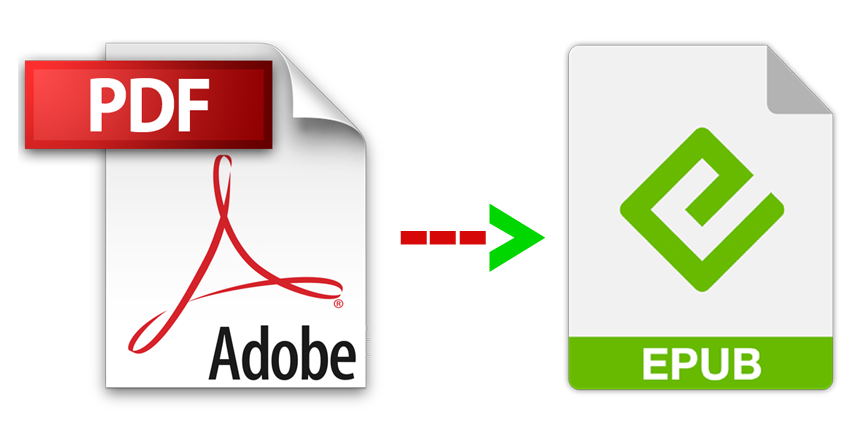

{width=80%}

Zacznijmy od różnic, a potem dopiero zastanówmy się nad ich znaczeniem.

PDF: 
  - pozwala na stworzenie struktury i formatowania, które zawsze będą takie same, 
  - nie pozwala na powiększanie i zmianę wyświetlanego fontu (czcionki), odstępów itd., 
  - obrazki i tabele będą zawsze w tym miejscu, w którym zaplanowała to osoba autorska, 
  - plik może być skomplikowany graficznie (np. tekst opływający obraz, pola z kolorowym tłem), 
  - drukowanie jest proste, dokument po wydrukowaniu będzie wyglądał tak jak plik. 

EPUB: 
- wygląd dokumentu zależy od preferencji użytkowników, a także od urządzenia wyświetlającego plik, rozmiar strony jest tylko umowny, 
- dostosowywać można m.in. wielkość tekstu, interlinię, marginesy, krój pisma, 
- obrazki i tabele mogą się rozjeżdżać, jeśli nie zostaną dobrze sformatowane, 
- plik może zawierać urozmaicenia graficzne, ale te będą zależeć od zakodowania ich w XML, HTML/CSS, więc podlegają innej logice konstruowania, 
- drukowanie również jest proste, ale plik po wydruku nie będzie tak schludnie sformatowany, jak to byłoby w przypadku pliku PDF. 

Przytłaczająca większość polskiej nauki została zaklęta w format PDF. Jest to zrozumiałe, format PDF pozwala na mimikrę drukowanych artykułów, czyli będą one wyglądać tak samo w drukowanym zbiorze artykułów, jak i na ekranie. Podkreślam frazę **tak samo**, ponieważ przeczuwam, że jest ona rozumiana jako fraza – **to jest to samo**. Skoro coś wygląda identycznie, to można uznać, że jest to ta sama rzecz. Identyczność nie opiera się na identyczności tekstu, tylko na graficznych pozorach podobieństwa. Artykuły naukowe cechuje wysoki stopień oficjalności, dotyczy to również formatowania. Poszczególne pisma mają swoje wytyczne co do formatowania, może to być nawet ich cecha rozpoznawcza. Publikacja cyfrowa jest więc domyślnie poddawana reżimowi formatowania tekstu. Spekuluję, że ten sam tekst w pliku DOCX lub TXT będzie uznany za mniej poważny, niż tekst opublikowany w formacie PDF. To kwestia legitymizacji, stałe formatowanie dodaje tekstowi naukowości, powagi. Czy nie jest to jednak jedynie iluzja? Jeśli tekst jest dobry i badania są dobre, ich wartość się nie zwiększy przez dodanie oficjalnych nagłówków, stopek i kolumn. Czy zmiana formatowania byłaby transgresją, przeciw instytucjonalnej oficjalności? Czy artykuł straciłby na wartości akademickiej?

# Problem
Główna zaleta formatu PDF (niemodyfikowalność) jest jednocześnie największą wadą, w kontekście pewnego, dość istotnego procesu – czytania. Jeśli narzucone formatowanie jest niewygodne do czytania, musimy to cierpliwie znieść. Jeśli używamy urządzenia, które niezbyt dobrze wyświetla pliki PDF – musimy to znieść. Jeśli układ dwu-, trzykolumnowy jest dla nas trudny do czytania – musimy to znieść. Jeśli edytorzy wybrali nieczytelną czcionkę i/lub skandalicznie małe odstępy pomiędzy wierszami – musimy to znieść.

**Format tekstu nie powinien nie może być dodatkowym utrudnieniem, przy już i tak trudnej do zrozumienia treści**

To może być irytujące dla osób sprawnych fizycznie i kognitywnie. Jednak dla osób niedowidzących, czy dla dyslektyków – to coś więcej niż irytacja. To już kwestia dostępności. Brak możliwości zwiększenia czcionki (lub zmiany czcionki na specjalnie dostosowaną do potrzeb) **może dosłownie być barierą, utrudniającą lub uniemożliwiającą dostęp do nauki**. 

# Rozwiązanie
Problemu tak naprawdę nie ma, jeśli uznamy, że oficjalne formatowanie nie jest cechą konieczną dla wartości artykułu. Wystarczy opublikować dwa pliki: PDF i EPUB.

**Wystarczy opublikować dwa pliki: PDF i EPUB.**

EPUB-y też mogą być ładnie sformatowane. Oferują pod tym względem nawet ciekawsze rozwiązania (albo po prostu inne), ponieważ dobrze sformatowany plik EPUB powinien mieć jasno podzielone sekcje z hiperlinkami, odsyłającymi do spisu treści, oraz dobrze zorganizowane hiperlinki do przypisów. Format ten pozwala na dużo lepsze skupienie na treści tekstu, a nie na jego wyglądzie – który w tym przypadku jest względny.

{width=60%}
 [Przykład wzorowej dystrybucji plików, czyli wiele formatów do wyboru na stronie Wolnych Lektur](https://wolnelektury.pl/katalog/lektura/strug-dzieje-jednego-pocisku/)

Pliki EPUB pozwalają na wygodne tworzenie zakładek, zaznaczanie tekstu i dodawanie komentarzy. Pliki EPUB można też zabezpieczać znakami wodnymi lub innym rodzajem zabezpieczeń (DRM).
Fakt, umieszczenie skomplikowanych tabel i grafik w epubie może dać rozczarowujący efekt (choć również zależny od inteligentnego sformatowania pliku). W tym jednak rzecz, format pdf wciąż zostaje pod ręką. Konieczne jest danie ludziom wyboru.
Tworzenie EPUB-ów nie wymaga ponoszenia kosztów – jest darmowe oprogramowanie, są konwertery. Najwięcej wysiłku będzie wymagać stworzenie pierwszego “pipeline’u”, potoku przetwarzania: od czystego manuskryptu, do sformatowanego EPUB-a. Każdy następny plik będzie jedynie formalnością. Zresztą, powracając do poruszonej na początku kwestii legitymizacji – zindywidualizowane formatowanie EPUB pod pismo naukowe może stać się nowym znakiem rozpoznawczym pisma. Warto spróbować!

{width=80%}
 [Repozytorium Biblioteka Nauki pozwala pobrać artykuły w wielu formatach](https://doc.bibliotekanauki.pl/pl/about/)

A czemu nie publikacje w formacie HTML, lub PDF-y z dodatkowymi funkcjami dostępności? EPUB-y są pod każdym względem prostszym, bardziej poręcznym i powszechnym rozwiązaniem. Pojawią się przypadki, w których każdy z tych formatów będzie najlepszy – ale to tylko przesłanka do tego, by publikować treści w różnych formatach. 
Dodatkowo warto zapoznać się z wyspecjalizowanymi formatami (BRF, DAISY, NIMAS).

Podsumowując – dominacja formatu PDF w nauce wynika prawdopodobnie w znacznym stopniu z przyzwyczajenia i instytucjonalnej inercji. Nie jest to zły format – sprawdza się dobrze w tym, czym jest, czyli w przechowywaniu dokumentów, bez możliwości dostosowywania do czytelników. Nie uwzględnia jednak tego, że czytelnicy są różni i mają różne potrzeby. I w tym miejscu doskonałym uzupełnieniem staje się EPUB – uniwersalny format do publikowania tekstu. EPUB pozwala czytelnikom m.in. na dostosowanie wielkości liter, odstępów i marginesów, dzięki czemu czytanie jest bardziej komfortowe, lub – w ogóle możliwe. Pisma, które zdecydują się dystrybuować swoje artykuły w wielu formatach wykażą się, oczywiście, myślą o potrzebach czytelników – ale, może przede wszystkim, szacunkiem dla swoich czytelników. 

⬥ ⬥ ⬥
 

I to jest koniec tekstu. To nie jest poradnik tworzenia epubów, tylko mikromanifest.  
Więcej informacji można znaleźć poniżej, załączam **przydatne linki**, zgrupowane w kategorie:

 **Oprogramowanie do tworzenia EPUB-ów:** 
💿 Sigil - polecany i darmowy program:  
https://sigil-ebook.com/sigil/  
💿 Lista kilkunastu różnych programów:  
https://medevel.com/17-open-source-epub-and-ebook-creators/  

**Oprogramowanie do czytania EPUB-ów:** 
📀 Calibre - darmowy, wielofunkcyjny program:  
https://calibre-ebook.com/download  
📀 Sumatra - darmowy, również wielofunkcyjny program:  
https://www.sumatrapdfreader.org/free-pdf-reader  
📀 Thorium - kolejna alternatywa:  
https://www.edrlab.org/software/thorium-reader/ 
📀 Okular - i jeszcze jedna alternatywa:  
https://okular.kde.org/pl/  

**LaTeX do EPUB:** 
https://minireference.com/blog/generating-epub-from-latex/ 
https://pandoc.org/epub.html  
https://www.ctan.org/pkg/tex4ebook?lang=en

**Książki:** 

📚
Coolidge, A., Doner, S., Robertson, T., & Gray, J. (2018). *Accessibility Toolkit—2nd Edition*. BCcampus. https://opentextbc.ca/accessibilitytoolkit/ ⡠ta publikacja jest darmowa!  
 📚 Garrish, M. (2012). *Accessible EPUB 3*. O’Reilly Media, Inc. ⡠ta publikacja jest darmowa! (https://helion.pl/ksiazki/accessible-epub-3-matt-garrish,e_2g0p.htm#format/e) 
 📚 Garrish, M., & Gylling, M. (2013). *EPUB 3 Best Practices*. O’Reilly Media, Inc. 
 📚 Paszkiewicz, D., & Dębski, J. (2013). *Dostępność serwisów internetowych: Dobre praktyki w projektowaniu serwisów internetowych dostępnych dla osób z różnymi rodzajami niepełnosprawności*. Stowarzyszenie Przyjaciół Integracji. https://depot.ceon.pl/handle/123456789/5609 

**Materiały w języku polskim:**

💬 Wytyczne dla dostępności informacji technologie informacyjno-komunikacyjne (TIK) w zapewnianiu dostępności informacji w procesie uczenia się (ICT4IAL): 
https://www.ict4ial.eu/guidelines-accessible-information  

💬 Fundacja Instytut Rozwoju Regionalnego - E-podręcznik dostępny dla wszystkich. Poradnik dla twórców elektronicznych materiałów edukacyjnych: 
[www.power.gov.pl%2Fmedia%2F13591%2Fe_podrecznik_dostepny_dla_wszystkich.pdf](www.power.gov.pl%2Fmedia%2F13591%2Fe_podrecznik_dostepny_dla_wszystkich.pdf)  

💬 Dominik Paszkiewicz, Jakub Dębski - Podręcznik Dostępność serwisów internetowych. Dobre praktyki w projektowaniu serwisów internetowych dostępnych dla osób z różnymi rodzajami niepełnosprawności: 
http://www.niepelnosprawni.pl/ledge/x/249472  

💬 Polska Akademia Dostępności: 
https://pad.widzialni.org/start  

💬 Kategoria: Równość i dostępność w nauce w Sortowni Wiedzy: 
https://szpm.shinyapps.io/baza_wiedzy/ 

💬 eTechnologie - Standardy dostępności w e-learningu (prezentacja): 
https://etechnologie.pl/standardy-dostepnosci-w-e-learningu/  

💬 Dostępność serwisów internetowych (różne materiały): 
https://niepelnosprawni.gov.pl/a,60,dostepnosc-serwisow-internetowych 

💬 Zespół Promocji ORE, Standardy przygotowywania i publikowania treści oraz projektowania serwisów internetowych zgodnie z wytycznymi WCAG 2.0 na poziomie AA: 
https://www.ore.edu.pl/wp-content/uploads/2020/09/standardy-przygotowywania-tresci-zgodnie-z-wytycznymi-wcag-2.1_ore_2020.pdf  + inne materiały: https://www.ore.edu.pl/materialy-do-pobrania/  

💬 BON UW: EPUB – ważny standard książek elektronicznych (i inne teksty tematyczne): 
https://bon.uw.edu.pl/epub-%C2%AC-wazny-standard-ksiazek-elektronicznych/  

💬 Beata Rędziak/Niepełnosprawni.pl - Książka (nie) dla wszystkich: 
http://www.niepelnosprawni.pl/ledge/x/119055 

💬 Mateusz Różański/Niepełnosprawni.pl - Nie widzę, nie słyszę – oglądam: 
http://www.niepelnosprawni.pl/ledge/x/1329924  

**Materiały w języku angielskim:**

💬 Top Tips for Creating Accessible EPUB 3 Files: 
http://diagramcenter.org/54-9-tips-for-creating-accessible-epub-3-files.html  
https://guides.cuny.edu/accessibility/epub  

💬 Web Accessibility Evaluation Tools List: 
https://www.w3.org/WAI/ER/tools/  
💬 EPUB Accessibility 1.1. Conformance and Discoverability Requirements for EPUB publications: 
https://www.w3.org/TR/epub-a11y-11/  

💬 Accessible Formats, Accessible Instructional Materials Center of Virginia (informacje m.in. o formatach BRF, DAISY, NIMAS): 
https://www.readingrockets.org/article/accessible-formats 

💬 Understanding the Accessibility Differences in EPUB and PDF Reading Experiences (prezentacja do pobrania): 
https://accessinghigherground.org/understanding-the-accessibility-differences-in-epub-and-pdf-reading-experiences/ 

💬 EPUB Adoption in Academic Libraries–Progress and Obstacles: 
https://inclusivepublishing.org/blog/epub-adoption-in-academic-libraries-progress-and-obstacles/ 

💬 Making digital journals and books more accessible with EPUB: 
https://insights.taylorandfrancis.com/social-justice/epub 

💬 Use Calibre to improve ePub accessibility: 
https://kb.iu.edu/d/bgeh 

💬 Accessible PDFs: 
https://www.adobe.com/accessibility/pdf/pdf-accessibility-overview.html  
https://helpx.adobe.com/pl/indesign/using/creating-accessible-pdfs.html  

**Alternatywa online dla formatu EPUB w nauce, czyli PubReader**  
https://www.ncbi.nlm.nih.gov/pmc/about/pubreader/  
(tutaj zarzut: jeśli strona nie pozwala ściągać plików via PubReader, to będziemy musieli zaufać, że serwis będzie zawsze działać – niestety strony naukowe bardzo często wypadają z obiegu, ponieważ dana instytucja przestała utrzymywać serwer lub zmieniły się adresy odnośników. Serwisy online-only powinny być traktowane z ograniczonym zaufaniem): 

**Różne deklaracje dostępności:** 

https://doc.bibliotekanauki.pl/pl/accessibility/ 

https://www.power.gov.pl/deklaracja-dostepnosci/ 

https://pad.widzialni.org/oswiadczenie-o-dostepnosci  
 
https://wcag.uj.edu.pl/lista/-/journal_content/56_INSTANCE_DuU7E3djxFwe/145608681/148186438 

https://www.uw.edu.pl/deklaracja-dostepnosci/  

https://www.osw.waw.pl/pl/deklaracja-dostepnosci 

https://www.dwutygodnik.com/dostepnosc.html 

https://www.ebsco.com/pl-pl/technologia/dostepnosc  

https://support.proquest.com/s/article/Accessibility-Statement-Ebook-Central?language=en_US 

https://help.taylorfrancis.com/students_researchers/s/article/Accessibility-Statement 

**Artykuły:** 
📄 Arellano, J. (2021). *Not open for all: Accessibility of open textbooks* (Nr 1). 34(1), Art. 1. https://doi.org/10.1629/uksg.557 

📄 Bowes III, F. (2018). *An overview of content accessibility issues experienced by educational publishers*. Learned Publishing, 31(1), 35–38. https://doi.org/10.1002/leap.1145 

📄 Eikebrokk, T., Dahl, T. A., Kessel, S., Oslo, & Hanssen, A. U. C. of A. S. with thanks to: E. (2014). *EPUB as Publication Format in Open Access Journals: Tools and Workflow*. The Code4Lib Journal, 24. https://journal.code4lib.org/articles/9462  
 — krótkie omówienie artykułu po polsku: https://babin.bn.org.pl/?p=2812 

📄 Suzuki, M., & Yamaguchi, K. (2020). *On Automatic Conversion from E-born PDF into Accessible EPUB3 and Audio-Embedded HTML5*. W K. Miesenberger, R. Manduchi, M. Covarrubias Rodriguez, & P. Peňáz (Red.), Computers Helping People with Special Needs (s. 410–416). Springer International Publishing. https://doi.org/10.1007/978-3-030-58796-3_48  

📄 Wang, L. L., Cachola, I., Bragg, J., Cheng, E. (Yu-Y., Haupt, C. H., Latzke, M., Kuehl, B., Zuylen, M. van, Wagner, L. M., & Weld, D. S. (2021). *Improving the Accessibility of Scientific Documents: Current State, User Needs, and a System Solution to Enhance Scientific PDF Accessibility for Blind and Low Vision Users*. ArXiv. https://www.semanticscholar.org/reader/56fbb4152b4535230827eb2bd23c618045855c26 

📄 Zhang, X., Tlili, A., Nascimbeni, F., Burgos, D., Huang, R., Chang, T.-W., Jemni, M., & Khribi, M. K. (2020). *Accessibility within open educational resources and practices for disabled learners: A systematic literature review*. Smart Learning Environments, 7. https://doi.org/10.1186/s40561-019-0113-2 

 

❖❖❖

