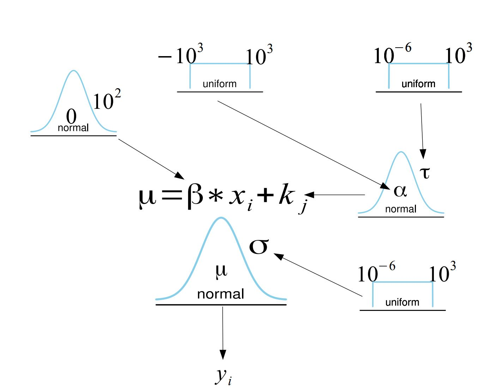

```{css echo=FALSE}
.MathJax_Display, .MJXc-display, .MathJax_SVG_Display {
    overflow-x: auto;
    overflow-y: hidden;
}
```

<p style="color:blue">Post będzie aktualizowany.</p>

Dzisiaj zajmiemy się bayesowskimi wielopopoziomowymi (mieszanymi/hierarchicznymi) modelami liniowymi. Na ten temat poświęca się całe książki, (choć z drugiej strony czasami mam wrażenie, że traktuje się ten temat jak czarną magię). Zobaczmy o co całe zmieszanie. 


## Motywacja

Zamiast zaczynać od wprowadzenia definicji mieszanego modelu liniowego, przyjrzyjmy się poniższym sytuacjom.   

### Niewykrycie prawdziego efektu

Załóżmy, że wykonujemy przez pewien czas pomiary zadowolenia z obsługi i wysokości napiwków u stałych klientów pewnej restauracji. 

```{r echo=FALSE}
library(tidyverse)

set.seed(1)
n <- 5
b <- 2
x <- seq(2, 2 * n, 2)

d <- do.call(rbind, lapply(1:n, function(i) {
  data.frame(
    Zadowolenie = b * seq(1, n, by = 0.2) + rnorm(21,0,2.5) - (1/5)*i,
    grp = as.character(i),
    `Napiwek w %` = seq(1, n, by = 0.2) + 5*i
  , check.names = F)
}))


ggplot(d, aes(x = `Napiwek w %`, y = Zadowolenie)) + geom_point() + theme_bw() + 
  theme(legend.position="none") + geom_smooth(method = "lm", se = F)


```
Widzimy tu brak zależności liniowej. Teraz zróbmy tak by na wykresie kolor kropki odpowiadał konkretnemu klientowi.

```{r echo=FALSE}
ggplot(d, aes(x = `Napiwek w %`, y = Zadowolenie, colour =
  as.character(grp))) + geom_point() + theme_bw() + 
  theme(legend.position="none") + geom_smooth(method = "lm", se = F)
```

Widzimy, że u każdego z klientów występuje związek liniowy pomiędzy napiwkiem i zadowoleniem. Jednak ponieważ, nasze pomiary zagnieżdone są w klientach, co objawia się tym, że każdy klient średnio daje inną wartość napiwku, przeoczylibyśmy ten związek, nie uwzględniając tego w modelu. 

### Wykrycie nieprawdziwego efektu

Czy może nam się zdarzyć sytuacja odwrotna? Używając prostej analizy liniowej wykryjemy efekt, którego nie ma? Załóżmy, że chcemy ocenić wpływ picia napojów kofeinowych na wyniki ucznia w nauce. Zebraliśmy dane z trzech klas liceum pytając o średnie spożycie napojów kofeinowych dziennie i średnią ocen. 

```{r echo=FALSE}
set.seed(123)

d2 = data.frame(`Spożycie napojów kofeinowych` = rnorm(90, 3, 0.1), `Średnia ocen` = rnorm(90,3.5,0.1), Klasa = c(rep(1,30),rep(2,30),rep(3,30)),check.names = F)

d2$`Spożycie napojów kofeinowych` = d2$`Spożycie napojów kofeinowych` + d2$Klasa/4
d2$`Średnia ocen` = d2$`Średnia ocen` + d2$Klasa/8
ggplot(d2, aes(x = `Spożycie napojów kofeinowych`, y = `Średnia ocen`)) + geom_point() + theme_bw() + theme(legend.position="none") + geom_smooth(method = "lm", se = F)


```
Zaznaczmy na wykresie kolorami uczniów przynależących do danej klasy. 


```{r echo=FALSE}
ggplot(d2, aes(x = `Spożycie napojów kofeinowych`, y = `Średnia ocen`, colour =
  as.character(Klasa))) + geom_point() + theme_bw() + 
  theme(legend.position="none") + geom_smooth(method = "lm", se = F)
```

Jak widzimy, w poszególnych klasach spożycie kofeiny nie ma wpływu na wyniki ucznia w nauce. Kiedy możemy zaobserwować taką zależność? Załóżmy na przykład, że każda z klas ma innego wychowawcę i ich wpływ przedkłada się na średnią ocen. Załóżmy też, że zupełnie przypadkowo w klasach z lepszym wychowawcą, średnie spożycie napojów kofeinowych jest większe. Otrzymamy wtedy sytuację jak na powyższych wykresach. 

Oczywiście, może istnieć jakaś zależność pomiędzy średnim spożyciem kofeiny na klasę a jej średnią ocen lecz to nie odpowiada na pytanie, które zadaliśmy tzn. o **wpływ kofeiny na osiągnięcia ucznia**. Tutaj warto wprowadzić sobie rozróżnienie między efektem węwnątrzobiektowym i międzyobiektowym. Zrobiłem to w jednym z poprzednich wpisów, można przeczytać tutaj. 


### Z czym się mierzymy?

Problem możemy zdefiniować na kika sposobów. W pierwszej sytuacji chcemy zbadać związek pomiędzy napwkami a zadowoleniem z obsługi. Na przeszkodzie jednak staje nam efekt kienta - każdy klient ma inny bazowy średni napiwek. Klient jest tu zmienną zakłócającą. By poprawnie wyestymować wpływ zadowolenia na napiwki, moglibyśmy kontrolować wpływ poszczególnego klienta. W istocie, na tym z grubsza polega mechanizm działania mieszanych modeli liniowych.  


Przyjrzyjmy się teraz problemowi z innej perspektywy. Gdy chcemy zbadać wpływ zmiennej $X$ na Y, na przykład licząc współczynnik korelacji Pearsona, musimy wykonać następujące kroki (książkowo):  **Losujemy obserwacje** do naszej próby. Następnie, ponieważ każda obserwacja miała takie samo prawdopobieństwo dostania się do próby, traktujemy te obserwacje jako niezależne zmienne losowe o identycznym rozkładzie (**iid, independent and identically distributed random variables**). Na chłopski rozum, oznacza to, że jeśli stworzymy sobie histogram zmiennej X, otrzymamy z grubsza estymatę rozkładu zmiennej $X$ w populacji. W przypadku powyższych danych, nie jest to prawda. Przyjrzyjmy sie dokładniej tej definicji. 

Definicja składa się z dwóch zasadniczych elementów. **Niezależność** oznacza, że obserwacje są niepowiązane (wylosowanie $x_1$ nie mówi nam nic o prawdopobieństwie wylosowania $x_2$), co często nie jest spełnione w danych pogrupowanych w klastry, ponieważ obserwacje wewnątrz klastra są do siebie bardziej podobne. Innymi słowy obserwacje w klastrze są ze sobą skorelowane. 

Drugą częścią definicji jest fakt, że obserwacje zostały **wylosowane z tego samego rozkładu**. Przykładowo, jeśli wykonujemy pojedynczy pomiar zadowolenia u różnych osób odwiedzających restaurację, to możemy powiedzieć, że wszystkie te obserwacje zostały wylosowane z tego samego rozkładu zadowolenia (by być dokładnym, z tego samego rozkładu w danym klastrze, czyli w tej samej restauracji). Jednakże, w praktyce wielokrotnie wykonujemy pomiary zadowolenia u tych samych osób, co oznacza, że zmienna "zadowolenie" ma inny rozkład u klienta A, a inny u klienta B. 

By więc poprawnie przeanalizować takie dane, musimy zastosować model mieszany. 

### Czym jest więc model mieszany?

Wikipedia opisuje go tak: Mieszany model liniowy to model statystyczny, który uwzględnia zarówno efekty stałe (*fixed effects*), jak i losowe (*random effects*) w celu analizy zgrupowanych (*clustered*) danych. 

Jest to definicja częstościowa, niemniej jednak pewnie każdy, kto miał styczność z modelami mieszanymi, słyszał o efektach stałych i losowych. Bez wchodzenia zbytnio w tę terminologię, efekty stałe są traktowane jako efekty, które mają określoną wartość, którą staramy się oszacować, na przykład wpływ zadowolenia na wysokość napiwku. Efekt losowy to efekt, który jest opisany jakimś rozkładem statystycznym, a my napotykamy na jakąś jego realizację, na przykład hojność danego klienta. Jednak gdy przeprowadzimy kolejne badanie na innych klientach, wciąż estymujemy ten sam związek między zadowoleniem a wysokością napiwku, ale nasi klienci będą mieli inną bazową wartość hojności.

My nie będziemy korzystać z tej terminologii. Według mnie czasami wporowadza ona zamieszanie w rozumieniu tej klasy modeli. Na szczęście mamy na to bardzo dobre uzasadnienie. Przypomnijcie sobie, że w statystyce Bayesowskiej wszystkie parametry traktujemy jako rozkłady statytyczne. Więc rozróżnienie na efekty stałe i losowe nie ma większego sensu, ponieważ w modelach Bayesowskich **wszystkie efekty są losowe**.

## Modele wielopoziomowe

### Model z efektem klastra

Jak więc będzie wyglądał bayesowski model, którym poprawnie możemy przeanalizować dane z powyższych przykładów?

W poprzednich częściach estymowaliśmy regresję liniową. Miała ona miała postać:

$$y_{i} \sim N(\mu = \alpha + \beta * x_i, \sigma)$$
A wszystkie paramtery  w tym równaniu miały rozkłady a priori ze zdefiniowanymymi przez nas hiperparametrami (czyli takimi parametrami, które są zdefiniowane arbitralnie, a nie estymowane z danych). 

Teraz musimy uwzględnić w modelu różnice pomiędzy obserwacjami wynikajace z przynależności do klastra:


$$y_{i} \sim N(\mu = \beta * x_i + k_j , \sigma)$$
$$k_{j} \sim N(\alpha, \tau)$$
$$\alpha \sim U(-10^{3}, 10^{3})$$
$$ \tau \sim N(10^{-6}, 10^{3}) $$
$$ \beta \sim N(0, 10^{2}) $$
$$ \sigma \sim N(10^{-6}, 10^{3}) $$
Żeby dokładnie zrozumieć co się dzieje, spójrzmy na diagram naszego nowego modelu. 



Żeby zrozumieć mechanizm tego modelu, warto zwizualizować sobie jak jest estymowany (mi to osobiscie pomagało zrozumieć jak działają bayesowskie modele). Przy użyciu MCMC, najpierw losujemy $\alpha$ i $\tau$ z ich rozkładów a priori, a następnie te wartości są używane do wylosowania wartości $k_j$ dla każdego klastra, korzystając z rozkładu normalnego. Na koniec, mając wylosowane także wartości $\beta$ i $\sigma$, sprawdzamy, jak prawdopodobne jest, że model o takich parametrach wyprodukował zaobserwowane dane $y$.

Parametr $k_j$, który występuje w funckcji wiarygodności ma rozkład *a priori* opisany rozkładem normalnym o średniej $\alpha$ i wariancji $\tau$, który także jest estymowany z danych, a jego parametry mają własne rozkłady *a priori*. Reszta modelu pozostaje taka sama jak w przypadku standardowej regresji. Zamiast pojedynczego interceptu, model ma teraz $j$ interceptów, gdzie $j$ to liczba klastrów.

Rozkład *a priori* $P(k_j|\alpha,\tau)$ określa prawdopodobieństwo wystąpienia intercepta o danej wartości, gdzie $\alpha$ oznacza średni intercept dla całego zbioru danych, a $\tau$ to wariancja interceptów.

### Implementacja
 
Posłużymy się danymi (do pobrania <span style="color:blue">[tutaj](https://github.com/Revan-tech/fuzzy-octo-waddle/tree/main/MBM%20Data)</span>) z drugiego przykładu i zaimplementujemy model użyciu JAGS. 

```{r tidy=FALSE, results='hide',fig.keep='all', layout="l-body-outset"}

library(rjags)
library(coda)

colnames(d) = c("Zadowolenie", "Klient", "Napiwek")

mod = "model {
  # Priors
  a ~ dunif(-1000, 1000)
  b ~ dnorm(0, 100^-2)
  sigma ~ dunif(0.000001,1000)
  tau ~ dunif(0.000001,1000)
  
  for (i in 1:5){
  k[i] ~ dnorm(a, tau^-2)
  }
  
  # Likelihood
  for (i in 1:length(Napiwek)) {
    mu[i] <- b * Zadowolenie[i] + k[Klient[i]]
    Napiwek[i] ~ dnorm(mu[i], sigma^-2)
  }}"

params = c("a","b","k","tau","sigma")
n.adapt = 100
ni = 3000
nb = 6000
nt = 1
nc = 6
jmod = jags.model(file = textConnection(mod), data = d, n.chains = nc, inits = NULL, n.adapt = n.adapt)
update(jmod, n.iter=ni, by=1)
post = coda.samples(jmod, params, n.iter = nb, thin = nt)
```

```{r}
summary(post)
```

Jeśli spojrzymy na kwantyle parametru $\beta$ zauważymy, że 0 znajduje się poniżej 2.5% percentyla. Innymi słowy, wykryliśmy efekt pomiędzy napiwkami a zadowoleniem z obsługi.  

Zauważmy też, że model moglibysmy zaimplementować w następującej formie: 

$$y_{i} \sim N(\mu =\alpha +  \beta * x_i + k_j , \sigma)$$
$$k_{j} \sim N(0, \tau)$$

Otrzymalibyśmy dokłokładnie to samo z tą różnicą, że teraz nie $k_j$ nie byłoby interceptem dla klastra, a wartością o jaką różni się intercept dla klastra od $\alpha$ (czyli, $\alpha$ + $k_j$  byłby intercepem dla klastra $j$.)

Wspomniałem wyżej, że modele mieszane zasadniczo można interpretować w kategorii kontrolowania zmiennych zakłócających. Policzmy zwykłą regresję (częstościową, ale dotyczy to też bayesowskiego odpowiednika), w której uwzględnimy predyktory kategorialne wskazujące przynależność do klastra.

```{r}
library(broom)
tidy(lm(Napiwek ~ Zadowolenie + Klient, d))
```
Otrzymaliśmy prawie taki sam współczynnik regresji! Różny sposób ujęcia problemu prowadzi do tego samego rozwiązania. 

Ot, cała tajemnica modeli mieszanych. W identyczny sposób możemy rozszerzyć model, by uwzględniał różnice we współczynniku regresji pomiędzy klastrami. Bądź zmodyfikować go tak by uwzględniał więcej poziomów i.e. klastry wenątrz klastrów. I taki przykład sobie zrobimy gdy będziemy omawiać case studies, ale najpierw opowiedzmy sobie o właściwościach modeli wielopoziomowych.

### Niezależność warunkowa

Łączny rozkład prawdopodobieństwa *post priori* naszych parametrów to:

$$P(\beta,k_j,\sigma,\alpha,\tau|y) \propto P(y|\beta,k_j,\sigma) P(k_j|\alpha,\tau) P(\beta)P(\alpha)P(\tau)P(\sigma)$$ 

To na co warto zwrócić uwagę, to relacje niezależności. 


<style>
p.comment {
-moz-border-radius: 6px;
-webkit-border-radius: 6px;
background-color: #f0f7fb;
background-image: url(css-box-icon-3.png);
background-position: 9px 0px;
background-repeat: no-repeat;
border: solid 1px #3498db;
border-radius: 6px;
line-height: 18px;
overflow: hidden;
padding: 15px 60px;
}

</style>


<br>

<p class="comment">
**Warunkowa niezależność**
<br>
<br>
Niech $A$, $B$ i $C$ będą zdarzeniami. $A$ i $B$ są warunkowo niezależne jeśli:
<br>
<br>
$$P(A|B,C)= P(A|C) $$
Ekwiwalentnie 
$$P(A,B|C) = P(A|C)P(B|C)$$
</p>
<br>

Czyli, jak widzimy na diagramie, bezpośrednio zależne są ze sobą tylko elementy połączone strzałkami. Na przykład $P(y|\beta,k_j,\sigma)$ nie zależy bezpośrednio od $P(\alpha)$ ponieważ:

$$P(y|\beta,k_j,\sigma,\alpha) = P(y|\beta,k_j,\sigma)$$
Innymi słowy, cała informacja jaką $\alpha$ ma o prawdopodobieństwie $y$, jest już zawarta w $k_j$. 

Możemy zadać sobie pytanie, skoro ta klasa modeli nazywana jest (też) modelami wielopoziomowymi, to gdzie te poziomy. Jeśli mamy funkcję wiargodności i rozkłady *a priori* dla parametrów, które zarządzane sa przez wybrane przez badacza wartości hiperparametrów, to modelujemy dane na 1 poziomie. Jeśli jednak parametry rozkładów *a priori* same mają rozkłady *a priori* wtedy modelujemy dane na 2 (lub więcej) poziomach.  


## Bayesowskie dzielenie informacji

Rozważmy teraz następujący problem: zmierzyliśmy zmienną $X$ w różnych podgrupach, a jedyne, co nas interesuje, to średnia wartość zmiennej $X$ w danej podgrupie. Jednak podgrupy różnią się liczebnością. Mamy trzy możliwości postępowania:

- Policzyć średnią dla każdej grupy, ignorując pozostałe grupy w tym procesie oraz fakt, że dokładność średnich będzie mniejsza dla mniej licznych grup (*no pooling*).

- Policzyć średnią zmiennej  $X$ , uznając, że lepiej jest skorzystać z najpewniejszej estymaty i zignorować podział na grupy (*full pooling*).

- Użyć modelu mieszanego, który pozwoli nam wykorzystać wszystkie dostępne dane, poprzez wykorzystanie informacji z całej naszej próby (*partial pooling, borrowing information*).

W jaki sposób model mieszany pozwoli nam na to? Dla uproszczenia zdefiniujmy model, w którym interesuje nas prawdopodobieństwo otrzymania średniej $y_{ij}$ w próbie dla danej podgrupy $j$. Jako funkcję wiarygodności wybierzmy rozkład normalny: 

$$P(y|\theta_j, \sigma_j) \sim N(\theta_j , \sigma_j)$$
Parametry tego rozkładu to prawdziwa średnia w grupie $\theta_j$ oraz odchylenie standardowe w grupie $\sigma_j$.

Jednocześnie, rozkład prawdziwych średnich w grupach zamodelujmy następująco:

$$\theta_{j} \sim N(\mu, \tau)$$
gdzie $\mu$ to ogólna średnia zmiennej  $X$ , a $\tau$ to odchylenie standardowe rozkładu ogólnej średniej.

Dobrze, to co nas naprawdę interesuje, to policzenie najlepszej estymaty prawdziwej średniej w grupie $\theta_j$. Do tego potrzebujemy rozkładu $P(\theta_j|\bar{x_{i}})$. Aby obliczyć szukany przez nas rozkład, możemy zastosować twierdzenie Bayesa:

$$P(\theta_j|y) \propto P(y|\theta_j)P(\theta_j)$$

<br>
<br>
<p class="comment">
**Rozkład Normalny** 
<br>
<br>
Rozkład normalny dany jest wzorem:
$$x \sim N(\mu,\sigma); \; \; P(x) = \frac{1}{\sigma\sqrt{2\pi}} 
  \exp\left( -\frac{(x-\mu)^2}{2\sigma^2}\,\right)$$
<br>
Gdzie $\mu$ i $\sigma$ to kolejno średnia i wariancja $x$. Ponieważ w statystyce bayesowskiej często wystarczą nam relacje proporcjonalności możemy usnąć wszystko, co tylko skaluje nasz rozkład:
<br>
$$P(x) \propto 
  \exp\left( -\frac{(x-\mu)^2}{2\sigma^2}\,\right)$$
</p>
<br>

Funkcja wiarygodności naszych danych to iloczyn prawdopdobieństwa otrzymania każdej obserwacji:

$$P(y|\theta_j) = \prod_{i=1}^{n} \exp\left( -\frac{(y_{ij}-\theta_j)^2}{\sigma^2}\,\right) = \exp\left( -\frac{\sum_{i=1}^{n}(y_{ij}-\theta_j)^2}{2\sigma^2}\,\right)$$

A więc nasz rozkład *post priori* będzie proporcjonalny do:

$$P(\theta_i|y) \propto  \exp\left(-\frac{\sum_{i=1}^{n}(y_{ij} - \theta_j)^2}{2\sigma_j^2}\right)\exp\left(-\frac{(\theta_j-\mu)^2}{2\tau^2}\right)$$

Gdy po wykonaniu kilku przekształceń otrzymamy:

$$P(\theta_i|y) \propto \exp\left(-\frac{(\theta_j - \hat{\theta_j})^2}{2S_i^2}\right)$$
Rozkład normalny jest rozkładem zgodym (*conjugate prior*) dla samego siebie. A więc rozkład *a posteriori* jest rozkładem normalnym o średniej $\hat{\theta_i}$ i wariancji $S^2$.  

Gdzie 

$$\hat{\theta_j} = \frac{\tau^2 \bar{x_j} + \frac{\sigma_j^2}{n}\mu}{\tau^2 + \frac{\sigma_j^2}{n_j}} = \left(\frac{\tau^2}{\tau^2 + \frac{\sigma_j^2}{n_j}}\right)\bar{x_j} + \left(\frac{\frac{\sigma_j^2}{n_j}}{\tau^2 + \frac{\sigma_j^2}{n}}\right)\mu$$
<br>
$$\bar{x_j} = \sum_{i=1}^{n_j}\frac{y_{ij}}{n_j}$$
<br>
$$\frac{1}{S_j^2} = \frac{1}{\tau^2} + \frac{1}{\frac{\sigma_j^2}{n}}$$

Czyli nasz rozkład *posteriori* $\theta_j$ ma rozkład o średniej $\hat{\theta}_{j}$ i wariancji $S^2$. Zwykle, jeśli chcemy otrzymać punktową estymatę parametru z rozkładu *posteriori*, bierzemy jego średnią (w przypadku rozkładu normalnego jego średnia ma najwyższą wartość gęstości prawdopodobieństwa). W tym przypadku będzie to $\hat{\theta_i}$. Możemy zauważyć, że wzór na $\hat{\theta_i}$, który otrzymaliśmy, to średnia ważona średniej empirycznej w próbie w danej grupie $\bar{x_j}$ i ogólnej średniej w próbie $\mu$. Możemy zapisać to następująco:

$$\hat{\theta}_j = \lambda_j \bar{x_j} + (1-\lambda_j)\mu$$

gdzie:

$$\lambda_j = \frac{\tau^2}{(\tau^2 + \frac{\sigma_j^2}{n})}$$

Widzimy, że najlepsza estymata średniej w grupie będzie się różniła od średniej w próbie dla grupy $j$ w zależności od tego, jak bardzo $\lambda_i$ będzie mniejsze od 1. Będzie się tak działo, gdy $\frac{\sigma_j^2}{n_j}$ będzie duży. A kiedy będzie duży? 


Im mniejsza wariancja w danej grupie i im większa liczebność grupy, tym bardziej estymata średniej będzie się zbliżała do średniej empirycznej w grupie. Natomiast, jeśli wariancja w grupie jest duża i/lub grupa ma małą liczebność, estymata $\hat{\theta}_i$ będzie bardziej przesunięta w stronę $\mu$, ponieważ prawdopodobieństwo, że średnia w grupie $j$ znacznie odbiega od średniej ogólnej, jest mniejsze (przypomnijmy sobie przykład z księgarnią z pierwszej części tutorialu). 

$\lambda_i$ nazywamy współcznynnikiem ściągania (*shrinkage coefficient*). Choć jego formuła nie będzie zawsze wyglądała tak elegancko, jak w tym przypdaku (gdzie rozkład *a priori* i funkcja wiarygodności dane są rozkładami normalnymi), widzimy, że model mieszany pozwala nam na estymację średnich w grupach z większą pewnością, ponieważ wykorzystujemy do tego obserwacje ze wszystkich podgrup! 


Ta własność pozwala nam nie tylko na uzyskanie większej pewności naszych estymat, ale także na nie martwienie się problemem wielokrotnych porównań. Model w naturalny sposób przybliża średnie w grupach do średniej ogólnej gdy wariancja grup $\tau^2$ zbliża sie do 0. Nie będziemy omawiać tego dokładniej, ale Andrew Gelman  opisał to w tym artykule [@gelman2012we], który wam polecam.

## Modelujmy dalej

Zobaczmy teraz nieco bardziej skomplikowane przykłady modelu wielopoziomowego.

Radon jest radioaktywnym gazem szlachetnym, drugą po paleniu tytoniu, przyczyną raka płuc. Zanieczyszcza on wnętrza budynków przedostając się do środka przez małe szczeliny i otwory, stwarzając zagrożenie dla ludzi. 


```{r include=FALSE}
# Set up the radon data

# read in and clean the data

srrs2 <- read.table ("srrs2.dat", header=T, sep=",")
mn <- srrs2$state=="MN"
radon <- srrs2$activity[mn]
log.radon <- log (ifelse (radon==0, .1, radon))
floor <- srrs2$floor[mn]       # 0 for basement, 1 for first floor
n <- length(radon)
y <- log.radon
x <- floor

# get county index variable

county.name <- as.vector(srrs2$county[mn])
uniq <- unique(county.name)
J <- length(uniq)
county <- rep (NA, J)
for (i in 1:J){
  county[county.name==uniq[i]] <- i
}

# get the county-level predictor

srrs2.fips <- srrs2$stfips*1000 + srrs2$cntyfips
cty <- read.table ("cty.dat", header=T, sep=",")
usa.fips <- 1000*cty[,"stfips"] + cty[,"ctfips"]
usa.rows <- match (unique(srrs2.fips[mn]), usa.fips)
uranium <- cty[usa.rows,"Uppm"]
u <- log (uranium)

uu = data.frame(county = unique(county), uranium = u )
data = left_join(data.frame(county, floor = x, radon = y),uu)

```

Mamy dane z 919 domów z 85 hrabstw, pomiar radonu w mieszkaniach oraz infromacje czy dom ma piwnicę (0) czy nie (1). Posiadamy także pomiar średniego stężenia uranu w glebie hrabstwa (Dane możecie je pobrać <span style="color:blue">[tutaj](https://github.com/Revan-tech/fuzzy-octo-waddle/tree/main/MBM%20Data)</span>). Zobaczmy je.

```{r}
data = read.csv("Radon_Data.csv")

head(data)

```


### Modelowanie interceptu i wpspółczynnika regresji dla klastra

Radon uwalnia się z gleby, więc chcemy dowiedzieć się, jak posiadanie piwnicy wpływa na stężenie radonu. Nasz model będzie miał postać:

$$y_i = N(a_j + b_jx_i,\sigma)$$
Indeks $i$ oznacza numer obserwacji, a indeks $j$ - numer hrabstwa. W naszym modelu uwzględniamy zarówno wyraz wolny (intercept), jak i współczynnik regresji dla danego hrabstwa. W ten sposób modelujemy korelacje pomiędzy obserwacjami w hrabstwach, które wynikają nie tylko z bazowego poziomu stężenia radonu w hrabstwie, ale także z różnic w poziomie stężenia radonu wynikających z posiadania piwnicy.

Warto zwrócić uwagę na fakt, że teraz każde hrabstwo ma swój własny intercept $a_j$ i współczynnik regresji $b_j$. Prawdopodobnie istnieje pewna zależność między tymi parametrami. Na przykład w hrabstwach o wysokim bazowym poziomie radonu ($a_j$) posiadanie piwnicy może mieć niewielki wpływ na poziom stężenia ($b_j$), a w hrabstwach o niskim bazowym poziomie radonu posiadanie piwnicy może znacząco wpłynąć na poziom stężenia. Taka zależność również wpływa na korelacje obserwacji w grupach (hrabstwach), dlatego należy ją uwzględnić w modelu.

Jak to zrobić? Aby to zrozumieć, przyjrzyjmy się wielowymiarowemu rozkładowi normalnemu. Podobnie jak opisujemy rozkład zmiennej $x$ za pomocą rozkładu normalnego, tak możemy opisać łączny rozkład zmiennych $x$ i $y$ za pomocą wielowymiarowego rozkładu normalnego. Wielowymiarowy rozkład normalny jest opisany dwoma parametrami: wektorem średnich zmiennych $\mu$ oraz macierzą kowariancji $\boldsymbol{\Sigma}$, która opisuje związki między zmiennymi. Jeśli dwie zmienne są niezależne, to odpowiednie elementy macierzy kowariancji są równe zero."

<br>
<p class="comment">
**Wielowymiarowy Rozkład Normalny**
<br>
<br>
Wielowymiarowy rozkład normalny opisuje sposób, w jaki zachowuje się $m$ zmiennych losowych, podobnie jak jednowymiarowy rozkład normalny opisuje sposób, w jaki zachowuje się jedna zmienna losowa. Jest on opisany przez wektor średnich $\boldsymbol{\mu}$ oraz macierz kowariancji $\boldsymbol{\Sigma}$. Wielowymiarowy rozkład normalny oznaczamy symbolem $\mathcal{N}_m(\boldsymbol{\mu}, \boldsymbol{\Sigma})$, gdzie $m$ określa wymiarowość przestrzeni, w której zmienne losowe mają swoje wartości.
<br>
<br>
Funkcja gęstości prawdopodobieństwa dla $m$-wymiarowego rozkładu normalnego ma postać:
$$f(\boldsymbol{x}) = \frac{1}{(2\pi)^{\frac{m}{2}}\sqrt{|\boldsymbol{\Sigma}|}} \exp\left(-\frac{1}{2}(\boldsymbol{x}-\boldsymbol{\mu})^T\boldsymbol{\Sigma}^{-1}(\boldsymbol{x}-\boldsymbol{\mu})\right)$$
<br>
gdzie $\boldsymbol{x}$ jest $m$-elementowym wektorem zmiennych losowych. Symbol $|\boldsymbol{\Sigma}|$ oznacza wartość wyznacznika macierzy $\boldsymbol{\Sigma}$.
</p>
<br>

A więc rokład *a priori* dla $a_j$, $b_j$ będzie wyglądał tak:

$$ \begin{aligned}
\begin{pmatrix}a_j \\ b_j \end{pmatrix} &\sim \mathcal{N_m}(\boldsymbol{\mu}, \boldsymbol{\Sigma}) \\
\end{aligned}$$

Gdzie

$$\boldsymbol{\mu} = \begin{pmatrix} \boldsymbol{\alpha} \\ \boldsymbol{\beta} \end{pmatrix}, \qquad \boldsymbol{\Sigma} = \begin{pmatrix} \mathrm{Var}(a_j) & \mathrm{Cov}(a_j,b_j) \\ \mathrm{Cov}(a_j,b_j) & \mathrm{Var}(b_j) \end{pmatrix}$$
Oczywiście wszystkie parametry z powyższego wzoru mają swoje rozkłady *a priori* (możecie zobaczyć je w kodzie poniżej).

Nasz model w JAGS będzie wyglądał następująco: 


```{r}
model =  "model {
#Likehood
for (i in 1:length(radon)){
radon[i] ~ dnorm(radon.hat[i], tau.y)
radon.hat[i] <- a[county[i]]+ b[county[i]]*floor[i]
}

#Prior dla sigma
sigma.y ~ dunif (0, 1000)
tau.y <- pow(sigma.y, -2)

#Prior dla alpha
alpha ~ dnorm (0, .0001)

#Prior dla beta
beta ~ dnorm (0, .0001)

#Priory dla a_j i b_j
for (j in 1:max(county)){
mu[j,1] <- alpha 
mu[j,2] <- beta 
g[j,1:2] ~ dmnorm(mu[j,1:2],tau.g[1:2,1:2])
a[j] <- g[j,1]
b[j] <- g[j,2]
}

#Prior dla wariancji a_j
sigma.a ~ dunif (0, 100)
sigma.g[1,1] <- pow(sigma.a, 2)

#Prior dla wariancji b_j
sigma.g[2,2] <- pow(sigma.b, 2)
sigma.b ~ dunif (0, 100)

#Prior dla wspóczynnika korelacji a_j i b_j
rho ~ dunif (-1, 1)

#Kowariancja a_j i b_j
sigma.g[1,2] <- rho*sigma.a*sigma.b
sigma.g[2,1] <- sigma.g[1,2]

#Zamiana na macierz precyzji
tau.g[1:2,1:2] <- inverse(sigma.g[,])
}"
```

O ile nie interesuje nas relacja między piętrem a radonem w konkretnym hrabstwie, możemy śledzić jedynie wektor $\boldsymbol{\mu}$ zawierający ogólny intercept ($\alpha$) i współczynnik regresji $\beta$. Wyestymujmy także $\rho$, czyli nasz współczynnik korelacji pomiędzy $a_j$ i $b_j$.

```{r, results='hide'}
params = c("alpha","beta", "rho")
n.adapt = 100
ni = 3000
nb = 6000
nt = 1
nc = 4
jmod = jags.model(file = textConnection(model), data = data, n.chains = nc, inits = NULL, n.adapt = n.adapt)
update(jmod, n.iter=ni, by=1)
post = coda.samples(jmod, params, n.iter = nb, thin = nt)
```

```{r}
summary(post)
```


Tak jak się spodziewaliśmy, im większy indywidualny intercept, tym mniejszy współczynnik regresji dla posiadania piwnicy. Taki model, który właśnie stworzyliśmy, jest konceptualnym odpowiednikiem modelu z random interceptem i random współczynnikiem w statystyce częstościowej.

### Predyktory na wyższych poziomach 

Zauważmy, że w danych mamy jeszcze informacje o średnim stężeniu uranu w glebie w danym hrabstwie. Radon powstaje w wyniku rozpadu uranu, więc jest to istotny predyktor stężenia radonu w mieszkaniu. Jednakże, posiadamy tylko dane dotyczące hrabstwa, a nie mieszkania, co wymaga od nas zamodelowania związku na poziomie klastra. Jak będzie wyglądał nasz model? Funkcja wiarygodności pozostaje taka sama:

$$y_i = N(a_j + b_jx_i,\sigma)$$

ale nasz rozkład *a priori* $a_j$ i $b_j$ będzie wyglądał tak: 

$$ \begin{aligned}
\begin{pmatrix}a_j \\ b_j \end{pmatrix} &\sim \mathcal{N_m}(\begin{pmatrix} \boldsymbol{\alpha + \lambda u_j} \\ \boldsymbol{\beta} \end{pmatrix} \begin{pmatrix} \mathrm{Var}(a_j) & \mathrm{Cov}(a_j,b_j) \\ \mathrm{Cov}(a_j,b_j) & \mathrm{Var}(b_j) \end{pmatrix}) \\
\end{aligned}$$

Jak możemy zauważyć, intercept dla danego hrabstwa jest teraz modelowany jako zmienna losowa z rozkładu o średniej $\alpha + \lambda u_j$. Widzimy też dosyć wyraźnie, że modelujemy relację pomiędzy stężeniem radonu a średnim stężeniem uranu na innym poziomie niż relację zmienną oznaczającą posiadanie piwnicy. Jeśli nazwiemy predyktorem dla pierwszego poziomu zmienną floor, to znaczy zmienną na poziomie każdej obserwacji (mieszkania), to średnie stężenie uranu wpływa tak samo na każde mieszkanie w hrabstwie, a więc jest predyktorem drugiego poziomu, to znaczy predyktorem interceptu dla klastra.

Możemy dopełnić skomplikowanie modelu w następujący sposób.

$$ \begin{aligned}
\begin{pmatrix}a_j \\ b_j \end{pmatrix} &\sim \mathcal{N_m}(\begin{pmatrix} \boldsymbol{\alpha + \lambda u_j} \\ \boldsymbol{\beta + \gamma u_j} \end{pmatrix} \begin{pmatrix} \mathrm{Var}(a_j) & \mathrm{Cov}(a_j,b_j) \\ \mathrm{Cov}(a_j,b_j) & \mathrm{Var}(b_j) \end{pmatrix}) \\
\end{aligned}$$

Czym w takim wypadku będzie $\gamma$? Będzie nam mówił jak zmienia się współczynnik dla piętra w zależności od średniego poziomu uranu w hrabstwie. Innymi słowy będzie współczynnikiem dla interakcji dla predyktora pierwszego poziomu - piętra i predyktora drugiego poziomu - uranu.

Zaimplementujmy taki model. 


```{r}
model =  "model {
#Likehood
for (i in 1:length(radon)){
radon[i] ~ dnorm(radon.hat[i], tau.y)
radon.hat[i] <- a[county[i]]+ b[county[i]]*floor[i]
}

#Prior dla sigma
sigma.y ~ dunif (0, 1000)
tau.y <- pow(sigma.y, -2)

#Prior dla alpha
alpha ~ dnorm (0, .0001)

#Prior dla beta
beta ~ dnorm (0, .0001)

#Prior dla lambda
lambda ~ dnorm (0, .0001)

#Prior dla gamma
gamma ~ dnorm (0, .0001)

#Priory dla a_j i b_j
for (j in 1:max(county)){
mu[j,1] <- alpha + lambda*uranium[j]
mu[j,2] <- beta + gamma*uranium[j]
g[j,1:2] ~ dmnorm(mu[j,1:2],tau.g[1:2,1:2])
a[j] <- g[j,1]
b[j] <- g[j,2]
}

#Prior dla wariancji a_j
sigma.a ~ dunif (0, 100)
sigma.g[1,1] <- pow(sigma.a, 2)

#Prior dla wariancji b_j
sigma.g[2,2] <- pow(sigma.b, 2)
sigma.b ~ dunif (0, 100)

#Prior dla wspóczynnika korelacji a_j i b_j
rho ~ dunif (-1, 1)

#Kowariancja a_j i b_j
sigma.g[1,2] <- rho*sigma.a*sigma.b
sigma.g[2,1] <- sigma.g[1,2]

#Zamiana na macierz precyzji
tau.g[1:2,1:2] <- inverse(sigma.g[,])
}"
```

By użyć tego modelu musimy wyciągnąć uranium z naszych danych i stworzyć z niego wektor tylu wartości, ile jest hrabstw. 

```{r}
uranium = unique(data %>% select(county,uranium)) %>% arrange(county) %>% select(uranium)
data = as.list(data)
data[[4]] = uranium$uranium
```

Zaimplementujmy model 

```{r, results='hide'}
params = c("alpha","beta", "rho", "lambda","gamma")
n.adapt = 100
ni = 3000
nb = 6000
nt = 1
nc = 4
jmod = jags.model(file = textConnection(model), data = data, n.chains = nc, inits = NULL, n.adapt = n.adapt)
update(jmod, n.iter=ni, by=1)
post = coda.samples(jmod, params, n.iter = nb, thin = nt)
```

```{r}
summary(post)
```


Podsumujmy, co dowiedzieliśmy się z tego modelu. Średnia beta jest ujemna, co oznacza, że jeśli dom nie posiada piwnicy, to średnie stężenie radonu jest mniejsze. Średnia lambda jest dodatnia, co sugeruje, że im wyższy średni poziom radonu w danym hrabstwie, tym wyższe stężenie radonu w mieszkaniu w tym hrabstwie.

Jednak średnia gamma jest ujemna, co oznacza, że im wyższe stężenie uranu w danym hrabstwie, tym mniejsze stężenie radonu w domach bez piwnicy. To wydaje się być nieco dziwne, ale warto zwrócić uwagę na przedział wiarygodności. Dla gamma 95% przedział wiarygodności zawiera 0, co sugeruje, że ta estymata może nie być zbyt wiarygodna. 

## Podsumowanie

Zobaczyliśmy, jak tworzy się modele hierarchiczne w podejściu bayesowskim. Niemniej jednak, ponieważ ten post skupiał się tylko na wybranych aspektach, możliwe, że pozostajecie z niedosytem. W takim przypadku polecam książkę Gelmana i Hill o modelach hierarchicznych, w której w sposób systematyczny pokazują, jak modelować dane wielopoziomowe [@gelman2006data]. 
