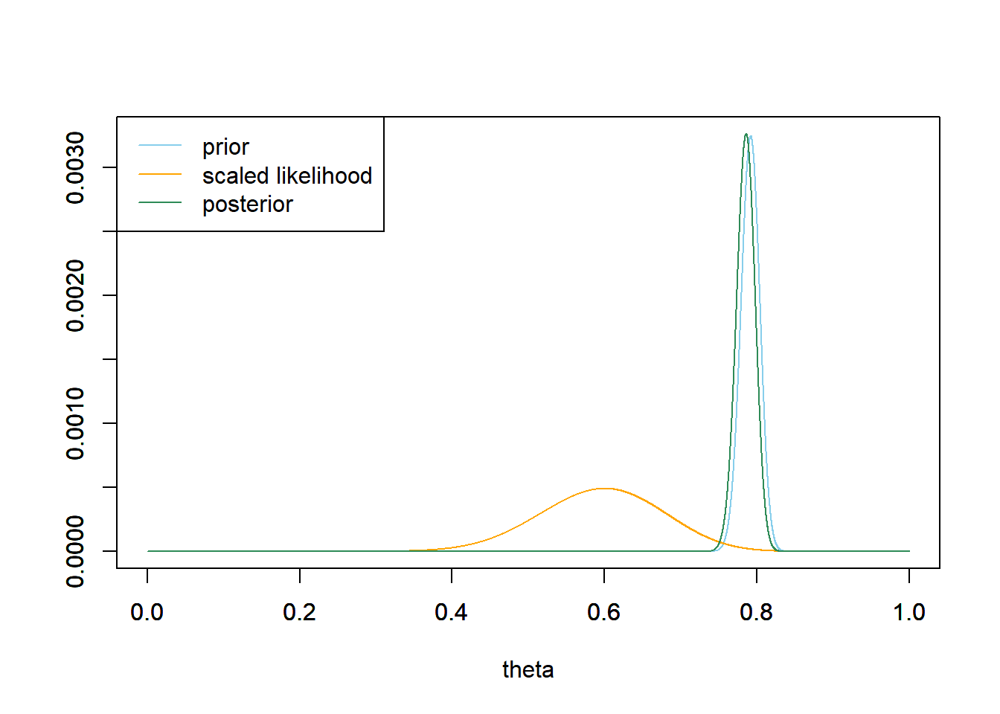

# Wstęp

Dzisiejszy wpis będzie nie będzie w formie zamkniętej, będę dodawał do niego treści gdy czas pozwoli. Poruszymy problematykę selekcji modeli, wyboru rozkładów a priori i innych przydatnych rzeczy w analizie Bayesowskiej.


## Selekcja modeli

Wyprodukujmy sobie dane powiązane kwadratowo.

```{r}
set.seed(123)
x = rnorm(100,1,1)
y = 0.5*x^2 + rnorm(100,0,1)
plot(x,y)
```

Następnie zamodelujemy związek x i y liniowo i kwadratowo. 


```{r message=FALSE, warning=FALSE,results='hide'}
library(rjags)
library(coda)
library(MCMCvis)

mod_lin = "model {
  # Priors
  a ~ dunif(-1000, 1000)
  b ~ dnorm(0, 100^-2)
  sigma ~ dunif(0.000001,1000)
  
  # Likelihood
  for (i in 1:length(y)) {
    y[i] ~ dnorm(a + b * x[i], sigma^-2)
  }}"

mod_sq = "model {
  # Priors
  a ~ dunif(-1000, 1000)
  b ~ dnorm(0, 100^-2)
  sigma ~ dunif(0.000001,1000)
  
  # Likelihood
  for (i in 1:length(y)) {
    y[i] ~ dnorm(a + b * x[i]^2, sigma^-2)
  }}"


params = c("a","b","sigma")
n.adapt = 100
ni = 3000
nb = 3000
nt = 1
nc = 3

model_lin = jags.model(file = textConnection(mod_lin), data = list(x = x, y = y), n.chains = nc, inits = NULL, n.adapt = n.adapt)
update(model_lin, n.iter=ni, by=1)
samples_lin = coda.samples(model_lin, params, n.iter = nb, thin = nt)

model_sq = jags.model(file = textConnection(mod_sq), data = list(x = x, y = y), n.chains = nc, inits = NULL, n.adapt = n.adapt)
update(model_sq, n.iter=ni, by=1)
samples_sq = coda.samples(model_sq, params, n.iter = nb, thin = nt)

```
Zerknijmy na przedziały wiarygodności dla współczynników regresji. 


```{r}
summary(samples_lin)
```
```{r}
summary(samples_sq)
```
W obydwu przypadkach przedziały nie zawierają zera. Musimy rozsądzić, który model jest lepszy. Moglibyśmy zrobić to przy pomocy już omówionego Czynnika Bayesa. Jednak, tak jak już wspominałem, obliczenie go w bardziej skomplikowanych modelach jest problematyczne.

W modelach częstościowych używa się kryteriów informacyjnych takich jak AIC i BIC do selekcji modeli. W statystyce Bayesowskiej do oceny dopoasowania modelu możemy użyć *Deviance Information Cryterion* (DIC). 

$$\text{DIC} = D(\bar{\theta}) + 2*p_D$$
gdzie:

$$ D(\theta) =  -  2\log ({\rm{P}}(y|\theta ))$$

$$ p_D= D(\bar{\theta}) -  \overline{D(\theta)}$$

DIC jest zdefiniowane jako różnica między (ujemnym) logarytmem funkcji wiarygodności zewaluowanym dla średniej wartości parametrów $\theta$ z rozkładu post priori $D(\bar{\theta})$ (gdzie dla symetrycznych rozkładów otrzymujemy najbardziej wiarygodne wartości) a dewiacją $p_D$. Dewiacja, z kolei, jest obliczana jako różnica między wartością funkcji wiarygodności $D(\bar{\theta})$ a średnią wartością logarytmu funkcji wiarygodności dla wszystkich parametrów. 


Innymi słowy, wartość $D(\bar{\theta})$ dostarcza informacji na temat skupienia gęstości prawdopodobieństwa wokół dominującej wartości $\bar{\theta}$. Im lepszy jest model, tym mniejsza jest ta wartość. Jednakże, gdy liczba parametrów w modelu wzrasta, wartość $D(\bar{\theta})$ może również maleć, ponieważ bardziej skomplikowany model ma większą elastyczność w dopasowaniu się do danych. Dlatego drugi składnik, $\overline{D(\theta)}$, mierzy stopień rozproszenia wiarygodności wokół dominującej wartości. Im więcej parametrów, tym większa wartość tego składnika.

Podsumowując, modele z mniejszą wartością DIC są preferowane, ponieważ sugerują większe skupienie gęstości prawdopodobieństwa wokół dominującej wartości, jednocześnie uwzględniając liczbę parametrów w modelu.
 
Policzmy DIC dla naszych modeli. 


```{r}
Dic_lin = dic.samples(model_lin,1000)
Dic_lin
```

```{r}
Dic_sq = dic.samples(model_sq,1000)
Dic_sq
```


```{r}
diffdic(Dic_sq,Dic_lin)
```


Widzimy, że model z kwadratowym związkiem pomiedzy x i y jest lepiej dopasowany do danych.  

Prócz DIC, w statystyce Bayesowskiej narzędziami do oceny dopasowania modeli są *Widely Applicable Information Criterion* (WAIC) oraz *Leave-one-out cross-validation* (LOO-CV). Są to metody, które nie są zaimplementowane w JAGS, jednak warto je poznać, ponieważ posiadają lepsze właściwości [@gelman2014understanding].


## Wybór rozkładów a priori

To chyba najtrudniejszy temat w statystyce Bayesowskiej. Zasadniczo zgodnie z ortodoksyjną filozofią Bayesowską rozkłady *a priori* powinny odzwierciedlać naszą wcześniejszą wiedzę. Filozofia ta może wydawać się kusząca, ponieważ tak właśnie powinna działać nauka. Akumulować wiedzę i następnie po otrzymaniu nowych danych aktualizować swoje oczekiwania. Jednak gdy przechodzimy do modelowania pojawia się problem. 

Jak przedstawić naszą wiedzę w postaci rozkładów *a priori*? Czy jeśli użyjemy informatywnego rozkładu dla współczynnika regresji, powiedzmy $N(100,0.001)$, i po otrzymaniu rozkładu *a posteriori* przedział wiarygodności nie będzie zawierał 0, czy właśnie nie oszukaliśmy by uzyskać "istotny" współczynnik regresji?

Z kolei jeśli użyjemy zbyt informatywnego rozkładu skoncentrowanego wokół zera, możemy ograniczyć naszą zdolność do wykrycia istniejącego efektu. 

Rozważmy następujący przypadek:



Widzimy tu przykład zastosowania bardzo restrykcyjnego rozkładu *a priori*. Rozkład *posteriori* nie bardzo przypomina rozkład *a priori*. Z kolei gdybyśmy brali pod uwagę tylko wiarygodność (tzn, zastosowalibyśmy płaski rozkład *a priori*), różniłby się on znacznie od rozkładu *a priori*. 

Przypomnijmy sobie jaką interpretacje ma rozkład *a posteriori* i zastosujmy ją do powyższego wykresu: Pod warunkiem naszych zaobserwowanych danych, zaobserwowane przez nas dane mają znikome prawdopodobieństwo zaobserwowania.

Hmm. Tak jak wspominałem ustalenie właściwych rozkładów to rzecz nietrywialna.   

Zasadniczo, możliwe podejścia do rozkładów *a priori*:

- **Używanie nieinformaywnych priorów** (np. rozkładów jednostajnych) - częste i najprostsze podejście. Zalety: Dobre do celów eksploracyjnych. Wady: To głębszy temat, jednak w wielu przypadkach użycie słabych priorów może znacząco zbiasować wyniki naszej analizy. Rozszerzę ten punkt, a na razie odsyłam do <span style="color:blue">[wpisu](https://statmodeling.stat.columbia.edu/2013/11/21/hidden-dangers-noninformative-priors/)</span> Andrewa Gelmana.

- **Empiryczny Bayes**. Możemy użyć danych by wyestymować rozkłady *a prior*. Przykład możecie znaleźć w pierwszej części tutorialu (przykład z księgarnią). Jest to użyteczne narzędzie, jednak niekoniecznie zawsze najlepsze do wnioskowania statystycznego. To znaczy, należy rozważyć na ile możemy sobie pozwolić na "zajrzenie" do danych, zanim użyjemy docelowego modelu. 

- **Wybieranie informatywnych rozkładów *a priori* **. W jaki sposób? Zwykle posiadamy jakieś informacje na temat badanego zjawiska. Jakiej wielkości efektu możemy się spodziewać? Jeśli współczynnik regresji 0.1 to maksymalna rozsądna wartość na jaką możemy liczyć, ponieważ wiemy, że inne zbadane w literaturze efekty znacznie ważniejszych predykatorów osiągają maksymalnie taki efekt, to $N(0,1)$ nie będzie najlepszym priorem, ponieważ ponad 90% gęstości prawdopodobieństwa znajduje się **poza przedziałem [-0.1, 0.1]**. Słaby prior mógłby na przykład sprawić, że wykrylibyśmy efekt "istotny, ale trywialny", jak na przykład korelację między atrakcyjnością rodziców a prawdopodobieństwem urodzenia dziewczynki. Ten pozorny efekt nie został by uznany za istotny, gdyby użyto informatywnego rozkładu *a priori*, który uwzględniał wielkości efektów dla zmiennych takich jak np. wiek matki [@gelman2017prior]. 

Ogólne wskazówki dotyczące wybierania rozkładów *a priori* (niezależne od wyżej wymienionych strategii):

Rozkład *a priori* powinien kształtem przypominać rozkład modelowanego parametru. Jeśli parametr jest średnią - to zwykle zamodelujemy go rozkładem normalnym. Co w przypadku innych parametrów? Warto zobaczyć jak takie parametry się zachowują. Policzmy sobie wariancję z 300^2 prób, w których losujemy 25 obserwacji z rozkładu normalnego.

```{r}
variances = replicate(300^2,var(rnorm(25,0,1)))
plot(density(variances))

```
Jak widzimy, rozkład wariancji jest prawoskośny. Rozkładem prawdopodobieństwa, którym często modeluje się wariancję jest rozkład Gamma. 


```{r}
curve(dgamma(x,7,7),0,3)
```
## Garść wniosków

Statystyka Bayesowska ma swoje wady i zalety. W tutorialu skupiliśmy się głównie na metodzie numerycznej, jaką jest MCMC, do modelowania. Ta metoda umożliwia także estymację modeli, które nie mają rozwiązań analitycznych (albo ich nie znamy). Moglibyśmy estymować parametry takich modeli za pomocą zwykłej optymalizacji. Jednakże, wtedy pojawia się problem, ponieważ nie możemy obliczyć przedziałów ufności. Mnie interesuje mnie głównie wnioskowanie statystyczne, a podejście Bayesowskie dostarcza nie punktową wartość parametru tylko jego rozkład, co pozwala ocenić niepewność związana z tymi parametrami!
