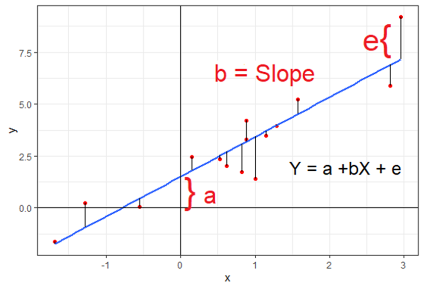

### Wprowadzenie

Motywacja do używania mieszanych modeli liniowymi (*aka* hierarchicznych/wielopoziomowych modeli liniowych). 

Będziemy ich używać wtedy gdy nasze obserwacje są pogrupowane w klastry, czyli na przykład wtedy gdy wykonujemy wiele pomiarów zmiennej u różnych osób. W takiej sytuacji pomiary wykonane u osoby A będą do siebie bardziej podobne, niż do pomiarów wykonanych u osoby B. Klastrem nie musi być osoba, może być to dowolna grupa (szkoła, klasa), która sprawia że obserwacje wewnątrz niej są bardziej do siebie podobne niż do obserwacji spoza grupy. Będzie to zwłaszcza istotne w badaniach podłużnych i eksperymentalnych, choć nie tylko. 

Dlaczego jest to problemem i czemu nie możemy zastosować do takich danych klasycznych metod statystycznych? 

Przypomnijmy sobie klasyczną regresję linową. 

Regresja liniowa ma postać:

$$ Y_i = \alpha + \beta X_i +\epsilon_i$$
gdzie $a$ to stała, $\beta$ to współczynnik regresji, $\epsilon$ to błąd. W takim modelu liniowym zakłamy, że jedyną zmienną losową jest błąd $\epsilon_i$ i zwykle modelujemy go rozkładem normalnym o średniej 0 i wariancji $\sigma$: 

$$\epsilon_i \sim N(0, \sigma)$$

Gdy chccemy oszacować związek liniowy pomiedzy zmienną Y i X wykorzystujemy taką włłaśnie funckję liniową, szukając takich parametrów $a$ i $\beta$, które zminimalizują nam średni kwadrat błędu $E(\epsilon^2)$. 



Czyli, zasadniczo staramy się wyestymować taką linię regresji, która sprawi, że odległości naszych obserwacji do niej będą jak najmniejsze. 

W naszej funcji liniowej $a$ kontroluje gdzie linia przetnie 0 na osi Y. Współczynik regresji $\beta$ kontroluje nachylenie lini (gdy wynosi 0 linia jest płaska). To co następnie robimy to liczymy statystykę T dla $/beta$ by określić czy istotnie różni się od 0. Jeśli tak uznajemy, że wykryliśmy związek liniowy pomiędzy Y i X. 

Co jeśli jednak nasze dane będą pogrupowane w klastry? 

### Niewykrycie prawdziego efektu

Załóżmy, że wykonujemy przez pewien czas pomiary zadowolenia z obsługi i wysokości napiwków u stałych klientów pewnej restauracji. 

```{r echo=FALSE}
library(tidyverse)

set.seed(1)
n <- 5
b <- 2
x <- seq(2, 2 * n, 2)

d <- do.call(rbind, lapply(1:n, function(i) {
  data.frame(
    Zadowolenie = b * seq(1, n, by = 0.2) + rnorm(21,0,2.5) - (1/5)*i,
    grp = as.character(i),
    `Napiwek w %` = seq(1, n, by = 0.2) + 5*i
  , check.names = F)
}))


ggplot(d, aes(x = `Napiwek w %`, y = Zadowolenie)) + geom_point() + theme_bw() + 
  theme(legend.position="none") + geom_smooth(method = "lm", se = F)


```

Widzimy tu brak zależności liniowej. Teraz zróbmy tak by na wykresie kolor kropki odpowiadał konkretnemu klientowi.

```{r echo=FALSE}
ggplot(d, aes(x = `Napiwek w %`, y = Zadowolenie, colour =
  as.character(grp))) + geom_point() + theme_bw() + 
  theme(legend.position="none") + geom_smooth(method = "lm", se = F)
```

Widzimy, że u każdego z klientów występuje związek liniowy pomiędzy napiwkiem i zadowoleniem. Jednak ponieważ, nasze pomiary zagnieżdone są w klientach, co objawia się tym, że każdy klient średnio daje inną wartość napiwku, przeoczylibyśmy ten związek, nie uwzględniając tego w modelu (stosując klasycznę regresje). 

### Wykrycie nieprawdziwego efektu

Czy może nam się zdarzyć sytuacja odwrotna? Używając prostej analizy liniowej wykryjemy efekt, którego nie ma? Załóżmy, że chcemy ocenić wpływ picia napojów kofeinowych na wyniki ucznia w nauce. Zebraliśmy dane z trzech klas liceum pytając o średnie spożycie napojów kofeinowych dziennie i średnią ocen. 

```{r echo=FALSE}
set.seed(123)

d2 = data.frame(`Spożycie napojów kofeinowych` = rnorm(90, 3, 0.1), `Średnia ocen` = rnorm(90,3.5,0.1), Klasa = c(rep(1,30),rep(2,30),rep(3,30)),check.names = F)

d2$`Spożycie napojów kofeinowych` = d2$`Spożycie napojów kofeinowych` + d2$Klasa/4
d2$`Średnia ocen` = d2$`Średnia ocen` + d2$Klasa/8
ggplot(d2, aes(x = `Spożycie napojów kofeinowych`, y = `Średnia ocen`)) + geom_point() + theme_bw() + theme(legend.position="none") + geom_smooth(method = "lm", se = F)


```
Zaznaczmy na wykresie kolorami uczniów przynależących do danej klasy. 


```{r echo=FALSE}
ggplot(d2, aes(x = `Spożycie napojów kofeinowych`, y = `Średnia ocen`, colour =
  as.character(Klasa))) + geom_point() + theme_bw() + 
  theme(legend.position="none") + geom_smooth(method = "lm", se = F)
```

Jak widzimy, w poszególnych klasach spożycie kofeiny nie ma wpływu na wyniki ucznia w nauce. Kiedy możemy zaobserwować taką zależność? Załóżmy na przykład, że każda z klas ma innego wychowawcę i ich wpływ przedkłada się na średnią ocen. Załóżmy też, że zupełnie przypadkowo w klasach z lepszym wychowawcą, średnie spożycie napojów kofeinowych jest większe. Otrzymamy wtedy sytuację jak na powyższych wykresach. 

Oczywiście, może istnieć jakaś zależność pomiędzy średnim spożyciem kofeiny na klasę a jej średnią ocen lecz to nie odpowiada na pytanie, które zadaliśmy tzn. o **wpływ kofeiny na osiągnięcia indywidualnego ucznia**. Tutaj warto wprowadzić sobie rozróżnienie między efektem węwnątrzobiektowym i międzyobiektowym. 

### Efekt wewnątrzobiektowy i międzyobiektowy


```{r include=FALSE}


signal_intercepts = rnorm(20,4,4) 
response_intercepts = rnorm(20,0, 5) + -2*signal_intercepts

data =  data.frame()
for (participant in 1:20){
  
  signal = rnorm(20,4,1)  
  response =  1*signal + rnorm(20,0,1)
  response = response + response_intercepts[participant]
  signal = signal + signal_intercepts[participant]
  data =  rbind(data, data.frame(signal,response,participant))
  
}
data_averaged = data %>% group_by(participant) %>% summarise(mean_signal = mean(signal), mean_response = mean(response))

```

```{r echo=FALSE, layout="l-body-outset"}
plot1 <- ggplot(data, aes(x = signal, y = response, colour = as.character(participant))) +
  geom_point() + theme_bw() +  theme(legend.position="none") + xlab("Szybkość pisania") + ylab("Ilość błędów")

plot2 <- ggplot(data_averaged, aes(x = mean_signal, y = mean_response)) +
  geom_point() + theme_bw() +xlab("Szybkość pisania") + ylab("Ilość błędów")

plot_grid(plot1, plot2, labels = "AUTO")
```


Jak widzimy na wykresie, występuje zarówno efekt międzyobiektowy, jak i wewnątrzobiektowy. Ponadto, te efekty mają przeciwny znak. 

Przykładem z życia takiej sytuacji jest szybkość pisania na klawiaturze. Im szybciej średnio dana osoba pisze na klawiaturze tym rzadziej popełnia błędy. Jednak każda osoba, im relatywnie szybciej (względem swojej średniej) pisze, tym więcej błędów popełnia. 

### Z czym się mierzymy?

Problem możemy zdefiniować na kika sposobów. W pierwszej sytuacji chcemy zbadać związek pomiędzy napwkami a zadowoleniem z obsługi. Na przeszkodzie jednak staje nam efekt kienta - każdy klient ma inny bazowy średni napiwek. Klient jest tu zmienną zakłócającą. By poprawnie wyestymować wpływ zadowolenia na napiwki, moglibyśmy kontrolować wpływ poszczególnego klienta. W istocie, na tym (tzn, kontrolowaniu dodatkowych źródeł błędu) z grubsza polega mechanizm działania mieszanych modeli liniowych.  

Przyjrzyjmy się teraz problemowi z innej perspektywy. Gdy chcemy zbadać wpływ zmiennej $X$ na Y, na przykład licząc współczynnik korelacji Pearsona, musimy wykonać następujące kroki (książkowo):  **Losujemy obserwacje** do naszej próby. Następnie, ponieważ każda obserwacja miała takie samo prawdopobieństwo dostania się do próby, traktujemy te obserwacje jako niezależne zmienne losowe o identycznym rozkładzie (**iid, independent and identically distributed random variables**). Na chłopski rozum, oznacza to, że jeśli stworzymy sobie histogram zmiennej X, otrzymamy z grubsza estymatę rozkładu zmiennej $X$ w populacji. W przypadku powyższych danych, nie jest to prawda. Przyjrzyjmy sie dokładniej tej definicji. 

Definicja składa się z dwóch zasadniczych elementów. **Niezależność** oznacza, że obserwacje są niepowiązane (wylosowanie $x_1$ nie mówi nam nic o prawdopobieństwie wylosowania $x_2$), co często nie jest spełnione w danych pogrupowanych w klastry, ponieważ obserwacje wewnątrz klastra są do siebie bardziej podobne. Innymi słowy obserwacje w klastrze są ze sobą skorelowane. 

Drugą częścią definicji jest fakt, że obserwacje zostały **wylosowane z tego samego rozkładu**. Przykładowo, jeśli wykonujemy pojedynczy pomiar zadowolenia u różnych osób odwiedzających restaurację, to możemy powiedzieć, że wszystkie te obserwacje zostały wylosowane z tego samego rozkładu zadowolenia (by być dokładnym, z tego samego rozkładu w danym klastrze, czyli w tej samej restauracji). Jednakże, w praktyce wielokrotnie wykonujemy pomiary zadowolenia u tych samych osób, co oznacza, że zmienna "zadowolenie" ma inny rozkład u klienta A, a inny u klienta B. 


### Co możemy zrobić? 

Rozważmy hipotetyczny eksperyment. Badane osoby oglądają różne zdjęcia, a po po obejrzeniu oceniają jak bardzo zdjęcie było pobudzające. W trakcie badania uczesnicy mają na palcu wskazującym i środkowym elektrody mierzące aktywność skórno-galwaniczną (mikropocenie). 

Chcemy zadać pytanie czy większa amplituda sygnału z elektrod jest związana z większym pobudzeniem. 

Gdyby interesowało nas to, czy osoby z średnio wyższą amplitudą sygnału mają wyższą średnią ocenę (efekt międzyobiektowy), możemy po prostu uśrednić pomiary na osobę i skorelować je ze sobą. 

Nas jednak interesuje to, czy osoby z średnio wyższą amplitudą sygnału mają wyższą średnią ocenę (efekt międzyobiektowy). Możemy spróbować po prostu uśrednić pomiary na osobę i skorelować je ze sobą. Niestety ta metoda nie zadziałałaby. Dlaczego? Zasymulujmy sobie takie dane:
 


```{r}
library(tidyverse)
library(lme4)
library(parameters)
library(datawizard)
library(cowplot)


between_effect = 0
within_effect = 0.5
between_sd = 2
within_sd = 0.1

signal_intercepts = rnorm(100,0,1) 
response_intercepts = rnorm(100,0, between_sd) + between_effect * signal_intercepts

data =  data.frame()
for (participant in 1:100){
  
  signal = rnorm(100,4,0.1)  
  response =  within_effect*signal + rnorm(100,0,within_sd)
  response = response + response_intercepts[participant]
  signal = signal + signal_intercepts[participant]
  data =  rbind(data, data.frame(signal,response,participant))
  
}
data_averaged = data %>% group_by(participant) %>% summarise(mean_signal = mean(signal), mean_response = mean(response))

cat("Korelacja pojedynczych pomiarów",cor(data$signal, data$response))
cat("Korelacja średnich pomiarów na osobę",cor(data_averaged$mean_signal, data_averaged$mean_response))

```
Nie obserwujemy znaczących korelacji w żadnym wypadku. Zerknięcie na wykres wyjaśni tajemnicę:

```{r tidy=FALSE, layout="l-body-outset"}
plot1 <- ggplot(data, aes(x = signal, y = response, colour =
  as.character(participant))) + geom_point() + theme_bw() + 
  theme(legend.position="none")

plot2 <- ggplot(data_averaged, aes(x = mean_signal, y = mean_response)) +
  geom_point() + theme_bw()

plot_grid(plot1, plot2, labels = "AUTO")
```

Jeśli spojrzymy na wykres po lewej, zobaczymy różnokolorowe zgrupowane punkty. Te kolory to poszczególni badani. Jeśli się im przyjrzymy zauważymy, że są lekko przechylone w prawo, co sugeruje związek liniowy. Jednak badani są rozrzuceni po całym wykresie (duża wariancja międzyobiektowa), ponieważ występuje duże zróżnicowanie pomiędzy ich bazowymi (średnimy) amplitudami i ocenami. Wykres ich średnich pokazuje brak związku, ponieważ te bazowe wartości nie są ze sobą związane.

Jest to sytuacja, którą stosunkowo często obserwujemy. Mamy na przykład dwie osoby, osoba A jest bardziej reaktywna niż osoba B, to znaczy że średnio będzie bardziej pobudzona i będzie miała większą reakcję skórno galwaniczną niż osoba B. Jednak u obu osób istnieje zależność im większe pobudzenie tym większa reakcja skórno galwaniczna. 

Jednak fakt, że osoby A i B znacząco różnią się swoją bazową reaktywnością sprawi, że możemy nie wykryć tego związku klasycznymi metodami. 

Jak więc wykryć związek?

A gdybyśmy tak od wartości naszych zmiennych odjęli średnią dla danego badanego i usuneli wartości bazowe dla każdego badanego?

```{r tidy=FALSE}
data = data %>% group_by(participant) %>% mutate(signal_demeaned = signal - mean(signal), 
response_demeaned = response - mean(response))

ggplot(data, aes(x = signal_demeaned, y = response_demeaned, colour = as.character(participant))) +
geom_point() + theme_bw() +  theme(legend.position="none")
```

Lepiej, co nie? Jak więc uwzględnić to w modelu liniowym?

Nasz model regresji musimy zmodyfikować tak by brał pod uwagę średnie amplitudy badanych dodając kolejne źródła błędu. 

$$ Y_{ij} = \alpha + \beta X_{ij} + \mu_j + \epsilon_{ij}$$

W takim modelu $\mu_j \sim N(0,\tau)$ stanowi błąd wynikający z faktu, że poszczególne klastry $j$ różnią się bazową (średnią) wartością. Jest to tak zwany efekt losowy (*random effect*, dodatkowe źródło błędu). Na zajęciach omówimy dokładnie czym są efekty losowe, jakie efekty losowe można dodać do modelu i jak dobrać właściwy model do danych.  

Poniżej możecie zobaczyć jak zmiana wielkości efektów i odchylenia standardowego międzyobiektowego i wewnątrzobiektowego wpływa na wykres rozrzutu punktów.


```{r echo=FALSE,layout="l-body-outset"}
knitr::include_app("https://szpm.shinyapps.io/Mixed/", height = "1020")
```


