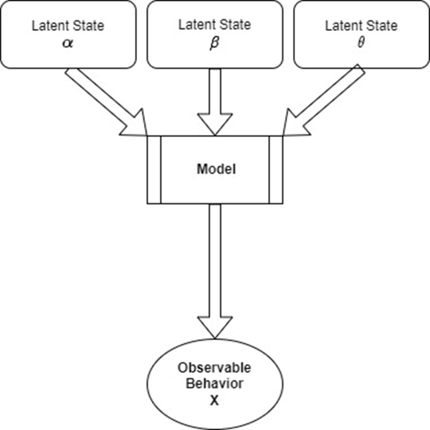

W wyniku eksperymentów behawioralnych zbieramy dane dostarczane przez uczestników badań. Mogą być to czasy reakcji, poprawność odpowiedzi, deklarowane pobudzenie emocjonalne i wiele innych. Możemy w myśl standardowego podejścia statystycznego np. porównywać czy w danej grupie badanych średnia danej miary jest większa. 

Możemy także spróbować zamodelować dany proces poznawczy tworząc model generatywny, który jest w stanie oddtowrzyć nam zaobserwowane dane. Takie podejście ma kilka przewag nad podejściem standardowym. Po pierwsze, tworząc model potrafiący odtorzyć nam zaaobserwowane dane, jesteśmy w stanie wnioskować na temat samego procesu. Możemy proponować wiele takich modeli i sprawdzać, który jest w stanie najlepiej odtworzyć obserwowane dane i na tej podstawie domniemywać, że podobny mechanizm poznawczy ma miejsce w umyśle człowieka. Po drugie, obserwowane dane mogą być mieszanką kilku procesów poznawczych, a uzycie modelu pozwala je nam od siebie odseparować. 

<center>
{width=60%}
</center>

Weźmy jako przykład krzywą psychometryczną. Modeluje ona związek pomiędzy charakterystyką fizyczną bodźca a kategoryzacją tego bodźca przez badanego. Częstym wyborem do modelowania krzywej psychometrycznej jest funkcja logistyczna. 

Wyobraźmy sobie badanie, w którym badananemu jest najpier zaprezentowany standarodowy obiekt o długości 100cm, a następnie 401 obiektów różnej długości. Zadaniem badanego jest zdecydowanie czy prezentowany obiekt jest dłuższy czy krótszy od standardowego. Prawdopodobieństwo, że badany określi obiekt jako dłuższy zamodeluje funkcją logistyczną. 


```{r}
library(ggplot2)

stimulus = seq(50,150, by = 0.25)
theta = rep(NA,401)
y = rep(NA,401)
nTrials = 401
standard = 100
alpha = 0
beta = 8
theta = 1/(1+exp(-(stimulus-standard-alpha)/beta))
y = rbinom(401,1,theta) # 0 - badany określił bodziec jako krótszy, 1 - jako dłuższy

dat = data.frame(stimulus,y, check.names = F)

ggplot(dat, mapping = aes(x = stimulus, y = y)) +
  geom_point() + 
  geom_function(fun = function(x){1/(1+exp(-(x-standard-alpha)/beta))}, colour = "blue") +
  xlab("Stimulus Size") + 
  ylab("Shorter\\Longer")

```
By wyestymować z danych parametry funcji, mogę posłużyć się podejściem bayesowskim. 


```{r}
library(tidyverse)
library(rjags)
library(coda)
library(MCMCvis)

m1 <- "model{
# Likelihood
for (trial in 1:length(y)){
theta[trial] = 1/(1+exp(-(stimulus[trial]-100-alpha)/beta))
y[trial] ~ dbern(theta[trial])
}

# Priors
alpha ~ dnorm(0,1/50^2)
beta ~ dnorm(0,1/100^2)T(0,)
}"

# what parameters we want to track
params = c("alpha", "beta")
# compile model
jmod = jags.model(file = textConnection(m1), data = as.list(dat,nTrials),
n.chains = 4, inits = NULL, n.adapt = 100, quiet = T)
# iterate through jmod for the extent of the burn-in
update(jmod, n.iter=1000, by=1)
# draw samples from the posterior for params
post = coda.samples(jmod, params, n.iter = 4000, thin = 1)
# diagnostic evaluation of posterior samples
MCMCsummary(post, params = c("alpha", "beta"))[,1:6]

```

Odzyskałem parametry. Ale zaraz, podobny efekt mógłbym osiągnąć używając zwykłej regresji logistycznej. Dlatego teraz skomplikujmy problem. Uczestnicy badań nie są w każdym trialu skpupieni tak samo na zadaniu. Czasami nie będą uważać i udzielą swojej odpowiedzi losowo, takie odpowiedzi są outlierami. Czy jesteśmy w stanie również ten proces zamodelować? Podmienię teraz w danych 40 obserwacji na 0 i 1 przyznane losowo. Następnie zmienię kod modelu tak by postarał się wyestymować czy dana obserwacja pochodzi z modelu logistycznego, czy była losowa. 


```{r}
dat$y[sample(1:401,40)] = sample(0:1,40,replace = T, prob = c(0.5,0.5))

m1 <- "model{
# Likelihood
for (trial in 1:length(y)){
theta_r[trial] = 1/(1+exp(-(stimulus[trial]-100-alpha)/beta))
theta_c[trial] ~ dbern(psi)
z[trial] ~ dbern(fi)
theta[trial] = ifelse(z[trial] == 0,theta_r[trial], theta_c[trial])
y[trial] ~ dbern(theta[trial])
}

# Priors
alpha ~ dnorm(0,1/50^2)
beta ~ dnorm(0,1/100^2)T(0,)
fi ~ dbeta(1,1)
psi ~ dbeta(1,1)
}"


# what parameters we want to track
params = c("alpha", "beta", "fi", "psi","z")
# compile model
jmod = jags.model(file = textConnection(m1), data = as.list(dat,nTrials),
n.chains = 4, inits = NULL, n.adapt = 100, quiet = T)
# iterate through jmod for the extent of the burn-in
update(jmod, n.iter=1000, by=1)
# draw samples from the posterior for params
post = coda.samples(jmod, params, n.iter = 4000, thin = 1)
# diagnostic evaluation of posterior samples
MCMCsummary(post, params = c("alpha", "beta","fi","psi"))[,1:6]

```

Model poradził sobie nieźle. Parametr fi mówi nam o odsetku outlierów wyestmowanych przez model. Parametr psi wkazuje natomiast jakie jest prawdopodobieństwo, że outlier przyjmie wartość 1. 

Możemy także sprawdzić jakie prawdopodobne jest, że dana obserwacja jest outlierem. 

```{r}
z = MCMCsummary(post, params = c("z"))[,1:6]
head(z)

```

Ot, stworzyliśmy właśnie model poznawczy dyskryminacji bodźca, biorący pod uwagę procesy uwagowe badanageo (skupienie na zadaniu). 
