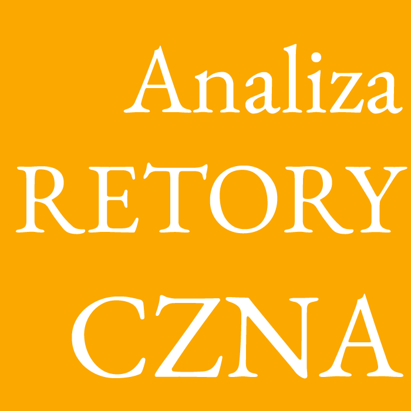

::: {.floatting}

```{r out.width='30%', out.extra='style="float:left; padding:20px"', echo=FALSE}
 
```

<br>
[Poszukiwanie wiedzy naukowej: Subiektywny poradnik](https://revan-tech.github.io/poradniki/P1_szukanie/szukanie)

Poradnik wprowadzający dla osób studiujących (i nie tylko!), które chciałyby znaleźć artykuły i książki naukowe - do esejów, prezentacji i różnorakich projektów. Pokazujemy przydatne źródła i narzędzia, radzimy co zrobić, żeby nie utonąć w nadmiarze danych.

<br>


```{r out.width='30%', out.extra='style="float:left; padding:20px"', echo=FALSE}
 
```
<br>
[Notatki z analizy retorycznej dla komunikacji naukowej](https://revan-tech.github.io/poradniki/P2_retoryka/retoryka.html)

Kompendium wiedzy o retoryce - kilka kilogramów informacji, skompresowanych do jednego artykułu. Dowiecie się: jak argumentować, jak komponować przekaz i jakich środków stylistycznych używać. Uwaga! Sięgamy do teorii lingwistycznych!


:::


