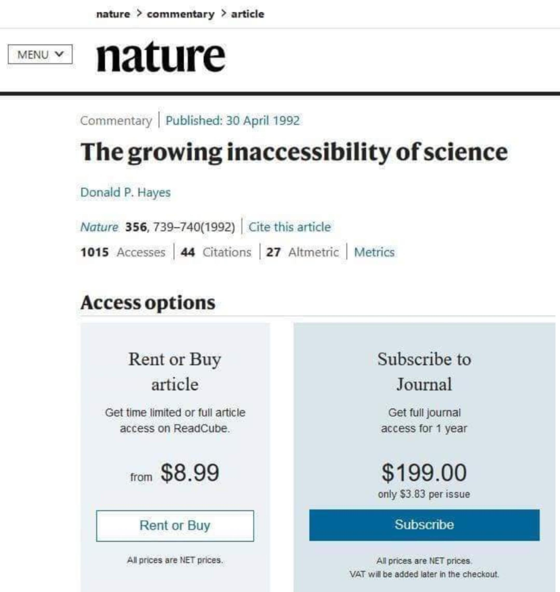
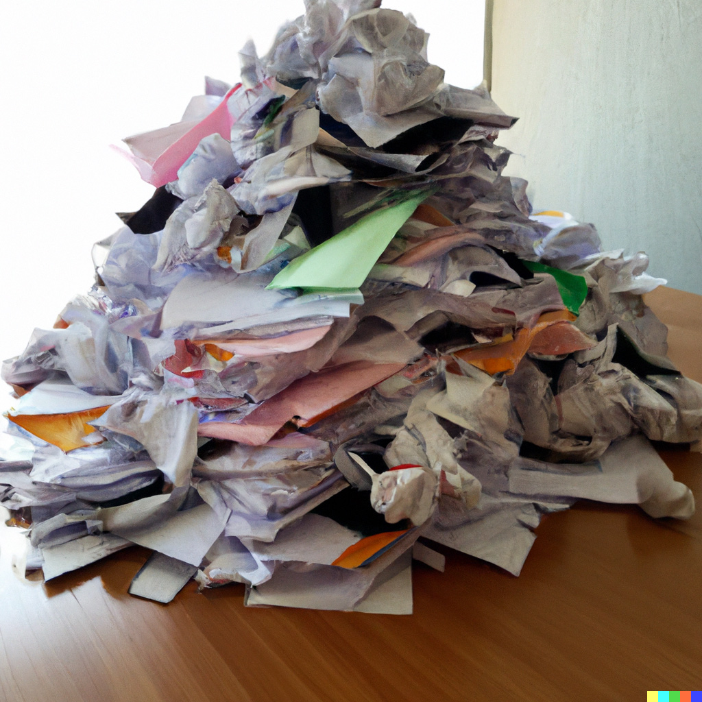

Cześć! Jesteście na Sortowni Wiedzy i jakkolwiek tu trafiliście, mogę założyć, że jesteście zainteresowani znalezieniem jakiegoś przydatnego kawałka wiedzy, informacji, naukowej treści. Zaczynacie przygodę z badaniami, ale nie jesteście pewni gdzie zacząć? Wyszukiwanie informacji może być przytłaczające, dlatego postanowiliśmy stworzyć krótki poradnik, który zaproponuje pewne podejście do przeszukiwania zbiorów. Pojawią się też powiązane kwestie, czyli budowanie metody, katalogowanie artykułów i ich czytanie.
**Nie ma jednego sposobu na szukanie wiedzy**, więc nie traktujcie tego tekstu autorytatywnie. Pokażę tu jedynie sposób, który dość dobrze się sprawdza.  

{width=70%}

## Przed wyruszeniem na poszukiwanie wiedzy, zbuduj sobie metodę

Może to zabrzmi zniechęcająco, ale to naprawdę ważne. I zasadniczo sprowadza się do zadania sobie pytania: “Czego szukam i po co tego szukam?”. Zanim wpiszemy hasło w [Google Scholar](https://scholar.google.pl/), zbudujmy sobie w głowie szkielet metody - nawet jeśli interesuje nas tylko pobieżne sprawdzenie losowego pomysłu, który oświecił nas o trzeciej w nocy. Wytyczenie kluczowych elementów i granic tematu pozwoli trafić na lepsze wyniki. Innymi słowy:

- co nas interesuje? czego chcemy się dowiedzieć?
- jakie są kluczowe elementy tego zagadnienia?
- gdzie są granice tego zagadnienia i co nas nie interesuje?
- po co tego szukamy?
- szukamy inspiracji czy konkretnych informacji?
- w jaki sposób użyjemy nowe materiały?
- ile ich potrzebujemy i kiedy musimy powiedzieć “stop” przy wyszukiwaniu?
- gdzie będziemy przechowywać pliki? jaka będzie struktura i nazewnictwo folderów na dysku?
- jak będziemy czytać artykuły i gdzie będziemy robić notatki?

Nie ma żadnej konieczności trzymania się tych zasad! Nie przyjedzie do Was policja naukowa na sygnale, gdy po prostu wpiszemy w wyszukiwarkę pierwsze hasło, które przyjdzie nam do głowy. Te zasady mogą się jednak przydać w momencie, gdy poczujemy zagubienie lub przytłoczenie nadmiarem treści. A czasem lepiej jest *po prostu płynąć* i dać się zaskoczyć znalezionymi materiałami.

{width=50%}

# Najprostsze wyszukiwanie

W większości przypadków, całkowicie wystarczające będzie otworzenie Google Scholar i wpisanie tam kilku haseł. Można ustawić wyszukiwanie na wyłącznie język polski (lub dowolny inny). Poradniki dotyczące [zaawansowanego wyszukiwania](https://pitt.libguides.com/googlescholar/searchtips) w Scholarze znajdują się w Bazie Wiedzy - m.in. wykluczanie haseł, szukanie po synonimach. Wiele artykułów uda się ściągnąć już z poziomu Google Scholar - jeśli są w otwartym dostępie. W zależności od dziedziny, Twoje pole naukowe może mieć inne domyślne repozytorium danych - w przypadku medycyny będzie to np. [PubMed](https://pubmed.ncbi.nlm.nih.gov/). 
Jeśli temat jest dla nas zupełnie nowy - **czasem warto najpierw rozeznać się**, poprzez czytanie wpisów na Wikipedii lub artykułów popularnonaukowych. Z tą wiedzą można ruszać dalej, na dokładniejsze poszukiwania. Często podkasty i kanały na Youtubie są świetnym wprowadzeniem w temat.
Można też zacząć od naszej [Bazy Wiedzy](https://szpm.shinyapps.io/baza_wiedzy/) w Sortowni Wiedzy, gdzie na szczycie listy zebraliśmy najważniejsze repozytoria artykułów naukowych. 
**[Cennym źródłem jest WordCat](https://www.worldcat.org/)**, strona zawierająca dane bibliograficzne książek, a także pobliskie biblioteki, w których daną książkę można znaleźć. A jeśli szukamy wyłącznie książek - to trzeba zajrzeć na [Google Books](https://books.google.pl/). Serwis ten wyświetla fragmenty książek, czasami to wystarczy, by zorientować się, czy książka jest nam potrzebna.

{width=50%} 
 
# Dostęp do artykułów i szara strefa, którą każdy zna - ale o której nie wypada mówić

Wiemy już, że istnieje jakiś artykuł w interesującym nas temacie, ale nie jest w otwartym dostępie i nie możemy go tak po prostu otworzyć. Może wystarczy nam abstrakt i nie musimy zdobywać całego pliku? Jeśli jednak przeczytanie artykułu jest konieczne, możemy zrobić kilka rzeczy. 

1. Zaskakująco często wystarczy przekopiować nazwę artykułu do zwykłej wyszukiwarki Google - autorzy często wrzucają swoje artykuły na [ResearchGate](https://www.researchgate.net/) lub [Academię](https://www.academia.edu/).
2. Może mamy dostęp instytucjonalny? Jeśli przynależymy do uniwersytetu, możemy mieć dostęp do wielu płatnych baz, na które nasz uniwersytet wykupił subskrypcję.
3. Czasami można poprosić autora o podesłanie artykułu. Niektórzy autorzy chętnie wysyłają swoje prace, wystarczy wysłać wiadomość.
4. Wchodzimy na Libgena lub SciHuba. To wymaga krótkiego omówienia:

<aside>Trzeba zaznaczyć, że Academia lubi spamować na maila zachętami do subskrypcji premium. ResearchGate jest zdecydowanie lepszym serwisem, ale może wymagać uniwersyteckiej skrzynki pocztowej do założenia konta. </aside>

Ekosystem publikowania prac naukowych jest, delikatnie mówiąc, nieidealny. **Autorzy nie dostają wynagrodzenia za swoją pracę, tak samo recenzenci**. Wydawnictwa pobierają jednak absurdalnie wysokie kwoty za pojedyncze artykuły (€20, €40 za jeden artykuł po jakimś czasie przestaje dziwić). Autorzy często muszą dopłacać za publikację od kilkuset, do kilku tysięcy Euro - jeśli chcą, by ich praca była w otwartym dostępie. Taki *gatekeeping* rzekomo gwarantuje wysoki poziom artykułów w prestiżowych pismach, faktycznie tworzy jednak barierę wolnego przepływu wiedzy i odcina od niej większość ludzi, w szczególności z mniej zamożnych krajów (co zresztą dalej pogłębia różnice pomiędzy Zachodem i resztą świata).

Stąd powstanie pirackich serwisów, które - w zależności od wybranego spojrzenia - uwalniają wiedzę lub ją zawłaszczają. 

Niezależnie od wybranego moralnego punktu widzenia, serwisy takie jak Libgen i SciHub udostępniają nieprzebrane ilości książek i artykułów za darmo.
Przed skorzystaniem z Libgena warto zainstalować Adblocka w swojej przeglądarce, by nie zostać zbombardowanym(ą) reklamami. Libgen ma wiele adresów, które z czasem mogą się zmieniać - adres można łatwo znaleźć przez Google.

Poniżej zamieszczam niezwykle przydatny poradnik korzystania ze wspomnianych stron (w języku angielskim):

https://docs.google.com/document/d/1ZwWs8JOrlkrrqiHwkQSwc4_NM85Zbzc9t9ifQ1rHZgM/edit 
Poradnik wspomina szereg innych stron i wyjaśnia jak z nich korzystać.

W samym Libgenie można zaznaczyć wyszukiwanie książek naukowych, beletrystyki, artykułów naukowych (SciHub), a nawet komiksów. Wyszukiwać można po autorach, tytule, roku, języku etc. 

Ewentualna wada Libgena? Mało jest tam materiałów w języku polskim. Na szczęście polskie artykuły naukowe zazwyczaj są w otwartym dostępie. Gorzej z polskimi książkami naukowymi - te jednak zazwyczaj wcale nie są bardzo drogie - wydanie ok. 30/40zł na książkę jest zawsze warte rozważenia. Nie zaszkodzi zajrzeć też na Docer i Chomikuj - ale tu uwaga - materiały na tych stronach zdecydowanie będą łamać prawa majątkowe danych dzieł. Jest to tym bardziej wątpliwe moralnie, że takie publikacje znajdziemy w bibliotekach publicznych. Dodatkowo, na Chomikuj łatwo przez przypadek ściągnąć potencjalnie niebezpieczny plik (szczególnie jeśli ma dziwną wielkość i końcówkę .exe). Co więcej, wersje chomikowe są zwykle kiepskiej jakości skanami. Lepiej odwiedzić lokalną bibliotekę lub [Ibuk Libra](https://libra.ibuk.pl) - jeśli mamy dostęp.

Żeby było jasne - **nie popieramy łamania praw autorskich i majątkowych**. Kupujcie artykuły i  książki, jeśli Was na to stać, niezależnie od tego czy cyfrowe, czy papierowe. Jednocześnie, wierzymy w otwarty i egalitarny dostęp do nauki i sprawiedliwe wynagrodzenia dla autorów dzieł. Obecny system obiegu wiedzy zawiera w sobie strukturalne patologie, które podważają zasadność podejścia moralnego i niejako wymuszają pragmatyczne “radzenie sobie” z zastaną sytuacją.

{width=65%} 

# Dalej nie mogę znaleźć tego, czego chcę: dwie klątwy

Ogólnie, przy wyszukiwaniu wiedzy mogą dotknąć nas dwie klątwy: nadmiar wyników i niedobór wyników.

W przypadku nadmiaru, najlepiej będzie wrócić do punktu startowego, czyli precyzyjniej określić sobie metodę wyszukiwania. Przy zbyt dużej ilości artykułów i książek spróbujmy określić, które są najbardziej znaczące dla naszego tematu.

W przypadku niedoboru można eksperymentować z doprecyzowanymi hasłami wyszukiwania, szukać po konkretnych autorach, wydawnictwach, lub po czasopismach. **Jeśli udało nam się znaleźć jeden pasujący artykuł - to zaglądamy do bibliografii i kłączowo szukamy kolejnych prac tam wymienionych**. Trzeba wykazać się kreatywnością w sprawdzaniu źródeł. Poniekąd dlatego zbieramy różne linki, bazy, agregatory w naszej [Bazie Wiedzy](https://szpm.shinyapps.io/baza_wiedzy/). Warto tam zajrzeć! Zgromadziliśmy sporo mało znanych i niszowych stron. Każda dziedzina będzie miała inne źródła, inne kluczowe strony. Jeśli znacie przydatne linki, których nie ma w Bazie - zgłaszajcie nam w formularzu! Będziemy dodawać i powiększać zbiór.

Ostatnio pojawiają się też strony takie jak [ResearchRabbit](https://researchrabbitapp.com/), które w bardzo wizualny sposób przedstawiają połączone tematycznie artykuły. Większość takich projektów korzysta w coraz większym stopniu z uczenia maszynowego i podpowiada pokrewne treści w dość sprytny sposób. Nie zapominajmy jednak, że wciąż najlepszym sposobem na znalezienie przydatnych treści jest zapytanie o poradę żywej osoby! Znajomi, wykładowcy i promotorzy zawsze chętnie podpowiedzą czego szukać. Pomóc może też zadanie pytania w odpowiednich grupkach akademickich na Facebooku lub Reddicie.

<aside> ResearchRabbit wymaga założenia konta.Nie jest też jedynym takim serwisem, zapraszamy do zajrzenia [pod ten link](https://aarontay.medium.com/3-new-tools-to-try-for-literature-mapping-connected-papers-inciteful-and-litmaps-a399f27622a), gdzie omawiane są [Connected Papers](https://www.connectedpapers.com/), [Inciteful](https://inciteful.xyz/) i [Litmaps](https://www.litmaps.com/).</aside>

{width=50%} 

# Weryfikacja treści

Zdobyliśmy artykuły! Nie cieszmy się jednak za wcześnie, zawsze trzeba zachowywać zdrowy rozsądek przy czytaniu. Artykuł opublikowany w Nature nie jest równy studenckiej notce udostępnionej na Academii. Trzeba uważać na Predatory Journals, które publikują praktycznie wszystko, o ile autor zapłaci. Trzeba uważać na jakość metod w badaniach, wielkość prób itd. Nie znaczy to, że wiedza z “prowincjonalnego” czasopisma jest bezwartościowa - ja osobiście uważam, że ze wszystkiego da się wyciągnąć jakieś przydatne informacje. Trzeba jednak krytycznie patrzeć na wszystko co czytamy. Nawet najbardziej prestiżowym pismom zdarzają się wpadki.

Kluczowe może być rozeznanie się, którzy autorzy są szczególnie istotni i wiarygodni w danej dziedzinie. Niektóre pisma są ważniejsze od innych - np. jedne służą jako platformy żywej dyskusji akademickiej i mają charakter opiniotwórczy, inne - służą publikacjom dla samego faktu publikacji. Wszystko zależy od dziedziny. Niezwykle istotna jest też data publikacji - stare badania mogą być już nieaktualne. Z drugiej strony, nauka ulega modom, więc w starszych pracach można często trafić na cenne inspiracje, zapomniane przez obecnie panujący mainstream dziedziny.

Nasze spojrzenie na wyniki badań i znaczenie publikacji może też zależeć od odpowiedzi, których od nich oczekujemy! Przykładowo:

 - jeśli robimy przegląd szczegółowego pola badawczego, będą nas interesować artykuły z jednostkowymi badaniami, które mogą mieć małe próby
 - jeśli szukamy odpowiedzi na ogólne pytania, powiedzmy: *czy telefony mają wpływ na jakość snu?*, *czy e-papierosy szkodzą zdrowiu?*, *na ile jakość edukacji wczesnoszkolnej wpływa na przyszłe zarobki?* - lepiej jest spojrzeć na badania z większych prób lub na metaanalizy (szczególny typ badań, uogólniający dane z wielu innych badań)
 - jeśli interesuje nas szerokie spojrzenie na temat, możemy sprawdzić jak odpowiadano na dane pytanie w różnych dziedzinach (np.: *człowiek w mieście* - spojrzenie psychologiczne, medyczne, socjologiczne, ekologiczne, literaturoznawcze, antropologiczne itd.)
 - jeśli chcemy poznać dziedzinę, interesują nas podręczniki, handbooki, wprowadzenia, monografie, opracowania z *concise* w nazwie
 
 

{width=60%} 

# Kupka wstydu

Na koniec być może największy problem. Naściągaliśmy mnóstwo plików i leży to wszystko latami, nigdy nie otworzone i nieprzeczytane. Wiedza musi żyć, musi być w umyśle, żeby funkcjonować. Zamknięta na dysku będzie mało przydatna. Sam nie wiem do końca jak rozwiązać ten problem, wciąż testuję różne systemy dla siebie. Do głowy przychodzą mi dwa podejścia:

A. Mieć dobrą strukturę folderów i plików, tak by można było szybko i łatwo odnaleźć dany plik. Najgorsze, co można zrobić, to wrzucać pliki do jednego folderu - i to jeszcze ponazywane np. article.pdf, article(1).pdf, 1213598.pdf…
Dodatkowo używam programu Everything, który błyskawicznie znajduje pliki na dysku. Czasami wystarczy, że pamiętam fragment nazwy pliku - mogę szybko odnaleźć to, czego potrzebowałem. 
Najważniejsze artykuły i książki warto katalogować w menedżerze bibliografii (np. Zotero), by można było szybko cytować istotne prace.

B. Mieć dobry system czytania. Czytanie artykułów naukowych jest ciężkie. Czasami “przedzieranie się” jest bardziej odpowiednim słowem. 
Są różne sposoby czytania artykułów naukowych. Wcale nie trzeba ich czytać od początku do końca! Dobrym sposobem jest:

  1. przeczytanie abstraktu i wstępu, 
  2. przeczytanie zakończenia, 
  3. przeczytanie środkowej części artykułu, 
  4. powtórzenie zakończenia, dla lepszego utrwalenia informacji. 

  
**Sposób czytania w dużej mierze zależy od tego, co chcemy wyciągnąć z artykułów i do czego dalej użyjemy tej wiedzy**. Czasem wystarczy pobieżne przejrzenie, czasem konieczne jest całkowite zanurzenie się w danej strukturze wiedzy.

  
Zawsze warto jest robić notatki i zaznaczenia - wewnątrz pliku, w zewnętrznym pliku, czy na papierze. Jeśli coś jest gwarantowane, to to, że za kilka miesięcy nie będziemy pamiętać z czytania prawie nic. Notatki wtedy będą ratującymi skórę bodźcami, które przypomną nam o czym czytaliśmy.
Trzeba się też rozeznać, kiedy ma się komfortowy czas na czytanie trudnych treści. Dla niektórych jest to poranek, dla innych późny wieczór (to ja). Nie ma co się zmuszać do czytania, jeśli nie mamy koncentracji i ewidentnie czytanie nie idzie. Często jednak warto lekko przymusić się i spróbować - po pierwszych 5 minutach może okazać się, że dalej już “jakoś poszło”. Bardzo rzadko będziemy mieli taki cudowny stan, w którym czytanie jest lekkie i sprawia radość. Przed czytaniem warto zrobić lekki wysiłek fizyczny - czasami pomaga na koncentrację.

{width=50%}

 
To tyle, kilka pomysłów na poszukiwania. Podkreślam - jest to subiektywna lista. Każdy wypracuje sobie własny najlepszy sposób. **Poszukiwanie wiedzy to żywy proces**, który za każdym razem się zmienia i ewoluuje. Pojawiają się nowe źródła, algorytmy zmieniają swoje działanie, my zmieniamy zainteresowania i uczymy się lepiej organizować wiedzę. Sam powód poszukiwań ma znaczenie dla ich wyglądu - raz lepiej jest robić to systematycznie, innym razem lepiej jest dać się porwać króliczej norze i popłynąć, razem z wyszukiwarkami i bazami danych.

Na pewno warto eksperymentować, testować różne sposoby. Któryś w końcu zadziała.

