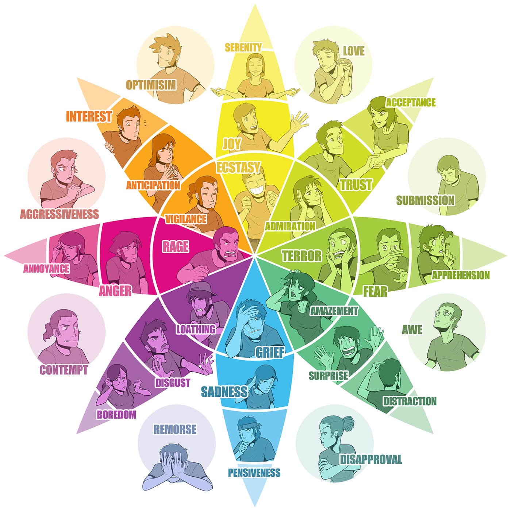
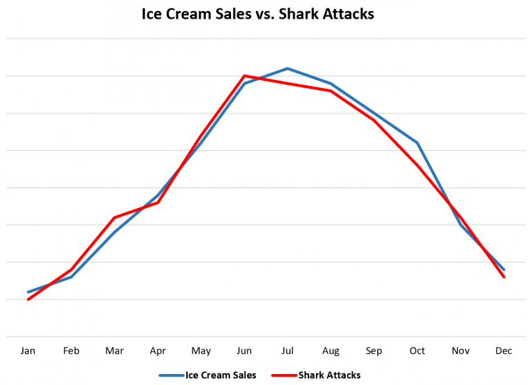
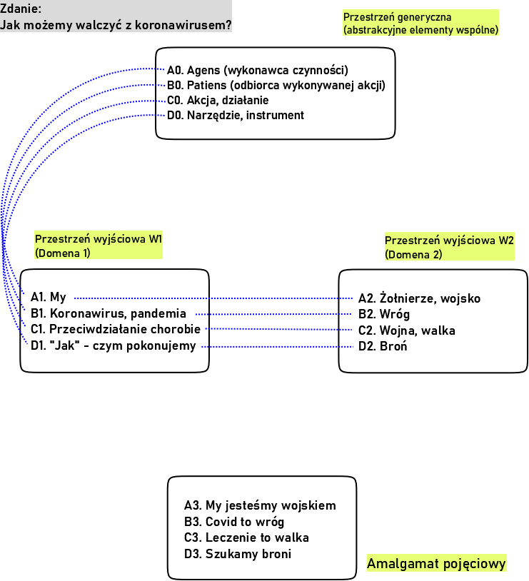
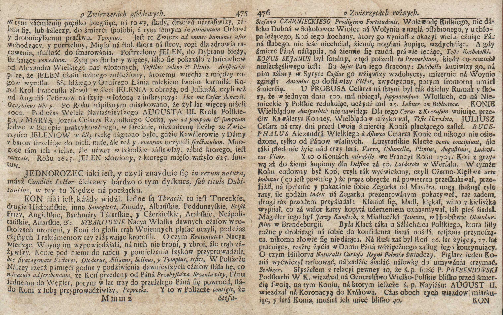

<p align="justify">


**Dla kogo jest ten poradnik?**<br>
- dla osób chcących poprawić jasność i skuteczność swoich wypowiedzi (również tekstowych)<br>
- dla chcących nauczyć się rozpoznawać strategie retoryczne w tekstach dyskursu publicznego, dla osób chcących analizować strategie retoryczne<br>
- dla osób obeznanych z lingwistyką, lub nie bojących się zmierzyć z pewną ilością terminologii lingwistycznej 

**Dla kogo nie jest ten poradnik?**<br>
- dla osób szukających sposobu na manipulowanie treścią (a w konsekwencji - ludźmi)

**Czym jest ten poradnik?**<br>
- zbiorem narzędzi do analizy tekstu, eklektycznie wybranych z kilku dziedzin lingwistyki<br>
- retoryką rozumianą luźno, jako celowe sposoby konstruowania wypowiedzi

**Czym nie jest ten poradnik?**<br>
- podręcznikiem do retoryki, kompleksowym omówieniem teorii<br>
- wprowadzeniem do retoryki arystotelesowskiej<br>
<br>

Poradnik jest dostępny w formie audio, <br>
w podkaście **Artykuły naukowe czytane**:<br>

[{width=40%}](https://www.spreaker.com/episode/52760721)
<br>(Podkast do przesłuchania na dowolnej platformie z podkastami, np. Google/Apple Podcasts, Spotify, Stitcher, Youtube)
<br>[Posłuchaj](https://www.spreaker.com/episode/52760721)
<br>[Dołącz](https://www.facebook.com/artykulynaukoweczytane/)

<br>

**Hej!** Masz przed sobą tekst o retoryce. Tekst, którego zadaniem jest wprowadzenie pojęć, które umożliwiają analizę tekstów. Inaczej mówiąc, pojęcia te umożliwiają dekonstrukcję tekstu. Wiedząc jak można teksty rozłożyć, zyskasz jednocześnie intuicje - jak można teksty składać intencjonalnie, czyli tworzyć.
Sklejam ten zestaw pojęciowy z kilku metodologii: klasycznej retoryki, lingwistyki kognitywnej, semantyki i pragmalingwistyki. Będzie to pewnego rodzaju szwedzki stół z metodami. Nie chcę ograniczać się do jednej kompleksowej ramy badawczej, by, po pierwsze, nie utknąć w szczegółach, a po drugie - ponieważ pozwoli to na bardziej elastyczne podejście w opisywaniu zjawisk/fenomenów zawartych w tekstach. Będę też trochę mieszał dwa porządki: porządek analizowania/dekonstrukcji (analiza retoryczna) i porządek produkcji/konstrukcji przekazu (retoryka). Tekst jest dość długi, więc nie czuj się w obowiązku do czytania jednym ciągiem. Tekst jest też dość intensywny terminologicznie - nie trzeba rozumieć i pamiętać wszystkiego od razu.

<details>
  <summary><span style="color: blue;">Terminologia w retoryce</span></summary>
  <hr>
Terminologię retoryczną uważam za dość problematyczną. Jest chaotyczną mieszanką terminów greckich, łacińskich, polskich. Na dodatek jest niemal całkowicie niekompatybilna ze współczesną lingwistyką. Na potrzeby tego poradnika ograniczam terminologię starożytną i staram się wprowadzać bardziej współczesne terminy. Przydałaby się nowa retoryka, która zrywałaby z ciężarem przeszłości - ale to temat na inną rozmowę.
<hr>
</details>


Zacznijmy od ustalenia wspólnego gruntu. Czym jest **komunikacja**? Jest to wymiana znaczeń. Ktoś tworzy tekst-informację i chce przekazać znaczenia, ktoś inny odbiera tekst-informację i dekoduje znaczenia. Nadawca i odbiorca. Słowa są formą, naczyniem dla znaczeń. Czym są znaczenia? No to już trudne pytanie. Na pewnym poziomie są w naszym mózgu. Jak ktoś mówi koń, to odpala się nam w głowie obszar “KOŃ”. Ogólna idea konia, związane cechy, wspomnienia, jakieś obrazy itd.

<aside>
Przez **tekst** mamy na myśli tekst kultury, czyli COŚ, co jest wehikułem komunikacji. Tym czymś może być tekst pisany, ale też - wypowiedź ustna, obrazek, film, gra, podkast.
</aside>

<details>
  <summary><span style="color: blue;">Znaczenia - neurony?</span></summary>
  <hr>
Można powiedzieć, że znaczenia to chmury neuronów w naszych mózgach, kodujące wiedzę o świecie - będąc powiązanymi zarówno z czystymi kategoriami w pamięci semantycznej, jak i z naszymi wspomnieniami z pamięci epizodycznej/autobiograficznej. Wiemy, że terminy odpowiedzialne za np. owoce i warzywa aktywują obszary mózgu w innym miejscu, niż na przykład terminy odpowiadające narzędziom. Co więcej - obszary mózgu związane z terminami na jedzenie znajdują się bliżej kory wzrokowej, a obszary związane z narzędziami - bliżej kory ruchowej.
<hr>
</details>

Jeśli ktoś nadaje jakikolwiek komunikat, to uruchamia dość skomplikowany proces **kodowania** tej mieszanki kategorii, wspomnień i obrazów w poręczny pakiet słów. Następnie, odbiorca komunikatu dekoduje słowa, przenosząc je na własną siatkę informacyjną - na własne kategorie, wspomnienia i obrazy. Jakim cudem jesteśmy zdolni się porozumieć? Dzięki koordynacji. Ludzie skoordynowali systemy znaczeń, ustalili wspólne, intersubiektywne kategorie. Tym jest, mówiąc z grubsza, język. Kiedy mówimy, mamy mniej więcej to samo w głowach. Kiedy powiem: koń, powinniśmy mieć dość podobne wyobrażenie (czyli konceptualizację) konia w głowie. Choć każde z nas będzie wyobrażać sobie trochę inny prototyp konia. Zawsze rozumiemy się “mniej więcej” - choć prawie zawsze to “mniej więcej” jest całkowicie wystarczające do sukcesu komunikacyjnego.
Nadawca kreuje przekaz, w nadziei że odbiorca odbierze to tak, jak nadawca zamierzył. Odbiorca odtwarza/rekonstruuje przekaz i w jakiś sposób reaguje. Czy zareaguje tak, jak chciał nadawca?

W związku z tym, tworzenie tekstu wymaga przewidywania i wyobrażania sobie, że tak naprawdę tworzymy całe **przestrzenie konceptualne** w głowach odbiorców. Więc - jesteśmy w zasadzie projektantami doświadczeń. To działa w dwie strony. Po pierwsze, możemy przeanalizować to co zostało zaprojektowane w już istniejącym tekście. Po drugie, możemy sami świadomie projektować teksty. Retoryka ma zarówno moc analityczną, jak i produkcyjną. Chciałbym jednak podkreślić, że trzeba to rozgraniczać. Analiza retoryczna jest ustrukturyzowanym sposobem rozkładu tekstu i sama z siebie nie tworzy rewelacyjnych, retorycznie fantastycznych przekazów. Chcę uniknąć około-coachingowych klimatów. Znajomość zjawisk retorycznych pomaga budować lepszą komunikację, ale produkcja tekstu wymaga użycia innego zestawu kompetencji.

Kolejna rzecz. Retoryka to sztuka dobrej argumentacji. Nie chodzi o wygranie dysputy za wszelką cenę (to erystyka i jej chwyty), a o przedstawienie jasnego i logicznie spójnego wywodu. Chcemy przekonać kogoś do swoich racji, ale to nasze racje mają wygrać. Czyli - musimy zadbać o to, żeby mieć dobre zaplecze: dane, dowody, argumenty, cytowania. Dopiero potem możemy zabrać się za sprawy językowe. Sensem retoryki jest wniknięcie w istotę rzeczy i wydobycie z niej tego, co przekonujące.

<details>
  <summary><span style="color: blue;">Debaty oksfordzkie</span></summary>
<hr>
Jedna rzecz doprowadza mnie do szewskiej pasji: debaty oksfordzkie i głęboko zakorzeniona w kulturze rama/metafora dyskusji jako walki lub wojny. Przekonanie, że jedna strona musi wygrać a druga przegrać. Czy to naprawdę potrzebne? Zakładając, że istnieje rzeczywistość obiektywna, celem dyskusji powinno być dążenie do niej, ustalanie konsensusu. Najlepiej, jeśli obie strony czegoś się nauczą od siebie, zaczną lepiej rozumieć omawiany temat. To nie jest gra o sumie zerowej! 
A jeśli nie mówimy stricte o obiektywnej rzeczywistości, tylko o subiektywnych perspektywach - dyskusja powinna umożliwić wspólne zrozumienie i porozumienie. 
<hr>
</details>


## Komunikacja naukowa
Czy chcesz napisać artykuł popularnonaukowy, czy tworzysz swoją pierwszą publikację naukową - musisz wziąć pod uwagę wpływ na odbiorców. Niby fakty mają obronić się same, ale w praktyce nastawienie odbiorców w trakcie czytania mocno zależy od pozamerytorycznych cech tekstu (tzn. wszystkiego tego, co nie jest sednem np. badań). Ktoś może się zniechęcić, bo nie zrozumie tekstu, zmęczy się tekstem lub zirytuje się zastosowanym stylem. Nie musisz czytać całego poradnika, natomiast zapamiętaj jedno: pisz przejrzyście i zrozumiale. To truizm, rzecz oczywista, ale ważniejsza niż wszystkie inne treści zebrane w tym poradniku. Królem jest ten, kto wytłumaczy trudne rzeczy w prosty sposób. Królową jest ta, która skutecznie przekaże wiedzę, bez jej spłycania.


<details>
  <summary><span style="color: blue;">Retoryka czy storytelling?</span></summary>
<hr>
Retoryka a storytelling i narratologia. Osoby interesujące się popularyzacją nauki łatwo trafią na poradniki storytellingowe, uczące jak ciekawie opowiadać o odkryciach naukowych. To inna dobra perspektywa, częściowo pokrywająca się i uzupełniająca z retoryką. Moim własnym zdaniem storytelling za bardzo zdominował “nauczanie mówienia o nauce”, przez co popularyzatorzy dużo tracą - np. właśnie dużo bogatszą perspektywę retoryczną. Tak, czy inaczej, wplotłem kilka elementów z teorii narracji do poniższego poradnika.
<hr>
</details>


Do rzeczy. W następnej części poradnika przedstawię działy retoryczne, struktury budowy przekazu i schematy argumentów. Potem opiszę wybór zjawisk językowych, które są elementami wypowiedzi retorycznych. Klasyczna retoryka ma 5 głównych działów - **inwencja**, **kompozycja** (dyspozycja), **elokucja**, mnemotechnika (memoria) i akcja-działanie. To dobry podział, również współcześnie, będziemy się go trzymać (ale mnemotechniki i działania nie będę opisywać w tym poradniku). 

# A. Inwencja
*Wyszukiwanie tego co przekonujące. Logos, czyli wynajdywanie słowa - faktu.*

Pole startowe to inwencja (inventio). Trzeba od czegoś zacząć - wybrać temat, dokonać selekcji informacji, obrać sobie cel, wstępnie dobrać toposy, sprecyzować odbiorców (audiencję).

Wybór tematu zdaje się być częścią oczywistą, ale to nie jest takie proste. Wie to każda osoba próbująca znaleźć temat do licencjatu czy magisterki. Musimy sami sobie zadać pytanie - czego chcemy, co chcemy przekazać, jaki efekt chcemy wywołać, co jest w zasięgu naszych możliwości. Pisałem o tym trochę w [poradniku poszukiwania wiedzy](https://revan-tech.github.io/poradniki/P1_szukanie/szukanie). Wszelkie poradniki storytellingu będą tłuc i wałkować konieczność ustalenia rdzenia opowieści, sedna, konkretów, kluczowych informacji i esencjonalnych wartości. To będzie punkt odniesienia nie tylko dla opowieści, ale i dla nas samych - przy poszukiwaniu źródeł wiedzy i argumentów. Można to przedstawić też poprzez pryzmat mowy sądowniczej: czy coś zaszło? co zaszło? kto był uczestnikiem? gdzie i kiedy coś zaszło? z jakim skutkiem? <br>
Pryzmat gatunku naukowego narzuca inne ramy: jaka jest hipoteza? jakie są zmienne? jaka jest metoda? jakie są czynniki zakłócające? jak przebiegła analiza/eksperyment? jakie były wyniki? czy udało się osiągnąć istotność statystyczną? jaki wpływ mają badania na szerszy kontekst naukowy?

A teraz - co jest naszym celem? Istotą retoryki jest zmiana przekonań. Jeśli używamy “retoryczności”, to chcemy kogoś przekonać. Nasz wyobrażony odbiorca ma jakiś system wiedzy, wartości i przekonań. Naszym celem jest przebudowanie systemu wiedzy odbiorcy (odbiorców), w oparciu o już istniejący, zastany system wiedzy odbiorcy. To znaczy - nie chcemy storpedować ludzi wiedzą i przytłoczyć naszymi racjami. Chcemy ich poprowadzić przez naszą argumentację, tak by sami odkryli jej sens i zgodzili się z proponowaną tezą. 

<details>
  <summary><span style="color: blue;">Budowanie rusztowania</span></summary>
<hr>
Jest to pokrewne teorii budowania rusztowania (scaffolding) i [modelowi hierarchicznej kompleksowości rozwoju](https://en.wikipedia.org/wiki/Model_of_hierarchical_complexity). Dobrym, jeśli nie najlepszym, sposobem edukacji jest budowanie tego metaforycznego rusztowania, które pomoże wspiąć się osobom na wyższy poziom rozumienia świata. Nie można jednak budować rusztowania, bez rozważenia obecnego stanu wiedzy odbiorców. 
<hr>
</details>

## Audytorium
Współcześnie retoryka nie ogranicza się jedynie do kilku ściśle określonych kontekstów (np. sądowego, doradczego, pochwalnego). Zasadniczo możemy retoryzować nawet samych siebie, prowadząc wewnętrzny dialog. Pomijając jednak ten ekstremalny kontekst, nasz przekaz (tekst, przemowa, wideo etc.) zawsze będzie miał jakichś odbiorców. Może być konieczne zrobienie rozróżnienia na bezpośredniego odbiorcę (np. w dyskusji) oraz publiczność. Jeśli tak - należy wziąć pod uwagę, że możemy oczekiwać jednej reakcji od bezpośredniego odbiorcy, a innej od publiczności. Sama publiczność może wpływać na przebieg dyskusji, a czasem może być i tak, że głównej zmiany nie oczekujemy od bezpośredniego odbiorcy, a właśnie od publiczności (np. w przypadku przedwyborczych debat politycznych).
Ustalenie audytorium jest więc kluczowym elementem procesu przygotowywania przekazu:<br>
**Kim są odbiorcy?<br>**
 - jak duża jest grupa odbiorców?<br>
 - jaki jest przedział wiekowy i przynależność pokoleniowa?<br>
 - jaki jest stan/klasa społeczno-ekonomiczna?<br>
 - jaka jest płeć, role społeczne, wykonywane zawody?<br>
 - do jakich subkultur, grup formalnych i nieformalnych przynależą?<br>
 - jakim językiem się posługują (rejestrem, socjolektem)?<br>
 - jak można nakreślić ich tożsamość?<br>
**Jaką strukturę wiedzy posiadają?**<br>
 - jakie jest wykształcenie odbiorców?<br>
 - jaką mają wiedzę, zasób pojęć, preferowane metody argumentacji?<br>
 - jakie mają przekonania uznawane za fakty (nie wymagające uzasadnienia, oczywiste)?<br>
 - jakie wyznają wartości?<br>
 - jakie mają doświadczenia (życiowe, biograficzne)?<br>
**Jakie są emocje odbiorców?**<br>
 - jakie mają nastawienie do tematu - pozytywne, neutralne, negatywne?<br>
 - jakie emocje panują obecnie, a jakie chcemy wzbudzić?<br>
 - czego odbiorcy oczekują od nas?<br>
 - ile odbiorcy są w stanie poświęcić dla nas (kupienie książki, poświęcenie czasu na obejrzenie wideo, przejście do określonego działania)?<br>
**Co łączy odbiorców?**<br>
 - na poziomie wartości, wiedzy, doświadczeń, przynależności społecznej<br>

<details>
  <summary><span style="color: blue;">Audytorium tego tekstu</span></summary>
  <hr>
Pewnie domagacie się odpowiedzi na pytanie - jakie ja wybrałem audytorium, przy pisaniu tego tekstu?
Odpowiedź jest dla mnie trochę kompromitująca, bo pierwotnie celowałem w szerszą publiczność, ale wyszedł mi dużo trudniejszy tekst, dla osób, które mają już pewne kompetencje w zakresie wiedzy lingwistycznej. W związku z tym projektowane audytorium tego tekstu wygląda mniej więcej tak: osoby z wyższym wykształceniem, młode, zainteresowane lingwistyką, wierzące w potencjał nauki do zmiany świata na lepsze, osoby operujące (i rozumiejące) język tekstów naukowych, osoby zainteresowane działaniem społecznym i popularyzacją nauki. Osoby studenckie, doktoranckie lub osoby zainteresowane nauką, ale bez przynależności instytucjonalnej.
<hr>
</details>

## Przygotowywanie toposów
Długo nie mogłem zrozumieć czym są toposy, prawdopodobnie przez edukację szkolną - gdzie mówi się o toposach, ale literackich. W retoryce toposy to gotowe schematy rozumowania, nie wymagające uzasadnienia argumenty. Są podstawą porozumienia między nadawcą a odbiorcą, tworzą wspólnotę wiedzy. Zastosowanie właściwych toposów może przesądzić o przekonaniu odbiorców do naszej tezy. Co więcej, toposy mają stałą strukturę semantyczno-logiczną, co znaczy mniej więcej tyle, że poszczególne elementy toposów mogą być wymieniane - ale ich sens pozostanie ten sam. Na przykład, frazes “przekuć swe miecze na lemiesze” możemy zamienić na “przekuli bagnety na sierpy”, albo i “przetopili karabiny na pługi”, a nawet “wymienili drony bojowe na traktory”. Sensem argumentacji jest tu pochwała (lub nagana) porzucenia narzędzi wojny, na rzecz produkcji żywności (a tym samym - pokojowego życia).

<details>
  <summary><span style="color: blue;">TV Tropes</span></summary>
  <hr>
Dobrym ćwiczeniem z rozpoznawania toposów będzie przejrzenie strony
https://tvtropes.org, która zbiera tysiące współczesnych tropów i toposów popkulturowych. Nie są to standardowe toposy retoryczne, ale mogą pomóc wyćwiczyć oko w rozpoznawaniu schematów argumentacji - ostatecznie nie bez powodu mówi się o “retoryce filmu”, czy “retoryce gier wideo”.
<hr>
</details>


Topos powinien więc być schematyczny, opowiadać krótką uniwersalną historię i musi być powszechnie rozumiany. Zdanie “Życie jest jak rzeka” powinno być klarowne, tak samo jak “Życie jest jak droga” - bo np. długie, pełne zakrętów, nieprzewidzianych wydarzeń etc. Natomiast “Życie jest jak jezioro” raczej nie zostanie zrozumiane, przynajmniej bez dodatkowego wyjaśnienia.

Toposy można ze sobą zestawiać, pokazując podobieństwa, sprzeczności, opozycje. Np.:<br>
- “Młodzi zawsze stoją na ramionach poprzednich pokoleń.”<br>
można zestawić z:<br>
- “Każde nowe pokolenie musi wykuć swoją własną ścieżkę.”<br>

Zaznaczam jednak, że toposy nie są jednoznaczne z metaforami, banałami, alegoriami czy kliszami. Mogą być przez nie realizowane - ale nimi nie są.


<details>
  <summary><span style="color: blue;">Cechy toposów</span></summary>
  <hr>
Toposy charakteryzuje sześć cech: narracyjność, paradygmatyczność, intertekstualność, funkcjonowanie w rzeczywistości pozatekstowej, argumentacyjność i kontekstualność. Oznacza to, że: (1) toposy coś opowiadają jako mikrojednostka narracyjna, (2) są spójną jednostką o stałej wewnętrznej strukturze, (3) występują wielokrotnie w różnych tekstach i różnych środkach przekazu, (4) funkcjonują poza tekstem, czyli w umysłach użytkowników języka, w ich kompetencji, (5) służą do przekonywania, (6) mimo wszystko istnieją tylko w określonych kontekstach i mają sens tylko w kontekście. 
<hr>
</details>

Ponieważ toposy są schematami, to znaczy, że mogą być też wizualne, dźwiękowe, a być może nawet zapachowe. Analizować można kolory, kompozycję wizualną, symbole, montaż filmowy, wpływ dźwięku na obraz, mechaniki gier komputerowych i tak dalej, i tak dalej. Przykład? [Memiczne przedstawienie Donalda Tuska w TVP](https://oko.press/tydzien-z-tuskiem-w-tvp-wrog-dziennikarzy-i-kobiet-niemiecki-demon-ktory-laknie-krwi), bardzo czerwonego na twarzy (wysoka saturacja kolorów) - gotowy schemat argumentacyjny CZERWONE TO ZŁO, DIABEŁ. Takim materiałem zajmuje się multimodalna analiza dyskursu, semiotyczna analiza dyskursu.


<details>
  <summary><span style="color: blue;">Toposy literackie</span></summary>
  <hr>
Toposy literackie/poetyckie zatracają nieco element retoryczny i zbliżają się do kategorii motywów, schematycznych obrazowych konceptualizacji. Stąd niedaleko już do [teorii ram](https://en.wikipedia.org/wiki/Frame_semantics_(linguistics)) i [schematów poznawczych/wyobrażeniowych](https://en.wikipedia.org/wiki/Image_schema) - opisywanych przez lingwistykę kognitywną.
<hr>
</details>

Ponieważ jednak pozostajemy w obrębie komunikacji naukowej, naszym głównym punktem odniesienia w wyszukiwaniu dowodów pozostaje cytowanie literatury naukowej. Nie potrzebujemy odwoływać się do starożytnych toposów kulturowych, jeśli możemy po prostu zacytować czyjeś badania. W tym względzie, konieczną częścią etapu inwencji jest przegląd literatury. Podstawowymi dowodami, legitymizującymi nasz przekaz, są cytowania w tekście. Całe nasze rozumowanie powinno opierać się na “dialogu” z nauką, tzn. na przedstawieniu stanu pola badawczego i odniesieniu się do niego krytycznie. 
W związku z tym, w sensie praktycznym, etap inwencji to wyszukiwanie książek i artykułów, robienie notatek, zapisywanie bibliografii do Zotero (lub innego menedżera bibliografii) i łączenie poznanej wiedzy w spójną narrację.

Zależy nam oczywiście na sile, mocy dowodów. Nie wszystkie metody naukowe są sobie równe i adekwatne do każdego tematu badań. Na Sortowni Wiedzy poruszamy [kwestie metody naukowej](https://www.facebook.com/SortowniaWiedzy/posts/146098801186180), [statystyki](https://revan-tech.github.io/posts/2022-01-15-seria-jak-rozumie-nauk-metodologia-bada-i-statystyka/), [statystyki bayesowskiej](https://revan-tech.github.io/posts/2022-07-31-tutorial-bayes/).

## Poziom szczegółowości argumentu
Sposoby konstrukcji argumentu (m.in. sylogizm) zostaną przedstawione w sekcji Kompozycja; póki jednak jesteśmy jeszcze przy samym doborze informacji, rozważmy zalety i wady związane ze szczegółowością lub ogólnością przywoływanych argumentów. 

Powiedzmy, że rozmawiamy na temat tego, że spora liczba najbogatszych Europejczyków nie płaci podatków w Europie, korzystając z tzw. rajów podatkowych.
Co możemy postulować?<br>
 - Konieczne jest zmuszenie bogaczy do płacenia w Europie!<br>
 - Zwiększenie integracji europejskich systemów podatkowych i wzmocnienie instrumentów penalizacji nieuczciwych zachowań (wersja o wysokim poziomie abstrakcji).<br>
 - Uszczelnienie systemu podatkowego i danie administracjom odpowiednich narzędzi do ręki, które umożliwią łapanie nieuczciwych obywateli (wersja z metaforami).<br>
 - M.in.: “[digitalizacja deklaracji VAT (wyeliminowanie z obiegu formy papierowej)](https://blog.symfonia.pl/slownik/uszczelnianie-systemu-podatkowego/)”.<br> 
 - “[Wprowadzenie systemu STIR](https://www.gov.pl/web/finanse/uszczelnienie-systemu-podatkowego): ogranicza możliwości wykorzystywania sektora finansowego do wyłudzeń skarbowych, eliminuje z obrotu gospodarczego firmy pozorujące prowadzenie działalności gospodarczej (...) Efektem działania systemu STIR było zablokowanie od 1 stycznia 2019 r. do 31 sierpnia 2019 r. 311 rachunków bankowych, które należały do 71 podmiotów, na łączną kwotę ok. 35,2 mln zł (...)”.<br>

Wypowiedzi zostały z grubsza uszeregowane od ogólnych do szczegółowych. Różnią się one też abstrakcyjnością sformułowania. Możemy to rozpisać tak:

Większa ogólność:<br>
+ łatwiejsze do zrozumienia, przy braku specjalistycznej wiedzy<br>
- mniej przekonujące, ponieważ są dalej od sedna sprawy<br>

Większa szczegółowość:<br>
+ są bardziej przekonujące; a przynajmniej mogą sprawiać takie wrażenie<br>
- są mniej zrozumiałe, jeśli nie posiada się odpowiedniego systemu odniesień - odpowiedniej wiedzy (skąd mam wiedzieć, czy system STIR ma sens, jeśli nie mam z czym go porównać?)<br>

Za osobne spektrum uznałbym abstrakcyjność-konkretność:<br>
Większa abstrakcyjność:<br>
+ obejmuje większe procesy, zjawiska, zasady<br>
- może być trudna do zrozumienia<br>

Większa rzeczowość, konkretność:<br>
+ łatwiejsze do zrozumienia, wyobrażenia, zwizualizowania<br>
- powoduje ryzyko tworzenia nieuprawnionych generalizacji (to, że np. pijany Polak zniszczył sklep w Londynie, nic nam nie mówi ani o brytyjskiej Polonii, ani o Polakach w ogóle)<br>


## Legitymizacja i ewidencjalność
Logos, patos i etos (i Aramis) - to elementy triady retorycznej. Logos jest obszarem dowodów, danych, sprawdzalnych i racjonalnych faktów. Patos to obszar emocji - ich rozpoznawania, a także wzbudzania. Etos jest statusem mówcy, autora. Jego/jej doświadczenie, kompetencja, pokładane zaufanie, szacunek ze strony audytorium.

Pomówmy więc o **legitymizacji**. Co decyduje, że odbiorcy chcą zaakceptować argumentację? Legitymizująca może być sama jasność, klarowność i celność dowodzenia. Spójność argumentacji i mocne dowody mogą legitymizować (a więc i przekonywać) w sposób wystarczający. Jednakże, legitymizujące mogą być same pozory dobrego dowodzenia i pozory wiarygodności. Legitymizować może sama postać nadawcy - a więc jej, jego etos.

A jak wierzymy w zewnętrzne dowody? Jak działa zewnętrzna spójność (czyli połączenie przekazu retorycznego z zewnętrznym kontekstem, z szerszą - być może obiektywną - rzeczywistością)?
**Ewidencjalność** to pojęcie, opisujące sposoby odwoływania się do źródeł. Mamy więc dowody:


**Bezpośrednie, poświadczone osobiście**
<dl>
    <dd>Naocznie (widziałem, ujrzałem, zobaczyłem, wygląda na to)</dd>

    <dd>Słuchowo (słyszałem, usłyszałem)</dd>

    <dd>Innymi zmysłami (czułem, poczułem)</dd>

</dl>

**Poświadczone niebezpośrednio**
<dl>
  <dt>Zaświadczone - przywoływane (*reported*)</dt>
    <dd>Z drugiej ręki (powiedziała mi że, dowiedziałem się)</dd>
    <dd>Z trzeciej ręki (X twierdzi, Y zaświadcza)</dd>
    <dd>Z “folkloru” i z oczywistości (wiadomo że, wszyscy wiedzą)</dd>
    
  <dt>Z wnioskowania (*inferring*)</dt>
    <dd>Z wyników, danych</dd>
    <dd>Z rozumowania, argumentacji</dd>
</dl>


Powoływanie się na twarde dane lub na wiarygodne autorytety zdawałoby się zdecydowanie uczciwym sposobem argumentacji, trzeba jednak pamiętać, że sama struktura atrybucji źródeł (powoływania się na źródła) wcale nie świadczy o prawdziwości źródeł. Ten sposób może być użyty do stworzenia pozorów poprawnej argumentacji, a także do zrzucenia z siebie odpowiedzialności:<br>
- “Y powiedział, że sos pomidorowy jest toksyczny. Ja się z tym zgadzam, ale to nie jest moje zdanie.” <br>
- “Artykuł Q jasno dowodzi, że jedzenie plastiku poprawia zdrowie. Badanie pochodzi z Uniwersytetu V, to dobry uniwersytet.”<br>

Co do wiedzy ogólnej, wiedzy z “folkloru”, retoryka powołuje termin **[endoxa](https://en.wikipedia.org/wiki/Endoxa)**. Wiedza codzienna, wiedza podzielana przez wszystkich (w danej grupie), wiedza co do której panuje konsensus. Nie trzeba jej uzasadniać - a nawet można pomijać, jako ukryte, ale akceptowane założenia. Oczywiście, nikt nie mówi, że endoxa będzie w jakimkolwiek wymiarze prawdziwa!

## Wartości
Każdy przekaz zawiera jakieś emocje i wartości. Zdradzają one nasze nastawienie (do czego? do kogo?), pozycję (gdzie?), tożsamość społeczną i akceptowany porządek etyczny. Mogą się odnosić do nas samych, a mogą być projekcją na odbiorców albo inne grupy ludzi. Wartości mogą komunikować stan obecny, mogą też być oczekiwaniem na przyszłość. Wartości są częścią “językowego obrazu świata” i wpływają na nasze interpretacje rzeczywistości.

I przede wszystkim - wartości są relacyjne, legitymizowane społecznie. Tak, każda wartość jest z definicji pozytywna, ale tylko w obrębie wspólnoty wartości, która akceptuje tę wartość. <br>
Jedna reklama powie: “Siła natury w nowym kremie! Tylko naturalne składniki!”<br>
Druga reklama powie: “Nienaturalnie niskie ceny!”<br>

Naturalność/prawdziwość skóry, z której zostało stworzone ubranie, jest wartością pozytywną tylko do momentu, gdy wprowadzony zostaje dylemat etyczny, związany z zabijaniem zwierząt.

<details>
  <summary><span style="color: blue;">Chleb</span></summary>
<hr>
Biały chleb tostowy (“[wonder bread](https://99percentinvisible.org/episode/good-bread/)”) obecnie może być traktowany jako mniej wartościowy od tradycyjnych chlebów piekarnianych, ale jeszcze kilkadziesiąt lat temu jego “fabryczność”, nienaturalność i standaryzacja były oceniane pozytywnie, ponieważ tradycyjny chleb kojarzył się z brudem i chorobami. 
<hr>
</details>

Stąd, powoływanie się w przekazie retorycznym na wartości będzie o tyle skuteczne, o ile odbiorcy podzielają przywołane wartości. Można się spierać, czy istnieją tzw. wartości uniwersalne - nie poddające się relatywizacji i pozytywne w każdym kontekście. To jednak nie miejsce na tę dyskusję.


<details>
  <summary><span style="color: blue;">Wartości na poziomie ideologii</span></summary>
<hr>
Możemy cofnąć naszą kamerę dalej i spojrzeć na wartości systemowo, na poziom ideologii. W obrębie porządku neoliberalnego wartościami są sukces, samodoskonalenie, konkurencja, wolność, indywidualizm, konsumpcjonizm. W innych porządkach niektóre z tych wartości stają się antywartościami - w dyskursie ekologicznym i np. ekonomii cyrkularnej indywidualizm i konsumpcjomizm stają się obiektem krytyki. W zamian, powoływane są alternatywne wartości - wzmacniania więzi społecznych, komunitarianizmu i wartość ograniczonej konsumpcji, umiarkowania.
<hr>
</details>


{width=100%}

## Emocje
Poruszanie emocji (patos) jest ważnym elementem retoryki. Podstawowe emocje to np.: radość, smutek, zaskoczenie, strach, złość, wstręt. [Modeli emocji jest dużo](https://en.wikipedia.org/wiki/Emotion_classification), na nasze potrzeby wykorzystajmy [“kwiatek” Plutchika](https://pl.wikipedia.org/wiki/Teoria_emocji_Plutchika).

Różne środki językowe mają potencjał do odpalenia każdej z tych emocji. Największą skuteczność będą miały te, które odwołują się do starych, najprawdopodobniej ewolucyjnych schematów interpretacyjnych naszego mózgu.<br> 
Wąż? Uciekaj! Strach!<br>
Oszustwo? Złość się!<br>
Jedzenie? Radość!<br>
Pleśń na jedzeniu? Obrzydzenie!<br>

{width=80%}
[Źródło grafiki.](https://commons.m.wikimedia.org/wiki/File:Plutchiks-emotional-wheel.png)


Te schematy pomagały nam (i wciąż pomagają) przeżyć, przetrwać jako wspólnota. Niestety, ludzie nauczyli się również nadużywać tych schematów, do własnych celów. I stąd mamy taki paradoks uchodźcy: jednocześnie jest nierobem, pobiera zasiłki; i jednocześnie odbiera NASZE miejsca pracy. W sekcji dotyczącej pola semantycznego pojawi się z kolei temat wywoływania strachu i obrzydzenia, poprzez konotacje z chorobami i pasożytami.


<details>
  <summary><span style="color: blue;">Nie jesteśmy odporni na manipulację</span></summary>
<hr>
Mamy pecha, bo ewolucyjnie nie wykształciliśmy biologicznych sposobów radzenia sobie z nieuczciwą retoryką. Wykształciliśmy sposoby kognitywno-kulturowe, czyli właśnie uczciwą argumentację/dialektykę, metodę naukową, kulturowe kody wzajemnego poszanowania w dyskusji itd. No ale tego trzeba się nauczyć i potem z tego korzystać. I wciąż, nawet najbardziej inteligentne osoby są jak najbardziej podatne na różnego rodzaju błędy poznawcze i przedkładanie myślenia emocjonalnego nad racjonalnym (patrz: [Pułapki Myślenia Kahnemanna](https://lubimyczytac.pl/ksiazka/154212/pulapki-myslenia-o-mysleniu-szybkim-i-wolnym)).
<hr>
</details>

Umówmy się więc, że w komunikacji naukowej postaramy się jak najmniej grać na pierwotnych emocjach - w szczególności tych negatywnych. To nie znaczy, że nie powinniśmy wywoływać jakichkolwiek emocji! Przeciwnie! 
Spójrzmy na Koło emocji Plutchika. **Wzbudzać można zaciekawienie, zachwyt, zaskoczenie, podziw, oczekiwanie**. Można zachęcać do poszukiwania wewnętrznego spokoju i zadowolenia. W przypadku zagrożeń, takich jak zmiany klimatyczne, można wywoływać czujność, zaniepokojenie i złość - ale tylko do tego stopnia, by pozostawić miejsce na chęć dążenia do zmian i mimo wszystko - optymizm. <br>
Najlepiej też, jeśli emocje są zniuansowane. Nasze emocje rzadko są “czyste”, częściej mierzymy się z trudnymi do określenia odcieniami wielu emocji. Czyjaś śmierć nie musi oznaczać tylko głębokiego smutku - może być mieszanką żałoby, zadumy, strachu, wściekłości na śmiertelność, radosnych wspomnień z przeszłości, niepewnego oczekiwania na kolejne dni itd. To coś, w czym literatura piękna, beletrystyka, jest zdecydowanie lepsza od retoryki i literatury popularnonaukowej. Warto podpatrzeć tam parę wzorców opisywania i wywoływania emocji. Przykładem bardzo specyficznej emocji z literatury jest głęboki kosmiczny, egzystencjalny lęk, wywoływany przez książki Lovecrafta. Lub - uczucie przygody u Tolkiena - nakładające się na antycypację, zainteresowanie (rozwojem wydarzeń) w modelu emocji Plutchika.

<aside>
O retorycznej analizie emocji można posłuchać (!) w [podkaście Artykuły naukowe czytane](https://www.spreaker.com/user/12005698/110-cwiczenie-z-retoryki-emocje). W odcinku - analiza dwóch tekstów na gorąco i spora garść analizy metafor.

</aside>


<details>
<summary><span style="color: blue;">Pozyskanie publiczności, czyli Captatio benevolentiae</span></summary>
<hr>
Skoro przy emocjach, warto wspomnieć o toposie pozyskiwania dobrej woli (*captatio benevolentiae*) publiczności, czyli schlebieniu jej - pośrednio lub bezpośrednio. Przykłady: <br>
"Zrozumieją mnie wszyscy, którzy lubują się w prawdzie”, <br>
"Zwracam się do tych z was, którym dobro tego kraju leży na sercu”. <br>

Alternatywnie, schlebić można z pomocą negacji: <br>
"Te słowa nie są skierowane do ludzi małej wiary, lecz do tych, którzy z nadzieją patrzą w przyszłość”. <br>

Nic oczywiście nie stoi na przeszkodzie, by sekcja captatio była dłuższa niż jednozdaniowe pochwały. Nie musi być też na początku przemowy, jeśli zostanie wpleciona w różne elementy struktury tekstu. W dalszej części poradnika poznacie litoty -- środek, który wydaje się działać szczególnie dobrze, w nastawianiu do siebie odbiorców, ponieważ może służyć chwaleniu, przy zachowaniu skromności: <br>
"Jako, że zebraliśmy się w audytorium uniwersyteckim, mogę założyć, że mam do czynienia z ludźmi naprawdę **niegłupimi**",<br>
"Nie zebrałbym was na to spotkanie, gdybym nie był pewien, że macie **pewien wpływ** na sprawy kraju" - sytuacja spotkania najważniejszych osób - litotą jest "pewien wpływ", w znaczeniu - bardzo duży wpływ. <br>

Za przypomnienie mi o istotności tej techniki, a także za przykłady - dziękuję serdecznie lubującej się w prawdzie osobie z Reddita <3
<hr>
</details>


# B. Kompozycja
*Dyspozycja, konstrukcja*

<p align="right">
Audionarracja:<br>
[{width=30%}](https://www.spreaker.com/episode/52766458)
<br>[Posłuchaj sekcji Kompozycja](https://www.spreaker.com/episode/52766458)
</p><br>


Tekst trzeba skonstruować. Wykorzystajmy asocjacje architekturalne i metaforę PRZEKAZ RETORYCZNY TO BUDYNEK. Pisząc ten tekst, wiem mniej więcej co chcę przekazać, ale wcielenie tego w rzeczywisty tekst wymaga wysiłku i rozmyślania - co wrzucić do tej sekcji, co będzie pasować, które informacje są niezbędne, a które można odrzucić. Mam otwarte cztery pliki pdf z notatkami, dwa epuby, notatki na czytniku książek i kilkanaście zakładek w przeglądarce internetowej. Próbuję to złożyć w jakąś sensowną całość, jakbym leżał na podłodze pośród klocków lego i nieco otumaniony próbował zadecydować gdzie pójdą kolejne klocki, żeby zbudować katedrę, która się nie zawali i nie będzie wyglądać jak chaotyczny zlepek badziewia. Już poczytałem książki, już złapałem sens retoryki; ale zawarcie tego w nowej formie wcale nie jest proste. Co zrobić, żeby budynek był i ładny i funkcjonalny?

Klasyczna retoryka proponuje następujący schemat wypowiedzi:<br>
**Wstęp - opowiadanie - argumentacja - refutacja (odparcie zarzutów) - zakończenie**

Czy trzeba to dokładnie omawiać? Powinniśmy mieć niezłe heurystyki wszystkich tych etapów - zaczynamy od przedłożenia tematu, zdobywamy przychylność audytorium, narracyjnie wprowadzamy kontekst/tło/okoliczności za pomocą opowiadania, następnie argumentujemy za swoją tezą - przeprowadzamy dowodzenie, potem jest czas na kontestację argumentów (jeśli debatujemy z drugą osobą) i odpieramy ewentualne kontrargumenty. Kończymy, podsumowując i wiążąc poruszone zagadnienia w zgrabną, łatwą do zapamiętania paczkę informacji.

No dobrze, to podnieśmy poprzeczkę i zmierzmy się z trudniejszymi zagadnieniami. Za chwile będą [argumenty](https://pl.wikipedia.org/wiki/Argumentacja), czyli najtrudniejsze (i centralne) zagadnienie retoryki. Najpierw zajmijmy się jednak porządkiem.  
Dobraliśmy 5 argumentów. Jak je porządkujemy?<br>
- w porządku wzrastającym zaczynamy od najsłabszych, kończymy na najmocniejszych.<br>
- w porządku opadającym zaczynamy od najmocniejszych, kończymy słabszymi.<br>
- w porządku liniowym wybieramy te najmocniejsze, pomijamy słabsze (lub już znane odbiorcom).<br>
- w porządku nestoriańskim zaczynamy mocno i kończymy mocno, słabsze argumenty wrzucając gdzieś w środku wywodu.<br>

Wszystkie te porządki mogą być skuteczne, zależy od sytuacji czy będą. Prowadzenie argumentacji to delikatna gra z zaangażowaniem emocji. Odniesiemy sukces, jeśli wciągniemy ludzi w swoje rozumowanie. A można to robić różnie:<br>
Zaczynamy od tezy -> przytaczamy argumenty na jej poparcie.<br>
Przytaczamy argumenty -> z których wynika postawiona przez nas teza.<br>

Zaangażowanie można wzniecać wieloma sposobami. Jeśli zostawimy niewielką lukę do wypełnienia w argumentacji - odbiorcy sami wypełnią tę lukę i będą usatysfakcjonowani, że doszli do wniosku sami (moment “Aha!”). Może to być w formie zagadki do rozwiązania, a samo rozwiązanie zostanie podane odrobinę później. Jest to figura, która świetnie się sprawdza w książkach popularnonaukowych.

Sama kompozycja wcale też nie musi być klasyczna. Na najbardziej ogólnym poziomie, kompozycja to organizacja wypowiedzi (lub organizacja obiektów w przestrzeni, jeśli mówimy o kompozycji wizualnej). Kompozycja wiąże elementy przekazu w sieć wzajemnych relacji, nadając im nowe znaczenie, wynikające z zestawienia i powiązania. Wykorzystane elementy są od teraz przekształcone i służą tematowi wypowiedzi.
Dobrze, jeśli kompozycja spełnia kryteria spójności: **spójność strukturalną** (kohezja - łączliwość słów, zdań), **spójność semantyczną** (koherencja - czy tekst jest zrozumiały) i **spójność pragmatyczną** (czy tekst jest spójny z bieżącym kontekstem). 

A dalej? Hulaj dusza, możemy eksperymentować. Wiele możemy nauczyć się o kompozycji z filmów - trzymanie napięcia, spójne opowiadanie historii, zwroty akcji. Kompozycja może być szkatułkowa (patrz - książki Orhana Pamuka, np. Nazywam się Czerwień), pierścieniowa (klamrowa), [ramowa](https://pl.wikipedia.org/wiki/Kompozycja_ramowa) (historia zanurzona w historii), [łańcuchowa](https://pl.wikipedia.org/wiki/Kompozycja_%C5%82a%C5%84cuchowa) (następny element jest dopełnieniem poprzedniego), [otwarta - pozostawiająca pole do interpretacji](https://pl.wikipedia.org/wiki/Kompozycja_otwarta), oraz [zamknięta](https://pl.wikipedia.org/wiki/Kompozycja_zamkni%C4%99ta). A może zrobić tryptyk o symetrycznych częściach? Albo tekst zainspirowany czasem i naturalnymi cyklami przyrody? <br>
Albo kolaż! Dwa rodzaje kolażu do wyboru: (1) awangardowy - elementy kolażu współzawodniczą w ramach całości; (2) postmodernistyczny - istnieją tylko fragmenty, istnienie całości jest poddane w wątpliwość. 

Szczególnej kompozycji wymagają strony internetowe. Możemy mówić o kompozycji hiperlinkowej (jak niniejszy poradnik), gdzie odnośniki do zewnętrznych treści pełnią funkcje retoryczne. A także o kompozycji multimedialnej - tekst, obrazy, wideo, dźwięki składają się na jeden przekaz retoryczny. Szczególną kompozycję mają artykuły prasowe, gdzie nagłówek/tytuł i lead są kluczowe w działaniu perswazyjnym - nie bez powodu są najlepiej widoczne i pisane największą czcionką.
Ważne jest jedno - dostosuj kompozycję do możliwości poznawczych swoich odbiorców. A teraz przechodzimy do argumentów.


## Argumentacja

Celem logiki jest niepodważalność dowodów. Retoryka jest nieco luźniejsza w tym aspekcie, jej celem jest akceptowalność dowodów. Pracujemy na wiedzy prawdopodobnej. Zacznijmy od rozumowania dedukcyjnego, czyli [sylogizmu](https://pl.wikipedia.org/wiki/Sylogizm).

Konstrukcja argumentu standardowego, sylogizmu, wygląda tak:
```
Przesłanka mniejsza (węższy zakres) + Przesłanka większa (szerszy zakres) -> Wniosek
Każde A jest B + Każde B jest C -> Więc każde A jest C
```
```
Przesłanka mniejsza: Elżbieta jest człowiekiem
Przesłanka większa: Każdy człowiek musi jeść
Wniosek: Elżbieta musi jeść, bo jest człowiekiem

Pm: Spacer jest lekką aktywnością fizyczną
Pw: Wiele badań wykazuje, że lekka aktywność fizyczna pozytywnie wpływa na zdrowie
W: Spacery są dobre dla zdrowia

Pm: Politycy są częścią większego systemu politycznego
Pw: Pole systemu politycznego jest grą społeczną, 
w której jedną z nagród jest utrzymywanie wysokiej pozycji w systemie
W: Politycy będą dążyć do zdobycia i utrzymania władzy, 
ponieważ do tego bodźcuje ich swoista gra społeczna, środowisko, w którym są zanurzeni

```

{width=100%}


Takie rozumowanie jest dość sztywne i nie wygląda zbyt dynamicznie. Stąd liczne stosowanie [entymematów](https://pl.wikipedia.org/wiki/Wnioskowanie_entymematyczne) (en thymo - w umyśle), czyli sylogizmów, w których jedna z części została ukryta (wniosek lub jedna z przesłanek) - bo np. jest oczywista dla audytorium. Na przykład:<br>

```
Jak każdy człowiek, Ela musi jeść.
Warto spacerować - badania wykazują, że lekka aktywność fizyczna jest dobra dla zdrowia.
Politykom zależy na władzy - bo w takim właśnie systemie się obracają.
```

Nietrudno jednak zauważyć, że w tym kryje się niebezpieczeństwo entymematów. Podstępnie można przepchnąć rozumowanie oparte na fałszywych przesłankach. Odbiorcy łatwo mogą to przegapić, a wytknięcie błędów w rozumowaniu wymaga specjalnej inicjatywy.


### Presupozycje i implikatury

Podobne zagrożenie przedstawiają [presupozycje](https://pl.wikipedia.org/wiki/Presupozycja) i [implikatury konwersacyjne](https://pl.wikipedia.org/wiki/Implikatura). Pierwsze wynika z zawartości semantycznej twierdzenia, drugie z pragmatycznej (sytuacyjnej, kontekstowej). Spróbuję wyjaśnić to jak najprościej:<br>
**Presupozycja** to jakiś sąd, wewnętrznie (implicytnie) zawarty w zdaniu. Są różne rodzaje presupozycji, ale ograniczmy się do przykładów:<br>
- “Obecny król Francji jest łysy” (presupozycja - Francja ma obecnie króla)<br>
Negacja: Obecny król francji nie jest łysy<br>
- “Zamknij okno!” (presupozycja - okno jest otwarte)<br>
Negacja: Nie zamykaj okna!<br>
- “Jestem głodny” (presupozycja - jestem istotą, która potrzebuje pożywienia)<br>
Negacja: Nie jestem głodny<br>
- “Słyszę szczekanie” (presupozycja - słyszę psa)<br>
Negacja: Nie słyszę szczekania<br>
- “Czy wciąż defraudujecie publiczne pieniądze?” (presupozycja - adresat pytania defrauduje publiczne pieniądze)<br>
Negacja: Czyli nie defraudujecie już publicznych pieniędzy?<br>
- “Wybaczam ci twoje zbrodnie” (presupozycja - ktoś popełnił zbrodnie)<br>
Negacja: Nie wybaczam ci twoich zbrodni!<br>
- “Jest w ciąży” (presupozycja - osoba jest kobietą)<br>
Negacja: Nie jest w ciąży<br>
- “Spodziewam się możliwości ataku terrorystycznego w związku z napływem uchodźców” (presupozycja: uchodźcy podnoszą prawdopodobieństwo ataku terrorystycznego)<br>
Negacja: Nie spodziewam się możliwości ataku terrorystycznego w związku z napływem uchodźców<br>

Jak widać, presupozycje są niewrażliwe na negację. Założenie ich prawdziwości jest niejako przemycane w konstrukcji zdań i potrzeba dużego wysiłku komunikacyjnego, by je zakwestionować.

**Implikatury** są bardziej zależne od kontekstu komunikacyjnego. Jeśli powiesz “Aj, zimno jest” - możesz implikować prośbę o zamknięcie okna albo prośbę o zmniejszenie mocy klimatyzacji. Implikatury wymagają od odbiorców przeprowadzenia dodatkowego wnioskowania, by “uratować” tzw. [zasadę kooperacji](https://pl.wikipedia.org/wiki/Regu%C5%82a_konwersacyjna), mówiącą o tym, że partnerzy komunikacyjni dołożą starań, by komunikacja zakończyła się sukcesem.<br>
- “Potrzebuję komórki” /druga osoba podaje telefon pierwszej osobie/ - implikowana jest prośba o podanie telefonu.<br>
- “Nasza partia doprowadzi do pięcioprocentowego wzrostu PKB w kraju!” - “A nasza wyśle człowieka na Marsa i otworzy tam kasyno” - implikowana jest całkowita nierealizowalność pierwszego projektu.<br>
- “Pada” - możliwa implikatura: trzeba zabrać parasol.<br>
- “Nie wiem jak to jest u was, ale dla mnie obecność tylu Szkotów w Polsce aż świerzbi, żeby chwycić za broń” - implikowane jest zbrojne powstanie przeciwko Szkotom.<br>
- “Jeśli chodzi o zrozumienie chemii organicznej, to nie zaszkodzi przeczytać publikację X” - implikowane jest, że ta publikacja jest jednak potrzebna do zrozumienia tematu.<br>
- “Czy nasze rządy były dobre? Wybudowaliśmy autostradę, lotnisko, zreformowaliśmy szkolnictwo, wprowadziliśmy podatek od sieci społecznościowych, zdynamizowaliśmy rynek kiszonek, wprowadziliśmy polski chrzan na rynki dalekowschodnie. Tyle mam do powiedzenia w temacie” - autor nie odpowiada na pytanie, poprzez wyliczenie implikuje, że rządy faktycznie były dobre.<br>


### Epicheremat, soryt i dylemat

Powróćmy do argumentacji.
Istnieje jeszcze kilka modeli klasycznej argumentacji, które mogą się przydać w komunikacji naukowej - a przynajmniej zainspirować do rozwijania własnego stylu dowodzenia. Są to sylogizmy niedoskonałe, odbiegające na różne sposoby od złotego standardu. 
I tak na przykład, **[epicheremat](https://de.wikipedia.org/wiki/Epicherem)** (“krasomówczy sylogizm”) to schemat, w którym przynajmniej jedna z przesłanek jest przerośnięta, bo dostaje dodatkowe uzasadnienie, dodatkowe dowodzenie wyjaśniające. Przykład:<br>
Zwykły sylogizm:<br>
```
Pw: Wszyscy ludzie są śmiertelni
Pm: Sokrates jest człowiekiem
W: Sokrates jest śmiertelny
```


Epicheremat, w którym obie przesłanki są dodatkowo uzasadnione:<br>
```
Pw: Wszyscy ludzie są śmiertelni, ponieważ mają ciało, organy, które się zużywają i mają ograniczony okres działania
Pm: Sokrates jest człowiekiem, ponieważ jego rodzice są ludźmi
W: Sokrates jest śmiertelny
```


**[Soryt](https://pl.wikipedia.org/wiki/Soryt_(logika))** (inaczej “łańcusznik” - brzmi jak jakiś jadowity wąż) jest łańcuchem sylogizmów, w którym każde kolejne zdanie wynika z poprzedniego. 
Może to wyglądać tak: <br>
- “Jestem obywatelem Polski, więc płacę podatki, z moich pieniędzy finansuje się opiekę zdrowia, a więc należy mi się darmowa wizyta u stomatologa”. 

Inna forma, to dobrze znany [**dylemat**](https://pl.wikipedia.org/wiki/Dylemat) (sylogizm dwurożny). Ma dwa zdania warunkowe, które się wykluczają. Z tego może wyłonić się trzecia możliwość, na przykład: “Możesz głosować na PiS albo PO. Tak źle i tak niedobrze. Wobec tego chyba lepiej nie głosować, albo założyć własną partię”, “Jeśli nie zainwestujemy w zieloną energię, to czeka nas kryzys klimatyczny związany z nadmiarem dwutlenku węgla. Ale jeśli zainwestujemy w zieloną energię, to system energetyczny może być niewydolny. Może w związku z tym warto rozważyć energię atomową?”. 
W podobnym tonie można porównywać dwa (lub więcej) elementy jakiegoś zbioru i na tej podstawie wyprowadzać wniosek (X jest takie, a Y takie. A więc…). To już nie dedukcja, a indukcja, czyli wnioskowanie z przykładów. Indukcja ma złą prasę w obrębie filozofii nauki, ponieważ jeśli próbka jest niereprezentatywna, to może prowadzić do nieuzasadnionej generalizacji. W szczególności mowa tu o dowodach anegdotycznych (“znam jednego obcokrajowca, który ciągle żyje na zasiłku, a mój szwagier zna takiego, co kradł rowery - a więc, obcokrajowcy to lenie i złodzieje”). Niemniej, badania indukcyjne mogą być bardzo cenne (w szczególności, jeśli przeprowadzane na reprezentatywnej próbie) i mogą służyć dalszym badaniom opartym na dedukcji, np. prowokując zadawanie nowych pytań badawczych. W sytuacji debaty retorycznej powinniśmy być jednak czujni - czy zaprezentowana część faktycznie reprezentuje całość? Czy podane przykłady zostały dobrane uczciwie? 

### Analogie

Ostatni sposób rozumowania, jaki tu opiszę, to [**analogia**](https://pl.wikipedia.org/wiki/Analogia) (X jest jak Y, stąd…). Na mocy podobieństwa porównujemy dwa byty i wyciągamy jakieś wnioski, co do istoty jednego z nich. Odwołujemy się do ich inherentnych cech i zestawiamy je ze sobą. Posłużę się tu rysowaną ilustracją, żeby zobrazować semantyczną zawartość dwóch bytów:

{width=90%}

Specjalnie postanowiłem, żeby zobrazować to zjawisko, bo dotyczy to nie tylko analogii, ale semantyki w ogóle. Postrzegamy zjawiska, obiekty i procesy jako kategorie, które odznaczają się pewnymi cechami. Analogia jest umiejętnością dostrzegania podobnych cech, pomiędzy różnymi bytami. To prowadzi nas do języka figuratywnego i metafor, ale o tym opowiem w kolejnej części poradnika. W samej retoryce dowód z analogii nie jest szczególnie mocny, a przede wszystkim może prowadzić do nadużyć - jeśli autor wyciąga cechy, których w jakimś bycie nie ma: <br>
- “Mężczyźni są jak lwy - dumni i szlachetni” - lwy nie znają takich ludzkich cech jak duma i szlachetność, porównanie jest nieuprawnione. Ewentualnie może to być projekcja naszych uczuć na lwy, ale w takim razie zdanie powinno brzmieć: “Mężczyźni są jak ludzki stereotyp lwów - dumni i szlachetni”.<br>
- “Partia X to dosłownie komuniści! Chcą wprowadzać darmowe uniwersytety!” - o tyle, o ile jedną z cech komunizmu mogła być darmowa edukacja wyższa, to nie jest to w żadnej mierze cecha definiująca komunizm.<br>
- “Partia Y to dosłownie faszyści! Chcą po raz kolejny dofinansować policję” - jak wyżej, dofinansowania policji nie są cechą definiującą faszyzmu. 

<details>
  <summary><span style="color: blue;">Analogia z Orwella</span></summary>
<hr>
- “Z całą tą poprawnością polityczną, to mamy już jak u Orwella” - zestawienie orwellowskiej Nowomowy (newspeak) z formami współczesnej uprzejmości językowej. Pomijając, że argument ignoruje większy kontekst książki Rok 1984 (język działający na usługi totalitarnej ideologii państwowej), to pomija dwa istotne aspekty: (1). nieproporcjonalna skala - nikt nie wymusza języka poprawności politycznej, język ten jest elementem ciągłej debaty publicznej, w której każdy może wziąć udział, (2). język zawsze się zmienia i ewoluuje, nie ma niczego niezwykłego w zmianie nazw pojęć, (3). język konserwatywnego dyskursu w równym stopniu narzuca wiele sposobów mówienia o rzeczywistości, wręcz wymuszając od dziesięcioleci mówienie w pewien sposób o kobietach, osobach nieheteronormatywnych i osobach innych niż białe. Ta analogia ma sens w zasadzie tylko wtedy, gdy żadna ze stron nie czytała książki.
<hr>
</details>


### Erystyka, argumentacja w prawdziwym życiu

Nie umieszczam w tym poradniku technik erystycznych (nieuczciwych chwytów argumentacyjnych). Warto się z nimi zaznajomić (np. poprzez skrót na Wikipedii https://pl.wikipedia.org/wiki/Erystyka), by móc wykrywać je na co dzień. Mi samemu zdarzało się chwytać partnera konwersacyjnego na nieuprawnionym rozszerzaniu lub zawężaniu tematu. Towarzyszy temu ciekawe uczucie - masz wrażenie, że tracisz grunt pod nogami, ale w momencie, kiedy orientujesz się, że druga strona właśnie zastosowała chwyt erystyczny, pojawia się olśnienie: “A! Mam cię! Stosujesz nieuczciwe zagranie i nawet potrafię je nazwać!”. Na co druga strona odpowiada: “Oj no, dobra dobra”.

Podsumowując, sam nie jestem pewien, na ile klasyczne sposoby argumentacji mogą się przydać w komunikacji naukowej. Jest mała szansa, że natrafimy na czyste sylogizmy w przestrzeni publicznej. Poprawna argumentacja to raczej sposób myślenia i postawa, z której dopiero będą wynikać bardziej złożone narracje. Ucieleśniając te schematy, będziemy tworzyć lepsze merytorycznie materiały. Zyskamy też możliwość krytycznej oceny cudzych rozumowań. Współczesne dyskusje mają jednak inny charakter, niż starożytne - po pierwsze, wiemy dużo więcej. <br>
Po drugie, mamy natychmiastowy dostęp do informacji. Po trzecie, wykształciliśmy metodę naukową (lub liczne metody naukowe), które w bardziej precyzyjny sposób zbliżają nas do “obiektywnej” rzeczywistości. Po czwarte, jesteśmy w stanie zrozumieć, że wiele ludzkich perspektyw tworzy wiele subiektywnych rzeczywistości - i pewnych rzeczy nie da się udowodnić na 100%. Czasami lepiej jest zaakceptować, że inne osoby mają inne widzenie świata - i to nie jest kwestia do udowadniania, tylko do zrozumienia. Dopiero z takiej pozycji można wychodzić do próby konsensusu, czyli porozumienia.<br>
Ponadto, klasyczna retoryka kładzie duży nacisk na odkrywanie ciągów przyczynowo-skutkowych. Takie zależności bardzo trudno jest udowodnić we współczesnej nauce, w szczególności w przypadku szerokich zjawisk, takich jak procesy społeczne. Dlatego trzeba koniecznie podkreślić: korelacja to nie kauzacja! Współwystępowanie to nie przyczynowość! Warto zwracać na to szczególną uwagę, ponieważ badania korelacyjne często są przedstawiane w dyskusjach jako dowód na ścisły związek dwóch fenomenów. Tak nie musi być i często nie jest. Najbardziej uczciwa dyskusja na dowolny temat powinna wyglądać więc tak:<br>
“Może być tak albo tak, ciężko stwierdzić, wpływać może wiele czynników. Poczytajmy na ten temat i wymieńmy się informacjami”.

{width=100%}
[Źródło grafiki i więcej przykładów korelacji.](https://www.statology.org/correlation-does-not-imply-causation-examples/ )


## Modalność, przestrzeń, czas
Jak sugerowałem wcześniej, i jak będę przekonywał później, proces komunikacji jest w dużej mierze procesem tworzenia konceptualizacji. Tworzymy potencjalne przestrzenie, które mają swoje miejsce, czas i stopień prawdopodobności. 
Mówiąc prościej: (1) opowiadamy o czymś, odbiorca wyobraża sobie przestrzeń. (2) Ta przestrzeń ma jakiś określony czas (musi mieć - wymusza to nasz język). (3) I wewnątrz tej przestrzeni dzieją się rzeczy mniej lub bardziej prawdopodobne.

<details>
  <summary><span style="color: blue;">Zagraj w grę</span></summary>
<hr>
[Stworzyłem na ten temat krótką grę](https://dziwnegrynaukowe.itch.io/teoria-przestrzeni-dyskursu-wprowadzenie), gdzie pokazuję obrazowo, na czym polega analiza tego np. w dyskursie publicznym. 
<hr>
</details>

Dla argumentacji szczególne znaczenie ma **modalność** - czyli stopień prawdziwości lub prawdopodobieństwa. Rozważ: może, tak, chyba, nie wiem, nie, możliwe, na pewno, na 100%, z pewnością nie, nigdy, zawsze, jest, nie wiadomo, fałsz, oczywiście, w życiu, prawdopodobnie, prawda, p < .05, całkowicie nieprawdopodobne, totalnie, była, bardzo możliwe (...)
Dysponujemy całym zestawem słów, które modulują nam prawdopodobieństwo i prawdziwość jakiegoś zdarzenia lub bytu. Co zaskakujące, największą moc ma brak jakiegokolwiek słowa. Np.:<br>
- “Byłem wczoraj w banku” versus “Na pewno byłem wczoraj w banku!”<br>
- “Nie ukradłem samochodu” versus “Naprawdę nie ukradłem samochodu”<br>
- “Będę jeść warzywa” versus “Zawsze będę jeść warzywa” (tutaj zmienia się odrobinę znaczenie, bo “zawsze” wzmacnia akt obietnicy)<br>
- “Jestem człowiekiem” versus “Zawsze jestem człowiekiem”, “Oczywiście, że jestem człowiekiem”<br>

Jeśli coś jest prawdziwe, to nie ma potrzeby podkreślać tego dodatkowym słowem. Intensyfikator paradoksalnie może wprowadzać pewną wątpliwość. Przy czym, zwróćcie uwagę - napisałem “może wprowadzać” - nie jestem pewien, być może są przypadki, gdzie nie ma to znaczenia. Co do zasady jednak, brak modyfikatora czyni istnienie czegoś oczywistym, inherentnym i wiecznym, uwaga odbiorcy jest na samym przedmiocie. Wprowadzenie modyfikatora przenosi uwagę odbiorcy z przedmiotu, na modalność tego przedmiotu.


<details>
  <summary><span style="color: blue;">Wiele prawd</span></summary>
<hr>
No i dodatkowy poziom trudności w tej grze: coś może być prawdą w jednym dyskursie, ale już nie w innym. Weźmy za przykład brytyjskie kolonie. Brytyjczycy mieli [taki pogląd swego czasu](https://en.wikipedia.org/wiki/File:%22The_White_Man%27s_Burden%22_Judge_1899_(cropped).png), że "my pokazujemy tubylcom jak sobą zarządzać, póki co nie rozumieją jeszcze idei państwa i jeszcze im trochę zajmie, zanim dojdą do poziomu społeczeństwa - ale jak to się stanie, to opuścimy kolonie i damy im się samym rządzić. My jesteśmy oświeceni i niesiemy ten płomień kultury do potrzebujących." - przykład oczywiście podkoloryzowany. I zasadniczo taka argumentacja ma sens - lokalne ludy jeszcze nie radzą sobie z pojęciem państwowości, nie potrafią wejść na rynek ekonomiczny. Ale z małą pomocą Brytyjczyków, zrobi się z nich "ludzi". Może jest to patronizujące, ale nie da się ukryć, że kolonizatorzy zbudowali niemal od zera wiele afrykańskich krajów.
Tyyyylko, pomija to jeden drobny szczegół: mieszkańcy Afryki, Azji, Australii, Ameryk świetnie się sobą rządzili do momentu przyjścia kolonizatorów. Mieli złożone struktury społeczne i własne systemy wymiany dóbr. Kolonizatorzy zniszczyli i zaorali do gleby te struktury, popełnili kilka ludobójstw i etnobójstw - i dopiero wtedy zaczęli budować nowe struktury społeczne (takie jakie uważają za odpowiednie i słuszne kolonizatorzy). Oba twierdzenia mogą być prawdziwe, jeśli pojawią się w różnych dyskursach - operujących różnym zasobem wiedzy. W tym przypadku wykluczają się dyskurs kolonialny i dyskurs postkolonialny.
<hr>
</details>


Jeśli chodzi o **czas**, to oczywiście mamy przeszłość, teraźniejszość i przyszłość. To jednak uproszczone spojrzenie, bo nie uwzględnia bardziej skomplikowanych relacji takich jak:<br>
- przeszłość/przyszłość bliższa i dalsza.<br>
- wydarzenia z przeszłości, które mają konsekwencje teraz i w przyszłości.<br>
- opisywanie przyszłości tak jakby była teraźniejszością lub przeszłością.<br>
- przeszłe przyszłości (np. futurologia z lat 50.).<br>
- różne formy podchodzenia do przyszłości (plany, prognozy, oczekiwania, działania, interwencje), również tzw. działania uprzedzające i pewne formy teraźniejszego działania, opartego o predykcje przyszłości: <br>
&emsp;- bombardowanie wioski ponieważ w przyszłości może być tam wróg.<br>
&emsp;- skomplikowane pochodne instrumenty finansowe, uzależniające zysk od przyszłych wydarzeń.<br>
&emsp;- tzw. anticipatory shipping, spedycja antycypacyjna - korporacje takie jak Amazon wysyłają produkty do magazynów niedaleko nas, w oparciu o nasze profile zakupowe i potencjalność dokonania zakupu w niedługim czasie.<br>
&emsp;- prewencja policyjna, policyjne działania wyprzedzające - profilowanie obywateli pod względem prawdopodobieństwa dokonania przez nich przestępstwa.<br>

<aside>
W temacie zawiłości czasu warto posłuchać trzech odcinków Artykułów czytanych:  [Przyszłość nie może się zacząć](https://www.spreaker.com/episode/51837374) + [Wyjście z jaskini Platona: Naturalna historia czasu](https://www.spreaker.com/episode/51272908) + [Obraz czasu w języku potocznym i naukowym](https://www.spreaker.com/episode/45693606).
</aside>

Również słowo o **przestrzeni** - przestrzeń w naszych opowieściach jest zawsze ludzka, w tym sensie, że rozumiemy przestrzeń poprzez własną percepcję, miarą przestrzeni zawsze jest człowiek. Od niemowlęctwa uczymy się szacować odległość, nasze ciało jest instrumentem poznania. I tak aż do śmierci. Stąd dystans można podzielić na:<br>
- to co jest w zasięgu naszych rąk <br>
- to co jest poza zasięgiem naszych rąk<br>
Lub:<br>
- to co widzimy<br>
- to co jest poza zasięgiem naszego wzroku<br>

Dystans można podzielić też wg **kategorii społecznych**:<br>
- intymny (bardzo blisko, np. na odległość oddechu)<br>
- indywidualny (na odległość do zwykłej rozmowy z drugą osobą)<br>
- społeczny (np. widzimy osobę z całym jej otoczeniem, z taką osobą można się przywitać po nawiązaniu kontaktu wzrokowego)<br>
- publiczny (odleglejsi ludzie w tłumie, ludzie w oddali, brak możliwości nawiązania bezpośredniego kontaktu)<br>

Warto o tym pamiętać, przy opisywaniu wielkości dla człowieka niemal niepojmowalnych: kosmicznych lub mikroskopijnych.

Czas, przestrzeń i modalność można sobie rozrysować:<br>
oś T (time): czas<br>
oś S (space): przestrzeń<br>
oś M (modality): modalność<br>
punkt 0, punkt centralny, tzw. centrum deiktyczne: tutaj, teraz, prawda/istnienie <br>

Przykład takiego rozrysowania:


{width=75%}

{width=75%}

{width=75%}


“K-K ujawnia”
Czas: teraz
Przestrzeń: brak danych
Modalność: 100%, prawda/rzeczywistość (chodzi o sam akt ujawniania, a nie o treść)

“Opozycja planowała”
Czas: przeszłość
Przestrzeń: brak danych
Modalność: 50%, plany są niepewne

“Upadek był na wyciągnięcie ręki”
Czas: przeszłość
Przestrzeń: bliska, w zasięgu ręki (figuratywnie, metaforycznie)
Modalność: niepełne nieistnienie - coś się nie wydarzyło, ale jednak była możliwość wydarzenia się. To takie zdanie kontrfaktyczne (“Co by było gdyby…”)

## Narracja
Wspominałem, że narracja jest częścią wypowiedzi retorycznej, wspominałem też, że istnieje wiele poradników dotyczących narracji treści naukowych. Dlatego w tym miejscu nie będę rozwijać tego wątku bardziej, niż tego wymaga zwięzłe uzupełnienie. Poszczególne figury retoryczne mają świetny potencjał narracyjny, odsyłam do dalszej części tekstu.

Sama narracja to szeroki temat, można argumentować, że wszystko jest narracją, jakąś opowieścią - nawet artykuł naukowy, spis treści, przepis na ciasto. Każdy tekst, który zawiera temporalność (czas, ciągłość czasową, następczość) może być wzięty za narrację. 
Opowiadanie pełni wiele fundamentalnych człowiekowi funkcji, m.in. jest to sposób na werbalizowanie swojego doświadczenia, jest to sposób na poznanie i zrozumienie rzeczywistości. Jest to też oczywiście źródło informacji o wydarzeniach.
Narracje służą ustalaniu czegoś, co nas szczególnie interesuje - czyli intersubiektywności, wspólnej płaszczyzny rozumienia świata.

Struktura narracji może być na przykład taka: 
(1) wprowadzenie głównego motywu, 
(2) przedstawienie uczestników, czasu, miejsca i okoliczności wydarzenia, 
(3) pojawienie się punktu zwrotnego, problemu, 
(4) ewaluacja - nadanie znaczenia historii, 
(5) rozwiązanie, przezwyciężenie problemu, 
(6) koda - zakończenie, podsumowanie i ocena moralna.

Historie nie muszą wcale być długie, by stworzyć jakiś świat przedstawiony:<br>
- “Pole żywiło rodzinę, aż przestało.”<br>
- “Wojna jak nawałnica, przeszła przez miasto i pozostawiła ruiny.”<br>
- “Pracując w barze, był świadkiem trzech pokoleń szczęścia, dramatów i wspólnej samotności.”<br>

Szczególnie obiecującym środkiem w narracji wydaje się być figura **prolepsis** - uprzedzenie, antycypacja. W węższym, retorycznym kontekście oznacza uprzedzenie potencjalnych pytań i wątpliwości słuchaczy, poprzez teoretyczne odpowiedzenie na nie. Patrząc szerzej, możemy rozumieć prolepsis jako wybieg do przyszłości, opisując przyszłość tak jakby już była zastana. W literaturze może to oznaczać przeskok narracji do wydarzeń z przyszłości, by pokazać co się stanie (np. aby pokazać konsekwencje działań bohaterów) - i powrót do teraźniejszości, do głównego ciągu narracji.
Przykład:<br>
- W Królu Edypie przepowiedziane jest, że Edyp zabije ojca. Pomimo swych wysiłków, nie może uniknąć losu.<br>
- Jakiś dowolny film kryminalny: kamera pokazuje martwego człowieka. W trakcie trwania filmu dowiadujemy się po kolei co zaszło, by zakończyć się na śmierci.<br>
- Książka dotycząca zmian klimatycznych: rozpoczyna się od ukazania wojen, głodu, suszy, światowego chaosu. Następnie wyjaśnia - to zdarzy się, jeśli nie podejmiemy działań teraz.


# C. Elokucja / Styl / Tropy i figury
*Środki językowe, stylistyczne*
<br>

<br><p align="right">
Audionarracja:<br>
[{width=30%}](https://www.spreaker.com/episode/52780672)
<br>[Posłuchaj sekcji Elokucja](https://www.spreaker.com/episode/52780672)
</p><br>

Dział elokucji dotyczy stylu przekazu. Nie znaczy to, że elokucja ma funkcję wyłącznie dekoracyjną. Wręcz przeciwnie, wszystkie opisywane tu środki mają duży potencjał perswazyjny. W tym dziale odjadę najdalej od klasycznej retoryki, przywołując wiele terminów z różnych gałęzi współczesnej lingwistyki. Początkiem będą jednak -

## Tropy i figury
Zajęło mi dużo czasu zrozumienie czym są tropy i figury. A raczej, nie tyle zrozumienie - co nabranie heurystycznej intuicji. Podobnie jak pojęcie toposu, również pojęcia tropów i figur mają wiele definicji, wyrobionych przez kilka tysięcy lat tradycji i mnogich dziedzin. Wybieram takie rozumienie tych środków: są to pewnego rodzaju anomalie językowe, odstępstwa od normy językowej. Są celowe i perswazyjne. Są celowym zaburzeniem porządku semantycznego lub składniowego. Sprawdzają się najlepiej, gdy pozostają niezauważone. Tropy są odstępstwami od normy semantycznej (czyli znaczeniowej), figury są specjalnymi przekształceniami na poziomie składniowym (szyku zdań, pozycji słów) i argumentacyjnym. 
Zastrzeżenie: językiem figuratywnym (niedosłownym) posługujemy się codziennie. Metafor używamy bez przerwy, nie mając tego świadomości. Wyznaczenie niefiguratywnej “normy” językowej jest niemożliwe (ponieważ taka nie istnieje), w związku z czym traktujmy tropy i figury z pewnym dystansem. Miejscami też różnica-granica między tropami i figurami jest niejasna - z góry przepraszam, jeśli źle przydzieliłem jakieś środki.

## Tropy
*(przekształcenia semantyczne)*

### Metafory i amalgamaty kognitywne

Z licznych środków, które mogą ubarwić przekaz retoryczny, metafory zdecydowanie królują. W samym tym poradniku jest pełno metafor. Cholera, samo pierwsze zdanie tego akapitu zawiera dwie metafory (ubarwić, królują). Jak działają **metafory**, częściowo już zacząłem to wyjaśniać, w sekcji dotyczącej analogii. Poszczególne byty zawierają zestawy cech, które możemy ekstrapolować, przeszczepiać, projektować na inne byty. Mówimy tu o domenach. Domena, z której wyciągamy cechy, to **domena źródłowa**. Domena, na którą przeszczepiamy cechy, to **domena docelowa**. Zazwyczaj metaforami tłumaczymy pojęcia abstrakcyjne, pojęciami bardziej dosłownymi.<br>
Na przykład:<br>
- Gospodarka kwitnie i ładnie się rozwija - GOSPODARKA TO ROŚLINA, bierzemy cechy rozwoju, z domeny roślinno-ogrodniczej.<br>
- Współczesne społeczeństwo cierpi na wiele przypadłości, jest to wynik szkodliwej zachodniej ideologii. Na szczęście mamy na to lekarstwo w nowym programie wyborczym - SPOŁECZEŃSTWO TO PACJENT, IDEOLOGIA TO CHOROBA, PARTIA TO LEKARZ, PROGRAM WYBORCZY TO LEK. To przykład, jak metafora może być rozwijana, czerpiąc cały czas z jednej domeny MEDYCYNA.<br>
- Mój mózg przestał przetwarzać nowe informacje - MÓZG TO KOMPUTER.<br>
- Jak możemy walczyć z koronawirusem? - WIRUS TO WRÓG, PANDEMIA TO WOJNA.<br>
- Imigranci z Europy Wschodniej napływają do naszego kraju - KRAJ TO ZBIORNIK, IMIGRANCI TO CIECZ.<br>
- Wczoraj byłem w dołku, ale dzisiaj mój nastrój się podniósł - ZŁE EMOCJE TO DÓŁ, DOBRE EMOCJE TO GÓRA.<br>
- Trzeba dogonić przyszłość - PRZYSZŁOŚĆ TO OBIEKT W RUCHU, przyszłość wg tej konceptualizacji znajduje się przed nami, “my” też musimy zacząć się poruszać.<br>
- Nadeszła przyszłość - PRZYSZŁOŚĆ TO ŻYWA ISTOTA, w tej konceptualizacji “my” jesteśmy statyczni, tylko przyszłość się porusza.<br>
- Do przyszłości prowadzi wiele dróg - PRZYSZŁOŚĆ TO MIEJSCE, przyszłość jest tu statyczna, tylko “my” się poruszamy.<br>

Jak widać, metafory mają duży potencjał i poznawczy i dekoracyjny i perswazyjny. Z jednej strony, pozwalają nam zrozumieć świat. Z drugiej strony, każde użycie metafory modyfikuje opis rzeczywistości.

W nagłówku wymieniam amalgamaty kognitywne. Co to jest? Właściwie, lepszym terminem byłoby stapianie kognitywne lub amalgamacja kognitywna (por. [conceptual blending](https://en.wikipedia.org/wiki/Conceptual_blending)). Jest to model analizy procesów poznawczych, które prowadzą do łączenia domen. Metafory konceptualne są węższym, jednokierunkowym przejawem amalgamacji kognitywnej. Wiem, brzmi strasznie. Chodzi o to, że my, ludzie, łączymy w głowach różne rzeczy, stapiając je w nowe zlepki znaczeniowe - amalgamaty. Załączam kolejny rysunek, przedstawiający szybką analizę “retrofuturyzmu PRL”, czyli nurtu narracyjno-estetycznego umieszczającego wyobrażoną przyszłość w Polsce Ludowej. Latające Polonezy, smartfony Bajtek itd. Analiza oczywiście w schemacie amalgamatu.

{width=85%}


Schemat przedstawia dwie domeny (PRL i Przyszłość), których poszczególne elementy są ze sobą łączone i stapiane w jeden koherentny obraz przyszłościowej komunistycznej dystopii. Górne pole, tak zwana przestrzeń generyczna, to miejsce gdzie wpisujemy role semantyczne elementów (agens, patiens, odbiorca, narzędzie, cel itd.), czy ogólnie nadrzędną funkcję, jaką pełnią dane elementy w domenach. Tak można analizować nie tylko złożone konceptualizacje, ale i dowolne metafory. Z zasady, metafora ma dwie domeny (źródłową i docelową), schemat amalgamatu pozwala na zwiększenie ilości domen, w przypadku bardziej skomplikowanych połączeń.

Pierwszy był przykład trudniejszy, rozważmy jednak coś prostszego, czyli przywoływane już zdanie: “Jak możemy walczyć z koronawirusem?”.

{width=90%}

Jak (mam nadzieję) widać z tego diagramu, ujawnia się tu potencjał metafory do jej rozwijania. Bo teraz możemy łatwo poszerzyć ją o kolejne elementy - np. że szczepionki to nasze tarcze bezpieczeństwa, lekarze to pierwsza linia frontu, a Koronawirus ma jakieś cechy jako wróg (np. nieustępliwy, groźny, wspólny, nieprzejednany, zaciekły itd.). Na diagramie powinno się łączyć zasadniczo wszystko ze wszystkim, ale ze względu na klarowność, wstawiłem linie tylko w dwóch miejscach. Odpowiadające sobie elementy są oznaczone literami (A, B, C, D).

Jeszcze jedna kwestia, dodajmy, że porównanie jest specjalnym przypadkiem metafory (lub czymś pokrewnym metaforze - o metaforze mówi się, że jest skróconym porównaniem). Tworząc porównanie, tak jakby stawiamy jedno wyobrażenie obok drugiego: “rząd jest jak ZOO”, “kapitalizm przypomina głodną bestię”, “fizyka jest jak wspaniała układanka”. Do odbiorcy należy przeprowadzenie wnioskowania, jakie elementy są wspólne obu konceptualizacjom. 

<details>
  <summary><span style="color: blue;">Metafory w komunikacji naukowej</span></summary>
  <hr>
Co do metafor w komunikacji naukowej - nie przesadzajmy z nimi. Jest ryzyko, że odbiorca zapamięta samą metaforę, a nie przedmiot opisywany. To samo tyczy się innych środków stylistycznych, przesadnej estetyzacji tekstu. Estetyzacja pomaga w zrozumieniu, ale tylko do pewnego momentu. Dodatkowo, ludzie różnie odbierają środki estetyczne i mają różną ich tolerancję, różne preferencje co do stylu - innymi słowy, ciężko przewidzieć co zadziała, a co nie.
<hr>
</details>


### Metonimie + synekdochy

**Metonimia** jest specjalnym rodzajem operacji mentalnej, w której mówimy o czymś poprzez cechy, istotę czegoś powiązanego; na mocy przyległości semantycznej. Np. “rusz głową” znaczy “pomyśl” - głowa za procesy myślowe. “Noszę adidasy” - marka obuwia za każde sportowe obuwie. “Czytam Prousta” - autor za książkę. “Berlin przedstawił plany rozwoju (…)” - miasto za rząd/osoby decyzyjne. “Polak idzie na wojnę” - jednostka za całość nacji. “Meksyk wygrał 2:0” - kraj za drużynę sportową. “Policja przyjechała” - cała instytucja za grupę funkcjonariuszy.

{width=100%}

Typów metonimii wyróżnia się wiele, ze względu na wewnętrzny rodzaj operacji, np. metonimia narzędzia: “pierwsza gitara w kraju” - na najlepszą osobę grającą na gitarze. Jednak zamiast zapamiętywać wszystkie rodzaje, lepiej jest nauczyć się rozpoznawać bardziej ogólne sytuacje, w których doszło do transferu cech. Zwrócę uwagę tylko na jeden szczególny przypadek metonimii, czyli **synekdochy**. Są to metonimie część za całość oraz całość za część. Mogą się odwoływać do ludzkiego ciała, społeczeństwa, organizacji/instytucji, pojazdów itd ("Polak idzie na wojnę" jest właśnie przykładem synekdochy). <br>
Metonimii używamy bez przerwy, nawet o tym nie myśląc. Z retorycznego punktu widzenia, mogą być użyteczne przy naświetlaniu pewnych zjawisk lub cech związanych z przedmiotem. Dobierane, poprzez przyległość semantyczną, cechy nie są wybierane przypadkowo - są celowe. Nie powiemy “społeczeństwo przyjechało”, kiedy w parku zjawią się funkcjonariusze policji. Owszem, są częścią społeczeństwa - ale taki zwrot nie miałby komunikacyjnego sensu. 

{width=100%}


Spróbujmy wymyślić trzy metonimie, opisujące Jeffa Bezosa:<br>
- “Łysy z Amazona” - cecha ciała za całą osobę; nacechowane pogardliwie/prześmiewczo.<br>
- “Głowa Amazona” - część ciała za pozycję dyrektora + metafora KORPORACJA TO CIAŁO; nacechowane neutralnie.<br>
- “Kup coś u Bezosa” - właściciel firmy za firmę, nacechowane neutralnie, z odcieniem familiarności.<br>
- “(...) został Bezosem farmaceutyki” - osoba za swój własny sukces; nacechowane pozytywnie.<br>

### Pole semantyczne, definicje retoryczne, etykiety, etymologie

Zanim opiszę kolejny wątek, musicie coś zrobić. Wejdźcie na http://plwordnet.pwr.wroc.pl/wordnet/ i przejrzyjcie kilka słów. Dowolne słowa, cokolwiek przyjdzie do głowy. 
Jak widzicie, słowa są systematycznie powiązane w relacje. “Pies” jest słowem bardziej ogólnym niż “jamnik”. “Jabłko” ma węższy zakres od “owocu”. “Facet” znaczy mniej więcej to samo co “mężczyzna”, choć wydźwięk jest nieco inny. 
Czym są **hiponimy**, **hiperonimy** i **synonimy** - wywnioskujecie z przeglądania Słowosieci. 
Dodatkowy termin: [**polisemia**](https://pl.wikipedia.org/wiki/Polisemia), te same słowa mogą być wieloznaczne. Na przykład “język” - część ciała, oraz mowa ludzka. “Polityka” - obszar działalności społecznej (“Maciek świetnie odnalazł się w polityce”) lub konkretne działanie (“polityka ekologiczna rządu okazała się umiarkowanym sukcesem”). Polisemiczne znaczenia mogą być więc dość wyraźnie odrębne (język), ale mogą też być bardzo bliskie (polityka). Często wieloznaczność ma charakter metonimiczny. Warto zwracać na to uwagę, bo polisemiczność może być wykorzystywana do nieuczciwej argumentacji. Zawsze warto jest dopytywać o dokładne definicje, tzn. ustalać wspólny grunt dyskusji. Bardzo często dwie strony mają całkowicie dobre intencje, ale nie dogadują się przez to, że inaczej rozumieją przedmiot dyskusji.

A właśnie, definicje. Istnieje pojęcie **definicji retorycznych**. Definiowanie również jest w dyskusji zabiegiem perswazyjnym, ponieważ autor posiada kontrolę nad prezentowaniem i uwypuklaniem aspektów danej rzeczy, procesu, zjawiska. Załóżmy, że moglibyśmy opisać konia na tysiąc sposobów. Ale osoba A wybierze taką definicję: “Patykowate nogi, wielkie zęby, frędzlowaty ogon”. Osoba B z kolei powie: “Majestatyczna lśniąca sierść, ambitna sylwetka, naprężone muskuły - gotowe do biegu”. Osoba C (Benedykt Chmielowski) napisze: “Koń jaki jest, każdy widzi”.

{width=100%}

Pole semantyczne można rozwijać, tworząc **wyrazy pokrewne/derywaty**. Załóżmy, że dyskusja dotyczy technologii. Jak możemy to rozwinąć? “Technologiczny”, “technologizacja rzeczywistości”, “technologizm”, “technologizowanie”, “technologicznie”. Następnie możemy sprawdzić w narzędziu HASK kolokacje http://pelcra.pl/hask_pl/ technologii (czyli często współwystępujące słowa). Przymiotniki: nowa, nowoczesna, informatyczna, cyfrowa, stosowana, przestarzała, innowacyjna, kosmiczna. Czasowniki: wykorzystywać, oprzeć, pozwalać, umożliwiać, opracować, wykorzystać, rozwijać. Rzeczowniki: produkcja, wytwarzanie, żywność, drewno, utylizacja.
Wzmocnienie efektu retorycznego może się odbyć przez zabawę z fleksją, np.:<br>
- “On kradł, kradnie i będzie kraść! Zajrzyjcie do jego domu - wszystko kradzione! Jego ulubione zajęcie? Kradzenie!”

Myślenie o polu semantycznym przedstawianej rzeczy pozwoli stworzyć pełniejszą konceptualizację, bogatszy świat wyobrażony. Z drugiej strony, odkrywanie tych sieci powiązań znaczeń daje nam do ręki narzędzie wykrywania perswazji. Przykład: przypisywanie pól semantycznych chorób i szkodników pewnym grupom społecznym, m.in. przez rządy totalitarne i autokratyczne. 
Porównaj dwa przykłady: <br>

https://twojahistoria.pl/2019/08/06/niszczycielskie-pasozyty-i-szkodniki-jak-przedstawiala-zydow-nazistowska-propaganda/ <br>

https://portal.abczdrowie.pl/kaczynski-o-imigrantach-sa-juz-objawy-cholery-pierwotniaki-pasozyty-wideo 

Inne zastosowania pól semantycznych: <br>
Tworzenie pozytywnych sieci skojarzeniowych (asocjacyjnych) dla produktów, przez agencje reklamowe. Wprowadzanie słownictwa martyrologicznego, języka ofiary, dla wywyższenia pozycji nacji. Stosowanie języka sukcesu w kulturze korporacyjnej. Promowanie toposu ciężkiej pracy, dla legitymizacji podziałów klasowych i rozbieżności majątkowych (“Gdybyś wcześniej wstawał, ciężej pracował…”).

Wzbogacanie konceptualizacji można dokonywać przez **nagromadzenia**. Różny stosunek ilości rzeczowników, czasowników i przymiotników wpłynie na charakter tekstu. Nagromadzenie rzeczowników ugruntuje tekst, osadzi w konkrecie. Duże ilości czasowników i przysłówków zdynamizują tekst, nadadzą poczucie procesualności, ruchu, akcji. Przymiotniki nadadzą tekstowi kolor (mówiąc metaforycznie), sprawią, że wizualizacje będą wyraźniejsze. 
Z kolei liczne **deiksy** (patrz: [deixis, deiktyka](https://pl.wikipedia.org/wiki/Deixis)), czyli środki wskazywania/demonstracji, podkreślą relacyjność opisywanych obiektów, systemowość, sieci powiązań. Przykłady deiks: tu, tam, ty, ona, wtedy, tutaj, gdzieś, *wskazujący ruch ręką*, w górze, obok, na lewo, dalej, wczoraj, oni, ich. Jak widać w tym zbiorze, znaczniki wskazywania mogą dotyczyć czasu, przestrzeni i osób.

Skoro jesteśmy przy polu semantycznym, warto wspomnieć o **etykietach**. Są to, jak nazwa wskazuje, proste, stereotypiczne nazwy, nadawane bytom, w celu usprawnienia komunikacji. Nadanie nazwy czasami niemal stwarza rzecz, a przynajmniej ją uwidacznia. Etykiet jednak trudno się pozbyć, jeśli już zaczynają funkcjonować w obiegu społecznym. Tym większy problem, jeśli etykiety mają negatywne nacechowanie i służą wykluczeniu grupy społecznej (“pedał”, “lesba”, “ciapaty”). W obliczu tego dane grupy muszą wykonać wiele pracy, by pozbyć się etykiet, lub je odbić dla siebie i zmienić nacechowanie na pozytywne (rozbrajanie terminu). Niemniej, etykiety są poręczne retorycznie, ponieważ urzeczowiają (reifikacja) niejasne lub abstrakcyjne terminy.

<aside>
Więcej o dyskryminacji w języku: [Dyskryminacja w dyskursach](https://www.spreaker.com/episode/47322201).
</aside>

W kontekście celów naukowych, edukacyjnych - zawsze warto podawać **etymologię** wyrażenia. To wpłynie pozytywnie na zapamiętanie terminu, ponieważ często etymologia tłumaczy samo słowo. Za etymologiami mogą stać też ciekawe historie, np. [“niedźwiedź” pochodzi od mědv-edь](https://sjp.pwn.pl/poradnia/haslo/Skad-sie-wziely-niedzwiedzie;6135.html), czyli “jedzący miód” i prawdopodobnie wynika to z tabu (czasów prasłowiańskich), zakazującego używania prawdziwego imienia groźnej bestii, stąd peryfrastyczny eufemizm - omówienie, unikające nazywania wprost.

### Hiperbole, litoty, eufemizmy, peryfrazy, hedging i boostery, zdrobnienia i zgrubienia

Sprawę modalności poruszałem już w poprzedniej sekcji. Teraz temat pokrewny. Zakładam, że wszyscy wiecie czym jest [**hiperbola**](https://pl.wikipedia.org/wiki/Hiperbola_(teoria_literatury)) (przesadnia): “To najlepszy obiad, jaki kiedykolwiek jadłem!”, “ta lampa jest jaśniejsza od słońca”, “lol, najgorzej”. 
**Litota**, powołująca się na skromność, jest tropem wykorzystującym negację: ktoś jest “niegłupi”, “niemądry”, “niewysoki”; coś jest “niejasne”, “nieprędkie”, “niewielkie”. Litota ma charakter eufemistyczny i osłabia moc wypowiedzi. Porównaj: “Jan jest głupi” z “Jan jest niemądry”. “Wynik Anny był wybitny, doskonały” z “wynik Anny był niezły, naprawdę nienajgorszy”.<br>
**Eufemizmy** polegają na mówieniu nie-wprost, na omijaniu, na autocenzurze, na tabu. Najczęściej mają charakter metonimiczny (czyli wykorzystują przyległość semantyczną). Mogą być stosunkowo niewinne: “trzeba sobie poradzić z problemem” - kot nasrał na dywan, “🔥🔥🔥” - trzy emoji ognia, mogą implikować seks w opisie na aplikacji randkowej. Mogą być kwestią delikatności: “pani w sile wieku” - starsza kobieta. Mogą mieć czysto propagandowy, szkodliwy charakter: “Endlösung der Judenfrage, ostateczne rozwiązanie kwestii żydowskiej”.
Podobny charakter ma [**peryfraza**](https://pl.wikipedia.org/wiki/Peryfraza). Zastępujemy nazwę jej omówieniem. “Jak powiedział twórca Tesli (…)” - Elon Musk. “W tym kraju z tektury i kartonu” - negatywnie o Polsce.

<aside>
O metonimicznym charakterze eufemizmów: [Rodzaje motywacji metonimicznej eufemizmów polskich](https://www.spreaker.com/episode/44003787).
</aside>

Innym podejściem, bardziej pragmatycznym niż retorycznym, jest wykorzystanie kategorii [**hedgingu**](https://en.wikipedia.org/wiki/Hedge_(linguistics)) i **boostingu**. Nie ma zbyt dobrych tłumaczeń tych terminów, powiedzmy że są to **znaczniki asekuracji** i **znaczniki wzmocnienia wydźwięku**. Porównaj:<br>
- “Koncert mi się podobał”<br>
- “Bardzo podobał mi się ten koncert” - booster<br>
- “Koncert? Nawet mi się podobał” - hedge<br>

Hedge, żywopłoty, znaczniki asekuracji - to słowa, które modyfikują wydźwięk wypowiedzi tak, by nasza propozycja była mniej atakująca, mniej silna, mniej zagrażająca, żebyśmy nie brzmieli zbyt pewnie, zbyt nachalnie. Cały ten tekst jest naszpikowany znacznikami asekuracji, za każdym razem kiedy piszę takie zwroty jak: “trochę”, “chyba”, “powiedzmy”. 
Jest to też element tzw. grzeczności negatywnej, czyli pozostawiania odbiorcom dystansu, przestrzeni. 
Litoty to oczywiście hedging.

Analogicznie, boostery wzmacniają moc wypowiedzi. Są elementem grzeczności pozytywnej, czyli “wychodzenia naprzeciw” do odbiorcy, wzmacniania pozytywnej więzi z odbiorcą. Grzeczność pozytywna to przyjacielskie klepanie po ramionach, entuzjastyczne pochwały, żywa intonacja, silne nawiązywanie kontaktu. “Spotykamy się jutro? Super super super!”.

Język polski jest niezwykle bogaty, jeśli chodzi o **zdrobnienia** i **zgrubienia**. Możemy tworzyć niezliczone zdrobniałe formy (kotek, koteczek, kotuś, kiciuś, kotełek, kitek) i zgrubiałe (kocur, kocurzysko). Oczywiście, da się to wykorzystać perswazyjnie, np. umniejszając czyjeś kompetencje, negatywnie rysując czyjąś postać:<br>
- “Pan poseł niech się przestanie bawić w polityczkę.”<br>
- “Dziennikareczka myślała, że ten tekst mnie poruszy.”<br>
- “Co za babsko, nawrzeszczała na mnie.”<br>
- “To nie jest dokument, to jest dokumencisko - jak mam przeczytać do jutra tysiąc stron?”<br>
- “Ordynarne chamisko, tyle mam do powiedzenia na jego temat.”<br>

### Ironia

Jeśli czytacie ten poradnik od początku do końca, to już poznaliście implikatury i eufemizmy. Wiecie, że można powiedzieć coś, ale chcieć przekazać coś innego (mieć inną intencję). Przywołajmy [teorię aktów mowy Austina](https://pl.wikipedia.org/wiki/Akt_mowy):
Wypowiedzenie składa się z (1) aktu lokucji, (2) aktu illokucji, (3) aktu perlokucji.
(1). akt lokucji to forma wypowiedzi - słowa, zdania.
(2). akt illokucji to INTENCJA nadawcy. To, czego chce nadawca.
(3). akt perlokucji to reakcja odbiorcy/audytorium na komunikat. Perlokucja nie występuje, jeśli odbiorców nie ma.

W przypadku **ironii**, najbardziej interesuje nas **akt illokucji**. Bo to właśnie intencja jest kluczowa w rozumieniu ironii. Ten sposób wypowiadania się jest dwugłosem, ma dwa poziomy - dosłowny i ukryty. Do kompetencji odbiorcy należy zdekodowanie ukrytego przekazu, będącego intencją nadawcy. Jest to rodzaj metajęzyka, bo nadawca dystansuje się do znaczenia dosłownego, wyraża opinię na temat tego, co jest w danej chwili wyrażane (a nie na temat samego przedmiotu dyskusji).
Cele? Humor, dyskredytacja, zbudowanie dystansu, rozluźnienie nastroju, zaatakowanie kogoś lub wykpienie, popisanie się inteligencją, wzmocnienie argumentu, pozostawienie czytelnikom retorycznej zagadki do rozkodowania. Ironia może służyć wytknięciu hipokryzji i sprzeczności poglądów stronie przeciwnej.
Ironia jest środkiem ryzykownym, ponieważ może atakować twarz społeczną odbiorców.

<aside>
Więcej o ironii: [Badanie ironii w komunikacji internetowej ](https://www.spreaker.com/episode/44273311).
</aside>

Przykłady: <br>
- “Świetna prezentacja.” - prelegent nie wyrobił się w czasie, mówił w sposób chaotyczny i mało zrozumiały.<br>
- “Szanowny Pan ma dużo do powiedzenia na temat miłości i czułości.” - polityk w studiu, publiczność doskonale pamięta, że uczestniczył niedawno w seks-skandalu.<br>
- “To teraz zostało nam tylko zebranie paru papierków po batonikach.” - np. w artykule na temat milionów ton śmieci w oceanach.<br>


## Figury

Figury, czyli przemieszczenia syntaktyczne - specjalne ujęcia wypowiedzi na poziomie zdań i akapitów (lub fragmentów wypowiedzi głosowej). Różnorakie mogą być te figury, objawiając się np. w dodawaniu elementów, powtórzeniach i zwielokrotnieniach, odejmowaniu elementów, zamianach szyku, specjalnym układzie graficznym, w celowych błędach, w narzucaniu rytmu, w zwrotach do odbiorcy. Typów figur [jest dużo](https://pl.wikipedia.org/wiki/Figura_retoryczna) i nie będę ich wszystkich wymieniał, zresztą przynajmniej połowa z nich brzmi jak ciężkie choroby. Wymienię te najciekawsze i te, które wg mnie są szczególnie przydatne w komunikacji naukowej.

Jedną figurę powinniście już dobrze znać. Czy konieczne jest wspominanie o pytaniu retorycznym?
Figuratywność pytania retorycznego mieści się w tym, że nie jest normą zadawanie pytań, jeśli nie chcemy odpowiedzi. Gdyby to była norma, to nie potrzebowalibyśmy pytań. Pytanie z definicji potrzebuje odpowiedzi. A jednak, używamy pytań retorycznych - po to, by zatrzymać na chwilę wypowiedź i sprawić, by odbiorcy sami uzupełnili sobie w głowie dalszy ciąg. Założenie jest takie, że odbiorcy wyrażą aprobatę, przytakną osobie mówiącej.

Figury można kategoryzować na różne sposoby, m.in. na figury słów i figury myśli. Figury słów dotyczą wyjątkowych konfiguracji wyrazów. Figury myśli dotyczą szczególnej organizacji przebiegu myślowego, można je podzielić na figury kontaktu i figury sprawy. Figury kontaktu obejmują specjalne formy relacji z odbiorcą/audytorium, natomiast figury sprawy - specjalnych sposobów mówienia o “sprawie”, czyli temacie wywodu retorycznego. Używam słowa “specjalny”, bo, jak przypominam - figury są czymś nietypowym, są odejściem od codziennej normy językowej.

## Figury Słowa

Figurę stworzysz sobie prosto, **dodając coś** i **odejmując**. Porównajmy kilka zdań:<br>
- “Jan wszedł do biura szybkim krokiem”<br>
- “Jan wszedł do biura bardzo, bardzo, bardzo szybkim krokiem”<br>
- “Jan wszedł do biura szybkim, pędzącym, piorunowym krokiem”<br>
- “Zapracowany, odpowiedzialny, ten prawdziwy pracownik roku, ten piękny pomnik kapitalizmu - Jan wszedł do biura szybkim krokiem”<br>
- “Jan, Jaś, Jasiek, Jasiołek wszedł do biura szybkim krokiem”<br>
- “Jan wszedł do biura szybkim krokiem, truchtem, biegiem wręcz”<br>
- “Jan wchodził, wchodził, wchodził i wchodził do biura szybkim (?) krokiem”<br>
- “Andrzej wszedł do banku. A Jan do biura, szybkim krokiem”<br>
- “Jan - biuro - szybkim krokiem”<br>

Istnieje też bezlik figur, które dotyczą zamiany pozycji, specjalnej składni, specjalnej organizacji zdań. Wykorzystajmy do tego po raz kolejny Jana:<br>
- “Szybkim krokiem wszedł do biura Jan”<br>
- “Do biura wszedł Jan, szybkim krokiem”<br>
- “Jan wszedł do biura szybkim krokiem, Andrzej wszedł do banku powolnym truchtem”<br>
- “Szybkim krokiem Jan wszedł do biura. Do banku wbiegł Andrzej, truchtem powolnym”<br>


Tu warto powołać się na **teorię tematyczno-rematycznej struktury zdania**. Wyobraźmy sobie, że mamy kilka zdań, które dotyczą jednej kwestii. Temat, to coś co już znamy. Remat to nowa informacja. Temat wprowadza remat. W drugim zdaniu remat jest już poznany, więc staje się nowym tematem - i służy do wprowadzania kolejnego rematu:<br>
— I co tam nowego u Jana? (temat)<br>
— A widzisz, Jan (temat) teraz jedzie (remat) na wakacje z Andrzejem.<br>
— Jedzie na wakacje? (temat)<br>
— No tak, bo się zaręczyli (remat). Zaręczyli się (temat) i są już ze sobą (remat) od chyba pół roku.<br>
— Od pół roku (temat)? A to co, chyba ślub potem (remat)?<br>
— Może i ślub (temat), ale jeśli tak, to raczej w Anglii (remat).<br>

Powyższe jest przykładem linearnej progresji tematycznej:<br>
T1--------R1<br>
&emsp;&emsp;&emsp;&emsp;T2(=R1)------R2<br>
&emsp;&emsp;&emsp;&emsp;&emsp;&emsp;&emsp;&emsp;&emsp;&emsp;T3(=R2)------R3<br>

Mogą być i inne rodzaje progresji, jak na przykład progresja ze stałym hipermotywem (hipertheme), gdzie pomniejsze motywy zwracają się wciąż do głównej informacji (np. temat dotyczy wyborów, kolejne rematy wprowadzają nowe informacje, będące argumentami za wyborem konkretnego kandydata):<br>
T1------R1<br>
T1---------------------R2<br>
T1-------------------------------------R3<br>

Kolejność przedstawiania rzeczy jest o tyle ważna, że może uwypuklić, naświetlić elementy zdania. Jak w przykładach z Janem, raz najważniejszą informacją zdania był Jan, a kiedy indziej - miejsce lub sposób wchodzenia.
Takie naświetlanie można retorycznie wywołać również poprzez **celowe błędy** i **specjalne zabiegi graficzne** i akustyczno-rytmiczne (naśladujące dźwięki, czerpiące z muzyki, własności głosu):<br>
- “Jan wszedł do biura baaaardzo szybkim krokiem”<br>
- “Jan wszedł do biura SZYBKIM KROKIEM”<br>
- “Jan wszedł do biura (!) szybkim krokiem”<br>
- “Jan wszedł (...) szybkim krokiem”<br>
- “Jan wszedł do biura - dziwi cię to? - szybkim krokiem”<br>
- “Jan wszedł do biura, i Andrzej”<br>
- “Padał deszcz. Jan skończył pracę. I deszcz też.”<br>
- “Deszcz padał, Anna tak samo.”<br>
- “Deszcz padał, padał padał. A Jan do biura wchodził, wchodził i wchodził”<br>
- “Deszcz padał ☔, Jan 🧑 wszedł do biura 🏢 szybkim krokiem 💨😅”<br>

<aside>
O sposobach wyrażania słuchowo-akustycznych doświadczeń: [Konceptualizacja wrażeń słuchowych w języku polskim](https://www.spreaker.com/episode/49615640).
</aside>


## Figury myśli

## Figury kontaktu
 
Czy wiesz, że figury kontaktu dotyczą specjalnej relacji nadawcy z odbiorcą/audytorium? Teraz już wiesz. **Pytanie retoryczne** jest tego typu figurą, ponieważ jest zwrócone bezpośrednio do osób odbierających przekaz (choć nie wymaga odpowiedzi - raczej namysłu). **Apostrofa** jest taką prototypową figurą kontaktu, ponieważ jest bezpośrednim zwrotem do osoby (lub bóstwa, idei, abstrakcyjnego bytu). Na poziomie gramatycznym, używamy pierwszej (my) lub drugiej osoby (ty, wy), może nawet zechcemy użyć wołacza:<br>
- Polaku! (przy okazji metonimia-synekdocha, jeden Polak za całą nację)<br>
- Osobo czytająca!<br>
- Droga odbiorczyni!<br>

W analizie retorycznej tekstów warto zwrócić uwagę, czy zaimki i formy czasowników są **inkluzywne** (włączające), czy **ekskluzywne** (wyłączające - kogoś).<br>
Załóżmy, że jesteśmy na konferencji naukowej:<br>
- “Zebraliśmy się tu, by omówić niecierpiące zwłoki zagadnienia chemii materiałowej” - audytorium jest włączone.<br>
- “Opracowaliśmy sposób na produkcję najtrwalszego materiału w historii biodegradowalnych tkanin!” - audytorium jest wyłączone, “my” odnosi się tylko do autorów prezentacji.<br>
- “Komisja nie jest zadowolona poziomem metod analizy, musimy coś z tym zrobić” - sugerowane oskarżenie, pierwsza osoba liczby mnogiej implikuje raczej, że to uczestnicy konferencji muszą podnieść poziom, a nie komisja.<br>

Sytuację mogą podgrzewać pewne akty mowy i **czasowniki deontyczne** (nakaz, zakaz, powinność):<br>
 - “Musicie coś z tym zrobić!”<br>
 - “Nie wolno tak prowadzić badań!”<br>
 - “Obiecuję, że poprawię mój eksperyment”<br>
 - “Ogłaszam rozpoczęcie konferencji! Od teraz, konferencja jest rozpoczęta”<br>
 - “Słuchajcie! Te badania was zszokują!”<br>

A skoro jesteśmy w temacie, poruszmy od razu kwestię obecności osoby autorskiej w przekazie. W tym poradniku stosuję pierwszą osobę (pojedynczą), wypowiadam się jako “ja”. Czasem też jest w tym tekście używana forma bezosobowa. Czasem patrzymy na retorykę poprzez liczbę mnogą. Niektóre fragmenty tekstu chyba zostały napisane w stronie biernej. 
**Ujawnianie się osoby autorskiej** w przekazie sygnalizuje stopień odpowiedzialności za wypowiedziane treści. Pierwszoosobowe “ja” może legitymizować dowody (ja widziałem, ja słyszałem), ale podkreśla subiektywny charakter wypowiedzi. Formy bierne i bezosobowe stwarzają pozory obiektywności, ponieważ żaden konkretny podmiot się pod nimi nie podpisuje. 
Jeśli wybieramy styl subiektywny, to zapoznajmy się z **czasownikami percepcji** i **czasownikami epistemicznymi** (poznawczymi, poznania):<br>

Czasowniki epistemiczne:<br>
- wiem/wiemy (że)<br>
- myślę<br>
- zdaje się (to może być cz. percepcji, bo odwołuje się do czegoś widzialnego, coś wygląda, coś ma jakieś pozory widzialne - z których wyprowadzamy rozumowanie)<br>
- rozumiem<br>
- sądzę<br>

Czasowniki percepcji:<br>
 - czuję<br>
 - widzę<br>
 - słyszę<br>
 - wygląda mi to na (...)<br>

Nie muszę chyba mówić, jakie ma to znaczenie dla modalności przekazu (prawdziwość, prawdopodobieństwo), dla ewidencjalności (skąd czerpiemy dowody) i dla legitymizacji (kto jest gwarancją dowodów).
**Styl subiektywny** jest przydatny w komunikacji naukowej. Tak, zaznacza subiektywny punkt widzenia, ale jednocześnie daje możliwość zempatyzowania z nadawcą, przyjęcia perspektywy nadawcy. Taka narracja wciąga i angażuje. Osobiście uważam też, że jest bardziej uczciwa - nie musimy kryć się za iluzją obiektywności strony biernej. Jeśli wykonaliśmy jakieś badania, to “my” je zrobiliśmy, nie jakiś bezosobowy byt, ani badania nie wykonały się same. 

### Rejestr, socjolekty

Chcąc utrzymać kontakt z odbiorcami, powinniśmy mówić ich językiem. W życiu mówimy różnymi **rejestrami języka** - wysokim w sytuacjach oficjalnych, niskim z rodziną i przyjaciółmi. Powinniśmy dostosować rejestr przekazu do aktualnego kontekstu komunikacyjnego. O dostosowywaniu języka mówi [Teoria Akomodacji Komunikacji](https://en.wikipedia.org/wiki/Communication_accommodation_theory).

Różne grupy społeczne mówią różnymi formami języka. Wyróżnia się socjolekty młodych ludzi (również slangi), mowę więzienną, socjolekty grup religijnych, socjolekty związane z wykonywaną pracą (np. korpomowa), socjolekty klas społecznych itd. Mowa tu o charakterystycznym słownictwie, specjalnych formach gramatycznych; a nawet o zmienionej wymowie spółgłosek i samogłosek.
Nauczenie się czyjegoś **socjolektu** to nie jest łatwa sprawa (możliwa chyba tylko przez przebywanie z ludźmi mówiącymi danym socjolektem), niemniej - łatwiej się przyjmuje argumenty, jeśli ktoś “gada jak nasz”.

### Dialogiczność, narratywizacja

Wprowadzałem tę formę kilkukrotnie w poradniku - w głównym tekście i w przykładach. Powiesz, że może momentami było to dość tandetne - ja na to odpowiem, że może i tak, ale ożywiło to tekst. Mowa z pewnością jest dla nas bardziej naturalnym środkiem przekazu, od tekstów naukowych. Szybciej nauczymy się tematu, dyskutując z przyjaciółmi na przerwie, niż z półtoragodzinnego wykładu, prowadzonego monotonnym głosem. Nadanie tekstowi cech dialogicznych, to nadanie mu **polifonii**, wielogłosowości. <br>
 — Czy chodzi o wprowadzenie formy, gatunku dialogu?<br>
 — Może o to chodzić, ale nie musi. Ujęcie tekstu w gatunek rozmowy na pewno będzie ciekawe, ale pytanie, czy nie będzie odwracać uwagi od sedna sprawy.<br>
 — Ale czy nie jest to manipulacja? Przecież autor kontroluje w wypowiedzi wszystkie głosy dialogu, wymyślając je podczas pisania.<br>
 — Jak najbardziej. Jest to i eksperyment myślowy i sposób na perswazyjne przedstawienie argumentów. W retoryce taka figura nazywa się konkretnie [**prozopopeja**](https://pl.wikipedia.org/wiki/Prozopopeja) - uosabianie. Można wprowadzić i przeciwników i zwolenników, odnoszących się do argumentacji. Można wypowiadać się, uosabiając zmarłych, nieobecnych.<br>
 — A jaki to ma sens w komunikacji naukowej?<br>
 — Duży potencjał! Bo można uosabiać byty abstrakcyjne, przedmioty - personifikować je. Spróbujmy oddać głos atomom, planetom, klimatowi, dwutlenkowi węgla, chlorofilowi, trzcinom, kablom transmitującym dane, serwerom, ustrojom politycznym.<br>
 — Jestem sceptyczna.<br>
 — …<br>
 — Ale zapamiętam.<br>


## Figury sprawy

Dochodzimy do figur wyjątkowego, nietypowego przedstawiania tematu (sprawy) przekazu retorycznego. Po co nam one? Aby angażująco przedstawić wywód, zaskoczyć słuchaczy, wciągnąć w swoje rozumowanie. 

### Gradacja, antygradacja (klimaks i antyklimaks)

Czasami mówi się, że coś było antyklimaktyczne. Z kolei, w filmach akcji mamy **gradację** napięcia, stopniowanie emocji - dochodzące do wielkiego finału i rozwiązania napięcia (klimaks - dosłownie z greckiego: drabina). Tak samo w retoryce możemy stopniować argumenty, [budując napięcie](https://pl.wikipedia.org/wiki/Gradacja_(literatura)) lub je [zmniejszając](https://pl.wikipedia.org/wiki/Antygradacja). **Antyklimaks** można osiągnąć poprzez zmianę tonu i rejestru - zaczynając od patetycznego i emocjonalnego wstępu, a kończąc na wulgaryźmie lub mowie potocznej. Można też zestawić mocne ze słabym, wielkie z małym.

### Niedomówienia, przemilczenia, wtrącenia, parentezy

Jak pokazują niektóre przykłady z Janem, zwrócenie uwagi na przedmiot może odbyć się poprzez [usunięcie jakiegoś elementu](https://pl.wikipedia.org/wiki/Niedom%C3%B3wienie), jak i przez dodanie nowych elementów. Dodając i odejmując, kierujemy uwagą odbiorców. Pozostawiamy czas i przestrzeń, by sami doszli do pewnych wniosków, przyjmując argumentację jako własną.<br>
- “Ochrona zdrowia jest w stanie, w jakim jest. Nie muszę chyba mówić kto jest za to odpowiedzialny.”<br>
- “Po sesji plenarnej będzie kawa, ciastka. Wszyscy nie możemy się doczekać na… No ale to za półtorej godziny”<br>
- “Haha, bo wiecie! ( ͡~ ͜ʖ ͡°)”<br>

Wtrącenia i [**parentezy**](https://pl.wikipedia.org/wiki/Parenteza) (zdania wtrącone w nawias - takie jak to) rozbijają tok argumentacji, na chwilę go przerywają i uzupełniają wypowiedź. Mogą służyć przedstawieniu innej perspektywy:<br>
- “Zdecydowali się na analizę jakościową materiału (Anna miała inne zdanie na ten temat)”

### Antyteza

[Jest to zestawienie](https://pl.wikipedia.org/wiki/Antyteza) dwóch **przeciwstawnych elementów**, z którego wynika nowe znaczenie. <br>
- “Mamy normalną walutę, gwarantowaną przez państwa, ale i od nich zależną. Mamy Bitcoina, wolnego od ingerencji rządowych - ale podatnego na spekulacje. Nie ma idealnego środka wymiany.”<br>
- “Ser zwykły, czy ser wegański? Jeden smakuje lepiej, drugi jest bardziej etyczny. U przeciętnego konsumenta zadecyduje więc pewnie cena.”<br>
- “Żyję! Ale co to za życie? Pełne cierpienia”<br>

### Sprostowanie (correctio)

Gdy chcemy wprowadzić wątpliwość, wycofać się z sądu, lub wzmocnić sąd - możemy użyć [**sprostowania**](https://pl.wikipedia.org/wiki/Correctio):<br>
- “Wstał, zjadł śniadanie… ale czy zjadł? Tak jakby nie tknął jedzenia. Spojrzał jej w oczy… ale czy spojrzał? Przebiegł wzrokiem, jakby winny, unikający.”<br>
- “Mamy w kadrze narodowej świetnego zawodnika. Świetnego? Wybitnego! Klasa światowa!”<br>
- “Pan, Panie pośle to osioł jest. Nie, więcej niż osioł - muł! Muł kwalifikowany.”<br>

Sprostowanie pozornie unieważnia twierdzenie, wciąga w rodzaj metagry z przekazem.

### Hypotypoza

Pod tą groźną nazwą kryje się figura, odpowiadająca za żywy, dynamiczny opis. **Tak jakby przedstawiana akcja działa się na naszych oczach**. To oznacza konieczność użycia dużej ilości czasowników, być może też czasu teraźniejszego:<br>
- “Marian wstaje, podchodzi do drzwi. Po drugiej stronie stoi nagi mężczyzna. Firany furkoczą w przeciągu. Ktoś pootwierał wszystkie okna. Powieka Mariana drgnęła na mikrosekundę, nie wie co się dzieje.”<br>
- “Słuchaj no, jestem w alejce z serami, podchodzi do mnie Elżbieta, mówię cześć, i tak rozmawiamy przez pół godziny, aż przychodzi do nas ekspedient - i rozumiesz - mówi że mamy iść, bo blokujemy sery. A Ela się pyta - to gdzie mamy iść? Na sałatę? - a ten pacjent odpowiada - na buraki! Bezczelny. Poszłam potem do domu i zrobiłam obiad, jedz, bo jeszcze ciepłe jest.”<br>
- “Tu, gdzie teraz są ogrody i parki, będzie pustynia! Jeśli nie zawalczymy o powstrzymanie zmian klimatycznych, to tu, gdzie stoicie, będzie martwa ziemia i pogorzelisko! Nie będzie wody, nie będzie jedzenia! Przejdziesz się po ruinach dawnej cywilizacji, przeklinając młodszego siebie, że nie działałeś - kiedy był odpowiedni czas!”.<br>

Figura hypotypozy wymaga osadzenia narracji w konkretnej rzeczywistości, w konkretnym czasie.

### Amplifikacja

Na koniec środek, który powinien być oczywisty, szczególnie że jego elementy pojawiały się tu i tam. [**Amplifikacja**](https://pl.wikipedia.org/wiki/Amplifikacja_(retoryka)) dotyczy powiększenia, wyolbrzymienia faktów, obiektów, pojęć (pomniejszenia też). Rodzaje amplifikacji można podzielić tak:<br>
- nagromadzenie - zbiór, kolekcja argumentów, którą można na koniec podsumować.<br>
- stopniowanie - narastające lub opadające, odsyłam do gradacji i antygradacji.<br>
- porównanie - zestawienie dwóch bytów, w obliczu czego jeden z bytów jest wywyższony - lub udowodniona jest ich równość. <br>
- domniemanie, amplifikacja z rozumowania - uwypuklając męstwo i siłę Galów chwalimy tak naprawdę Juliusza Cezara, który ich pokonał. Inny przykład: chwaląc dobrobyt w kraju, chwali się polityków, którzy przez ostatnie lata rządzili.


# Zakończenie

I tu postawmy kropkę. Poradnik mógłby rozrastać się w nieskończoność, kłączowo wnikając we wszelkie dziedziny i poddziedziny nauk związanych z retoryką. Ja wybrałem środki i pojęcia, kierując się aspektem przydatności. Stąd też pozbyłem się części terminologii greckiej i łacińskiej, by wzmocnić ich przyswajalność. Mam nadzieję, szczerze liczę na to, że ktoś z Was, że Ty - weźmiesz coś z tej skrzynki narzędzi i zmontujesz fajny tekst. Albo przemowę. Albo film, grę, komiks; jakiś przekaz, poprzez jakiś środek przekazu. 
Zostały jeszcze dwa działy retoryki - actio i memoria. Akcja i pamięć. Może jest to materiał na przyszły poradnik, a może wystarczy odesłać do literatury, która to porusza (w szczególności Ćwiczenia z retoryki). Nie było też o retoryce obrazu, o której można wiele powiedzieć - np. w kontekście propagandy, reklam, ikonografii protestów.

<details>
  <summary><span style="color: blue;">Dyskusja nie zawsze jest warta naszej energii</span></summary>
  <hr>
I jeszcze jedna rzecz - pamiętajmy, że nie zawsze warto wchodzić w dyskusje. Nie da się wygrać dyskusji, jeśli druga strona ma złe intencje i gra w inną grę. Jest wiele trolli, których celem jest wciągnięcie innych w emocjonalną kłótnię i racja nie ma tu żadnego znaczenia. Celem takich osób jest wycieńczenie drugiej strony i oczekiwanie na błąd, aż dojdzie do kompromitacji. Nie warto grać w tę grę, szkoda energii.
<hr>
</details>


Ostatnie zdania chcę poświęcić ideałom - to wszystko jest po coś. Chcemy stworzyć lepszą rzeczywistość. Przekazywanie wiedzy naukowej może być w tym kluczowe. Jednak język nie jest neutralny, wszystko co tkwi w języku jest subiektywne. Język tworzy przemoc symboliczną i jest narzędziem kontroli. To zagrożenie, które trzeba nauczyć się dostrzegać, wykrywać. Nadzieją jest natomiast druga strona tej monety - retoryka jako kompetencja, zdolność do wyłaniania z przedmiotów tego, co przekonujące. Nie - retoryka jako sztuka wygrywania sporów, nie. Retoryka jako sposoby przedstawiania istoty rzeczy w przekonujący sposób. Kompetencja do prowadzenia dialogu społecznego pomiędzy wieloma stronami. To wydobyłem z retoryki na własne potrzeby. A jak będzie dalej - zobaczymy.


# Źródła, dodatkowe materiały


Tekst oparłem w dużej mierze na dwóch książkach:<br>
```
Barłowska, M., Budzyńska-Daca, A., & Wilczek, P. (2008). Retoryka. Wydawnictwo Naukowe PWN.
Budzyńska-Daca, A., Barłowska, M., & Załęska, M. (2010). Ćwiczenia z retoryki. Wydawnictwo Naukowe PWN.
```

Pewna część pomysłów na wykorzystanie lingwistyki kognitywnej pochodzi z książki:<br>
```
Hart, C. (2010). Critical Discourse Analysis and Cognitive Science: New Perspectives on Immigration Discourse. Palgrave Macmillan UK.
```

Rozumienie retoryki zawdzięczam w dużej części zajęciom (sylabus zawiera cenną literaturę):<br>
https://usosweb.uw.edu.pl/kontroler.php?_action=katalog2/przedmioty/pokazPrzedmiot&kod=3502-JIS-1


Kilka stron z Wikipedii pomoże rozeznać się w temacie i poznać nowe środki retoryczne:<br>
https://pl.wikipedia.org/wiki/Kategoria:Retoryka <br>
https://pl.wikipedia.org/wiki/Kategoria:%C5%9Arodki_stylistyczne <br>
https://pl.wikipedia.org/wiki/J%C4%99zykowe_%C5%9Brodki_perswazji <br>

Trochę ciekawych materiałów (np. infografiki) znajduje się na stronie:<br>
https://retoryka.edu.pl/o-retoryce


# Zadania na rozruch!
Po zadania retoryczne, odsyłam do Ćwiczeń z retoryki, świetnej książki, pełnej przykładów i tekstów do analizy. W tym miejscu zagramy trochę inaczej, tzn. skupimy się tylko na krótkich zadaniach dotyczących konkretnie komunikacji naukowej.


⤑ Znajdź 5 metafor - w tym tekście lub dowolnym innym. Zidentyfikuj domenę źródłową i domenę docelową. Przykład: WIEDZA TO KLUCZ.

⤑ Opracuj 3-5 metafor dla własnej dziedziny (lub tematu zainteresowania). Przykład: Planety rodzą się z materii w mgławicach (tu już jedna metafora - rodzą się, PLANETY TO ISTOTY ŻYWE), MGŁAWICE TO FABRYKI PLANET lub MGŁAWICE TO ŻŁOBEK PLANETARNY. 

⤑ Spersonifikuj jakieś pojęcie naukowe, obiekt lub teorię. Przykład: kora przedczołowa jest w mózgu odpowiedzialna m.in. za hamowanie impulsów (również nagłych stanów emocjonalnych), jest związana z decyzyjnością i kontrolą zachowania. Personifikacja: kora przedczołowa jest policjantem, kontrolującym zachowania. Lub: kora przedczołowa jest jak zawiadowca ruchu kolejowego. Lub: kora przedczołowa jest opiekunem, który powstrzyma dziecko przed używaniem wulgaryzmów.
Dodatkowe zadanie - kiedy już wybierzesz personifikację, stwórz życiorys dla tej persony. Wypisz jak najwięcej cech, elementów życia, emocje, charakter itd.

⤑ Opisz jakieś zagadnienie naukowe w jednym akapicie na trzy sposoby, używając: a) nagromadzenia rzeczowników, b) nagromadzenia czasowników i c) nagromadzenia przymiotników.

⤑ Stwórz hypotypozę (żywy, naoczny opis) dla jakiegoś zjawiska lub pojęcia.

⤑ Wybierz jakiś tekst naukowy (np. losowy artykuł z Google Scholar), wybierz jeden akapit i dodaj do niego: a) hedging, aby stworzyć tekst niepewny i wycofany, b) boosting, aby stworzyć test pewny i przebojowy.

⤑ Scharakteryzuj dwa rodzaje audytorium: a) uczestnicy konferencji naukowej, b) rodzina przy obiedzie świątecznym.

⤑ Opisz konia z perspektywy: a) fizyki cząsteczkowej, b) astronomii.

⤑ Odpocznij sobie, weź 5 głębokich oddechów.

⤑ Wybierz temat i dobierz do niego ok. 5 argumentów, korzystając z Google Scholar lub innej wyszukiwarki. Uszereguj argumenty wg wybranego porządku.

⤑ Stwórz gradację lub antygradację. Możesz użyć do tego argumentów z poprzedniego zadania lub stworzyć nową narrację.

⤑ Opisz wybrane pojęcie (na 1 akapit), raz używając czasu przeszłego, raz teraźniejszego, a raz przyszłego.

⤑ Stwórz sylogizm - a potem przekształć na entymemat.

⤑ Stwórz soryt.

⤑ Wybierz jakieś pojęcie naukowe i rozbij je na jak najwięcej komponentów semantycznych - “wniknij w istotę rzeczy”, wypisz cechy, aspekty, powiązane rzeczy.

⤑ Znajdź jakieś pojęcie naukowe lub dziedzinę naukową w Słowosieci, przeanalizuj pole semantyczne. Sprawdź też kolokacje tego pojęcia na stronie HASK.

⤑ Znajdź etymologię wybranego pojęcia, terminu. Czy da się opowiedzieć jakąś ciekawą historię, na podstawie tej etymologii? Jeśli ciężko znaleźć polską etymologię, spróbuj znaleźć angielską.

⤑ Opisz coś w kilku zdaniach, a potem przestaw elementy zdania - pozmieniaj kolejność - tak, by podkreślić/naświetlić coś innego, niż początkowo było w centrum uwagi. Przykład: “Teoria banalnego nacjonalizmu mówi m.in. o tym, że takie symbole jak flaga i kontury granic państwa, w sposób nienachalny i niezauważalny umacniają wiarę w istnienie bytu państwowego - a tym samym legitymizują istnienie struktur państwowych.” versus: “Wiara w państwo - jako istniejący byt, jest konieczną legitymizacją istnienia struktur państwowych. Symbole, takie jak flaga i kontury granic państwa, umacniają wiarę w państwo - o czym mówi teoria banalnego nacjonalizmu.”

⤑ Wybierz fragment tekstu i rozpisz go w atrakcyjny graficznie sposób. Wszystkie chwyty dozwolone (podpunkty, emoji, pogrubienia, wielkość czcionki, strzałki, rozstrzelenie, duże odstępy itd, itd.).

⤑ Przemilcz coś. Wybierz jakiś tekst - wyjaśnienie, definicję - i przerób tak, by coś było przemilczane, a jednocześnie było wiadome i wynikało z reszty tekstu. Alternatywnie: stwórz z jakiegoś tekstu zagadkę.


