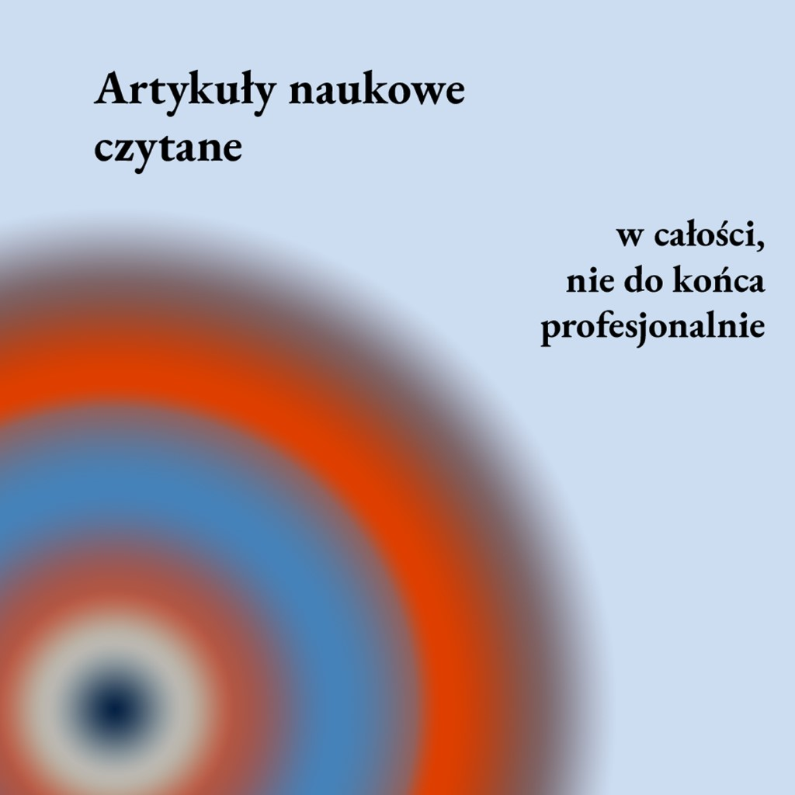

::: {.floatting}

```{r out.width='30%', out.extra='style="float:left; padding:10px"', echo=FALSE}
 
```


https://www.spreaker.com/show/artykuly-naukowe-czytane


To pierwszy (i mamy nadzieję, że już niedługo jeden z wielu!) projekt związany z Sortownią.
W <i>Artykułach Naukowych Czytanych w całości, nie do końca profesjonalnie</i> posłuchacie właśnie tego - artykułów naukowych. Na łamach tego podkastu jak dotąd pojawiła się socjologia, psychologia, neurobiologia, lingwistyka, afrykanistyka, historia, antropologia, kosmologia... i wiele innych dziedzin
:::


---