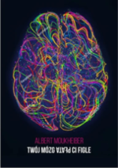
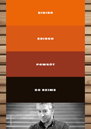
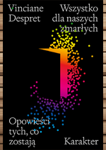
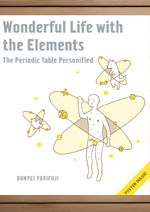

```{r echo = FALSE}
knitr::opts_chunk$set(
  echo = FALSE
)
```

<head>

<link type="text/css" rel="stylesheet" href="https://cdnjs.cloudflare.com/ajax/libs/lightgallery/1.6.0/css/lightgallery.min.css" /> 
<script src="https://cdnjs.cloudflare.com/ajax/libs/lightgallery-js/1.4.1-beta.0/js/lightgallery.min.js"></script>

<!-- lightgallery plugins -->
<script src="https://cdnjs.cloudflare.com/ajax/libs/lg-fullscreen/1.2.1/lg-fullscreen.min.js"></script>
<script src="https://cdnjs.cloudflare.com/ajax/libs/lg-thumbnail/1.2.1/lg-thumbnail.min.js"></script>

<link rel="stylesheet" href="https://cdnjs.cloudflare.com/ajax/libs/lg-icon/1.0.0/lg-icon.min.css" />


</head>


```{css}
@font-face {
  font-family: 'lg';
  src: url("fonts/lg.ttf?22t19m") format("truetype"), url("fonts/lg.woff?22t19m") format("woff"), url("fonts/lg.svg?22t19m#lg") format("svg");
  font-weight: normal;
  font-style: normal;
  font-display: block;
}

.column {
  float: left;
  width: 45%;
  margin-left: 1rem;
}

/* Clear floats after the columns */
.row:after {
  content: "";
  display: table;
  clear: both;
}

#lightgallery a[href]:hover img {
   transform: scale(1.15, 1.15);
   transition: 0.4s ease-in-out;
   cursor: pointer;
}


/* For some reason, icons are not loaded so I choose them myself */
.lg-actions .lg-next {
  content:"\1433"
}
.lg-actions .lg-prev {
  content:"\1438"
}
.lg-toolbar .lg-download {
 content:"\2913"
}
.lg-toolbar .lg-close {
 content:"\00D7"
}
.lg-toolbar .lg-icon {
	background-color: #000;
	border-color: #000;
	border-style: solid;
}
```

**W tym miejscu będziemy prezentować wartościowe w naszej opinii książki naukowe i popularnonaukowe**<br>
**🏗️Strona jeszcze w trakcie konstrukcji 🏗️**

<div class="row" id="lightgallery">
  <a>
    
  </a>
  <a href="_gallery/shelf/przykład/przykład.html">
    
  </a>
  <a href="_gallery/img/small_lingwistykadyskursu.png">
    
  </a>
  <a href="_gallery/img/small_wyobraz.png">
    
  </a>
  <a href="_gallery/img/small_ludobojstwo.png">
    
  </a>
  <a>
    
  </a>
   <a>
    
  </a>
</div>

<div class="row" id="lightgallery">
  <a>
    
  </a>
  <a href="_gallery/img/small_walczprotestuj.png">
    
  </a>
  <a href="_gallery/img/small_dziejeczlowieka.png">
    
  </a>
  <a href="_gallery/img/small_powrotdoreims.png">
    
  </a>
  <a href="_gallery/img/small_radykalnemiasta.png">
    
  </a>
  <a>
    
  </a>
   <a>
    
  </a>
</div>

<div class="row" id="lightgallery">
  <a>
    
  </a>
  <a href="_gallery/img/small_cyfrodziewczyny.png">
    
  </a>
  <a href="_gallery/img/small_wszystkodlazmarlych.png">
    
  </a>
  <a href="_gallery/img/small_topolskihistoriapolski.png">
    
  </a>
  <a href="_gallery/img/small_lifeofelements.png">
    
  </a>
  <a>
    
  </a>
   <a>
    
  </a>
</div>


<script type="text/javascript">
    document.addEventListener('DOMContentLoaded', function() {
        const lightgallery = document.getElementById('lightgallery');
        lightgallery.addEventListener('click', function(event) {
            if (event.target.tagName === 'IMG') {
                event.preventDefault(); // Prevent the default behavior (displaying the image)
                const link = event.target.parentNode.getAttribute('href');
                if (link) {
                    window.location.href = link; // Redirect to the specified URL
                }
            }
        });
    });
</script>


<script type="text/javascript">
    lightGallery(document.getElementById('lightgallery'), {
        selector: 'a[href]'
    });
</script>